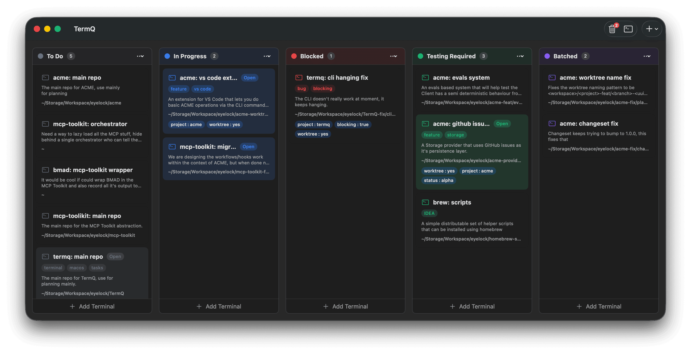

# TermQ

A Kanban-style terminal manager for macOS. Organise your terminal sessions as cards on a board, move them through stages as work progresses, and give each one the context it needs to pick up where you left off.

## New to TermQ?

Start with [Why TermQ](why.md) to understand the mental model, then work through the tutorials in order. Each one builds on the last.

**[→ Start: Why TermQ](why.md)**

## Tutorials

### The Board
1. [Your First Board](tutorials/01-first-board.md)
2. [Richer Cards](tutorials/02-richer-cards.md)
3. [Find Anything Fast](tutorials/03-find-anything-fast.md)
4. [Organise Your Space](tutorials/04-organise-your-space.md)

### Power Workflows
5. [Persistent Sessions](tutorials/05-persistent-sessions.md)
6. [Terminal Context](tutorials/06-terminal-context.md)
7. [Lifecycle](tutorials/07-lifecycle.md)
8. [Git Worktrees](tutorials/12-worktree-sidebar.md)

### Automation & AI
9. [CLI Automation](tutorials/08-cli.md)
10. [Persistent AI Context](tutorials/09-ai-context.md)
11. [MCP Integration](tutorials/10-mcp.md)
12. [Queued Actions](tutorials/11-queued-actions.md)

## Reference

- [Keyboard Shortcuts](reference/keyboard-shortcuts.md)
- [CLI Reference](reference/cli.md)
- [MCP Reference](reference/mcp.md)
- [Configuration & Data](reference/configuration.md)
- [Security](reference/security.md)
