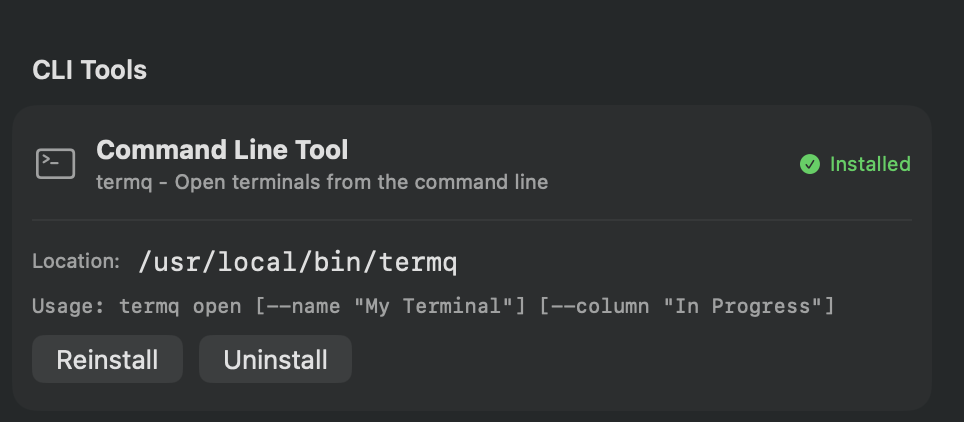

# CLI Tool

The `termqcli` CLI tool lets you manage terminals from your shell. It outputs JSON for easy scripting and works great with LLM assistants like Claude.

## For LLM Assistants

**Start every session with:**
```bash
termqcli pending   # See terminals needing attention
termqcli context   # Get full workflow guide
```

The `pending` command shows terminals with queued tasks (`llmNextAction`) and staleness indicators. The `context` command outputs comprehensive documentation for cross-session workflows.

## Installation

1. Open **TermQ → Settings** (or press ⌘,)
2. Click **Install Command Line Tool**
3. Enter your password when prompted

The CLI will be installed to `/usr/local/bin/termqcli`.



## Quick Start

```bash
# See what's in your board
termqcli list

# Open an existing terminal by name
termqcli open "My Project"

# Create a new terminal for your current project
termqcli create --name "My Project" --column "In Progress"

# Find terminals by name
termqcli find --name "api"

# Move a terminal to Done when finished
termqcli move "My Project" "Done"
```

## Understanding the Board

TermQ organizes terminals in a **Kanban board** with columns like "To Do", "In Progress", and "Done". Each terminal has:

- **Name & Description** - What this terminal is for
- **Column** - Current workflow stage
- **Tags** - Key-value metadata (e.g., `env=prod`)
- **Badges** - Visual labels
- **LLM Prompt** - Notes/context for AI assistants (see below)

## Commands

### Open a Terminal

Open an existing terminal by name, ID, or path. Returns terminal details as JSON (including `llmPrompt` for context).

```bash
# Open by name
termqcli open "API Server"

# Open by UUID
termqcli open "70D8ECF5-E3E3-4FAC-A2A1-7E0F18C94B88"

# Open by path (matches working directory)
termqcli open "/path/to/project"

# Open with partial name match
termqcli open "api"
```

**Output:** Returns the terminal's full details as JSON:

```json
{
  "id": "70D8ECF5-E3E3-4FAC-A2A1-7E0F18C94B88",
  "name": "API Server",
  "description": "Backend service",
  "column": "In Progress",
  "columnId": "UUID",
  "tags": {"env": "prod", "version": "2.0"},
  "path": "/path/to/project",
  "isFavourite": false,
  "llmPrompt": "Node.js backend using PostgreSQL",
  "llmNextAction": "Continue implementing rate limiting"
}
```

### Create a Terminal

Create a new terminal in TermQ.

```bash
# Create in current directory
termqcli create

# Create with name and description
termqcli create --name "API Server" --description "Backend"

# Create in specific column
termqcli create --column "In Progress"

# Create with tags
termqcli create --name "Build" --tag env=prod --tag version=1.0

# Create in specific directory
termqcli create --path /path/to/project
```

### Launch TermQ

```bash
termqcli launch
```

### List Terminals

List all terminals as JSON (ideal for LLM consumption).

```bash
# List all terminals
termqcli list

# Use debug data directory
termqcli list --debug

# Filter by column
termqcli list --column "In Progress"

# List columns only
termqcli list --columns
```

**Output format:**
```json
[
  {
    "id": "UUID",
    "name": "Terminal Name",
    "description": "Description",
    "column": "Column Name",
    "columnId": "UUID",
    "tags": {"key": "value"},
    "path": "/working/directory",
    "badges": ["badge1", "badge2"],
    "isFavourite": false,
    "llmPrompt": "Persistent context",
    "llmNextAction": "One-time task (runs on next open)"
  }
]
```

### Find Terminals

Search for terminals by various criteria.

```bash
# Smart search across all fields (name, description, path, tags)
termqcli find --query "api server prod"

# Find by name (partial, case-insensitive)
termqcli find --name "api"

# Find by column
termqcli find --column "In Progress"

# Find by tag
termqcli find --tag env=prod

# Find by ID
termqcli find --id "70D8ECF5-E3E3-4FAC-A2A1-7E0F18C94B88"

# Find by badge
termqcli find --badge "prod"

# Find favourites only
termqcli find --favourites

# Combine filters
termqcli find --column "In Progress" --tag env=prod
```

#### Smart Search (`--query`)

The `--query` option provides intelligent multi-word search:

- **Word normalization**: Separators like `-`, `_`, `:`, `/`, `.` are treated as word boundaries
- **Multi-field**: Searches across name, description, path, and tags simultaneously
- **Relevance scoring**: Results sorted by match quality (name matches score highest)

**Example**: `termqcli find --query "mcp toolkit migrate"` will find a terminal named `"mcp-toolkit: migrate workflows"` because each word matches.

### Modify Terminals

Update terminal properties via URL scheme (requires TermQ to be running).

```bash
# Rename a terminal
termqcli set "Terminal Name" --name "New Name"

# Set description
termqcli set "Terminal Name" --set-description "New description"

# Move to column
termqcli set "Terminal Name" --column "Done"

# Set badge
termqcli set "Terminal Name" --badge "prod, v2.0"

# Set persistent LLM context
termqcli set "Terminal Name" --llm-prompt "Node.js API server, uses PostgreSQL"

# Set one-time LLM action (runs on next open, then clears)
termqcli set "Terminal Name" --llm-next-action "Fix the auth bug discussed in issue #42"

# Set init command (runs when terminal opens)
termqcli set "Terminal Name" --init-command "npm run dev"

# Add tags (additive by default)
termqcli set "Terminal Name" --tag env=prod --tag version=2.0

# Replace all tags instead of adding
termqcli set "Terminal Name" --tag env=staging --replace-tags

# Mark as favourite
termqcli set "Terminal Name" --favourite

# Remove favourite
termqcli set "Terminal Name" --unfavourite

# Use UUID instead of name
termqcli set "70D8ECF5-E3E3-4FAC-A2A1-7E0F18C94B88" --name "New Name"
```

### Move Terminals

Move a terminal to a different column.

```bash
# Move by name
termqcli move "Terminal Name" "Done"

# Move by UUID
termqcli move "70D8ECF5-E3E3-4FAC-A2A1-7E0F18C94B88" "In Progress"
```

### Check Pending Work (LLM Session Start)

Show terminals needing attention. **Run this at the start of every LLM session.**

```bash
# See all terminals with pending actions and staleness
termqcli pending

# Only show terminals with llmNextAction set
termqcli pending --actions-only
```

**Output format:**
```json
{
  "terminals": [
    {
      "id": "UUID",
      "name": "API Project",
      "column": "In Progress",
      "path": "/path/to/project",
      "llmNextAction": "Continue implementing auth middleware",
      "llmPrompt": "Node.js backend using PostgreSQL",
      "staleness": "fresh",
      "tags": {"project": "org/repo", "status": "active"}
    }
  ],
  "summary": {
    "total": 5,
    "withNextAction": 1,
    "stale": 2,
    "fresh": 2
  }
}
```

Terminals are sorted with pending actions first, then by staleness (stale → ageing → fresh).

### Get LLM Context

Output comprehensive documentation for LLM/AI assistants including cross-session workflow.

```bash
termqcli context
```

This outputs a complete guide including:
- **Session Start/End Checklists** - What to do at beginning and end of each session
- **Tag Schema** - Recommended tags for cross-session state tracking
- **Command Reference** - All commands with examples
- **Workflow Examples** - How to maintain continuity across sessions

## Getting Help

All commands support `--help` for quick reference:

```bash
# Main help (lists all commands)
termqcli --help

# Command-specific help
termqcli open --help
termqcli set --help
termqcli find --help
```

Example output from `termqcli --help`:
```
OVERVIEW: Command-line interface for TermQ - Terminal Queue Manager

LLM/AI Assistants: Run 'termqcli pending' at session start, then 'termqcli context'
for the complete cross-session workflow guide.

SUBCOMMANDS:
  open, create, launch, list, find, set, move, pending, context
```

## Debug Mode

All read commands (`list`, `find`) support `--debug` to use the debug data directory (`~/Library/Application Support/TermQ-Debug/`).

```bash
termqcli list --debug
termqcli find --debug --name "test"
```

## Error Handling

All commands output JSON for easy parsing:

**Success:**
```json
{"success": true, "id": "UUID"}
```

**Error:**
```json
{"error": "Error message", "code": 1}
```

### Common Error Codes

| Code | Meaning | Example |
|------|---------|---------|
| `1` | General error | Invalid arguments, file not found |
| `1` | Terminal not found | `termqcli open "nonexistent"` |
| `1` | Column not found | `termqcli move "Terminal" "Bad Column"` |
| `1` | No matches | `termqcli find --name "xyz"` returns empty `[]` |

> **Note:** Currently all errors return code `1`. Check the `error` message for details. An empty result (e.g., `[]` from `find`) is not an error—it means no matches.

## LLM Integration

TermQ supports any LLM CLI tool through **Init Command tokens**. This vendor-agnostic approach lets you use Claude Code, Aider, GitHub Copilot, or any other tool.

### Token Placeholders

Use these tokens in a terminal's **Init Command** field:

| Token | Description |
|-------|-------------|
| `{{LLM_PROMPT}}` | Persistent context (never auto-cleared) |
| `{{LLM_NEXT_ACTION}}` | One-time action (cleared after terminal opens) |

### Example Init Commands

```bash
# Claude Code - interactive session with context
claude "{{LLM_PROMPT}} {{LLM_NEXT_ACTION}}"

# Claude Code - non-interactive (headless)
claude -p "{{LLM_PROMPT}} {{LLM_NEXT_ACTION}}"

# Cursor - interactive agent mode
agent "{{LLM_PROMPT}} {{LLM_NEXT_ACTION}}"

# Cursor - non-interactive (headless)
agent -p "{{LLM_PROMPT}} {{LLM_NEXT_ACTION}}"

# Aider - pass task directly
aider --message "{{LLM_NEXT_ACTION}}"

# GitHub Copilot
gh copilot suggest "{{LLM_NEXT_ACTION}}"

# Custom script
my-llm-wrapper.sh --context "{{LLM_PROMPT}}" --task "{{LLM_NEXT_ACTION}}"
```

> **Tip:** Use the **Generate Init Command** section in the terminal editor's Agents tab to quickly create these templates for popular LLM tools.

### Interactive vs Non-Interactive Mode

Some LLM tools support a **non-interactive mode** (using the `-p` flag) that's useful for:
- Automated/headless execution without user prompts
- Long-running tasks that produce a single output
- CI/CD pipelines or scheduled tasks

When generating init commands in the UI, toggle **Interactive Mode** off to add the `-p` flag for supported tools (Claude Code, Cursor).

> **Note:** The Init Command is configured in the TermQ app UI (terminal editor → Agents tab), not via CLI. The CLI is used to set the `llmPrompt` and `llmNextAction` values that get substituted into the Init Command.

### Setting LLM Fields via CLI

```bash
# Set persistent context (always available)
termqcli set "API Server" --llm-prompt "Node.js backend. Entry: src/index.ts. Uses PostgreSQL."

# Set one-time action (runs once, then clears)
termqcli set "API Server" --llm-next-action "Implement rate limiting. See plan in context."

# Read LLM fields
termqcli list | jq '.[] | {name, llmPrompt, llmNextAction}'

# Check pending actions
termqcli list | jq '.[] | select(.llmNextAction != "") | {name, llmNextAction}'
```

### How It Works

1. User sets **Init Command** with tokens (e.g., `claude "{{LLM_PROMPT}} {{LLM_NEXT_ACTION}}"`)
2. User or LLM sets `llmPrompt` and/or `llmNextAction` via CLI or UI
3. When terminal opens, tokens are replaced with actual values
4. If `{{LLM_NEXT_ACTION}}` was in the command and had a value, it's cleared after use
5. Empty tokens become empty strings (your LLM tool handles gracefully)

### Use Cases

**Persistent Context (`llmPrompt`):**
- Project background info
- Tech stack details
- Important notes that should persist

**Next Action (`llmNextAction`):**
- Parking work with "resume from here" instructions
- Queueing tasks for later
- Handoff between sessions

## Cross-Session State Tracking

Use tags to track work state across multiple LLM sessions:

| Tag | Values | Purpose |
|-----|--------|---------|
| `staleness` | `fresh`, `ageing`, `stale` | How recently worked on |
| `status` | `pending`, `active`, `blocked`, `review` | Current work state |
| `project` | `org/repo` | Project identifier |
| `worktree` | `branch-name` | Current git branch |
| `priority` | `high`, `medium`, `low` | Work importance |
| `blocked-by` | `ci`, `review`, `user` | What's blocking progress |
| `type` | `feature`, `bugfix`, `chore`, `docs` | Work category |

**Setting tags:**
```bash
termqcli set "Terminal" --tag staleness=fresh --tag status=active
termqcli set "Terminal" --tag project=eyelock/TermQ --tag worktree=feat/new-feature
```

**Finding by tags:**
```bash
termqcli find --tag staleness=stale    # Find work that needs attention
termqcli find --tag status=blocked     # Find blocked work
termqcli find --tag project=org/repo   # Find all terminals for a project
```

**Recommended workflow:**
1. **Session start**: Run `termqcli pending` to see what needs attention
2. **During work**: Keep `status` tag updated
3. **Session end**: Set `llmNextAction` if incomplete, update `staleness=fresh`

## Automation & Scripting

The CLI outputs JSON for easy parsing in scripts or by AI assistants.

**Example: Find all production terminals**
```bash
termqcli find --tag env=prod | jq '.[].name'
```

**Example: Move all "In Progress" to "Review"**
```bash
termqcli find --column "In Progress" | jq -r '.[].id' | xargs -I {} termqcli move {} "Review"
```

## Tips for AI Assistants

If you're an LLM assistant helping a user with TermQ:

1. **Use `termqcli open <name>`** to resume work - returns terminal details including both LLM fields
2. **Check `llmNextAction`** first - this is a pending task queued for you
3. **Check `llmPrompt`** for persistent background context
4. **Set `llmNextAction`** when parking work - user's Init Command will inject it on next open
5. **Update `llmPrompt`** for context that should persist (project info, notes)
6. **Use `termqcli create`** only when starting genuinely new work
7. **Use columns** to track workflow (To Do → In Progress → Done)

**Complete Workflow Example:**

```bash
# Session 1: User opens terminal, you do some work
termqcli open "API Project"
# Returns: llmPrompt="Node.js backend", llmNextAction=""

# You implement a feature, but need to pause. Queue next action:
termqcli set "API Project" --llm-next-action "Continue implementing rate limiting from line 42"

# Session 2: User opens terminal again
# Init Command: claude "{{LLM_PROMPT}} {{LLM_NEXT_ACTION}}"
# Becomes:      claude "Node.js backend Continue implementing rate limiting from line 42"
# llmNextAction is cleared, you pick up where you left off
```

**Parking Work Pattern:**
```bash
# Before ending session, queue the next task
termqcli set "My Terminal" \
  --llm-prompt "React frontend, uses Redux" \
  --llm-next-action "Implement the login form. See design in Figma link in description."
```
