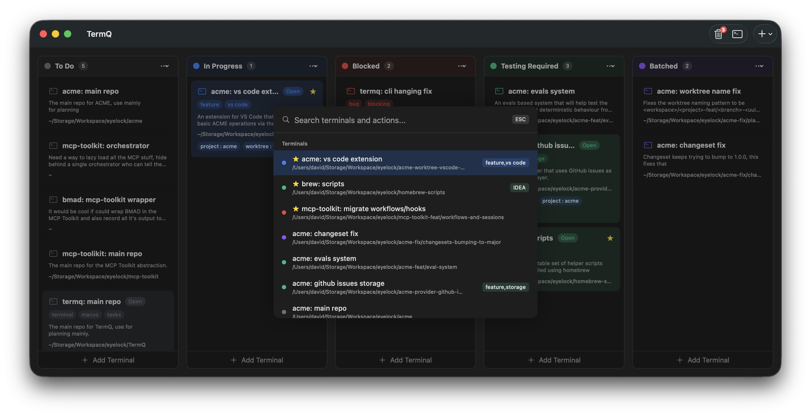
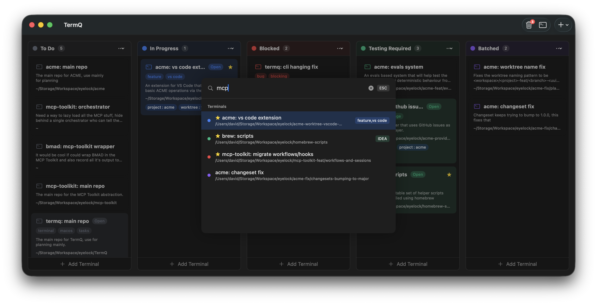
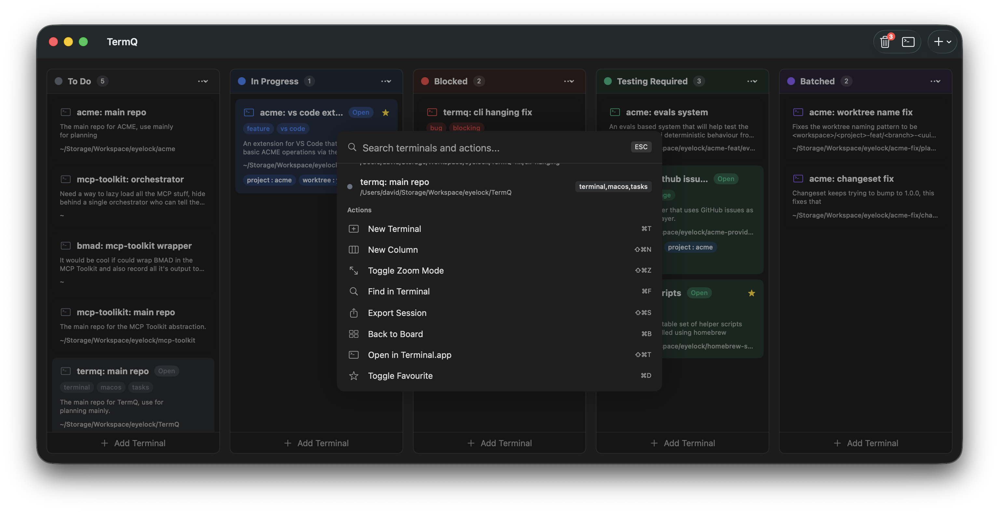

# Command Palette

## Quick Access

Press **⌘K** to open the command palette for fast navigation and actions.

## Search

- Type to filter terminals by name, description, or working directory
- Filter actions by name

## Navigation

- Use **↑** and **↓** arrow keys to select
- Press **Enter** to execute
- Press **Escape** to close

## Available Actions

- New Terminal
- New Column
- Toggle Zoom Mode
- Find in Terminal
- Export Session
- Back to Board
- Open in Terminal.app
- Toggle Favourite

