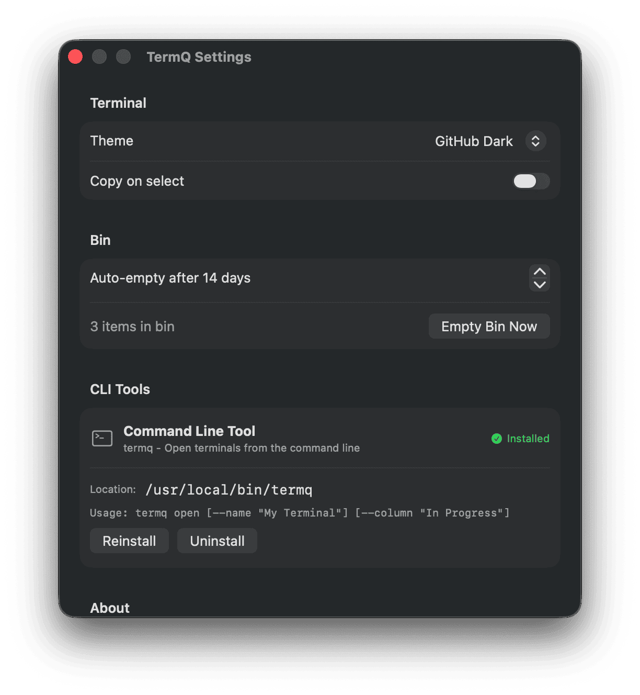

# Configuration & Data

## Data Storage

TermQ stores its data at:

```
~/Library/Application Support/TermQ/board.json
```

This JSON file contains all columns, cards, and their metadata. You can:

- Back it up manually
- Edit it with a text editor (when app is closed)
- Sync it via cloud storage

## Settings

Access Settings via **⌘,** or the TermQ menu.

Available settings:

- **Theme** - Choose from 8 color schemes
- **Copy on Select** - Automatically copy selected text
- **Default Working Directory** - Default working directory for new terminals
- **Default Backend** - Choose between Direct or TMUX for new terminals
- **Bin Retention** - Days before auto-deleting binned terminals
- **CLI Installation** - Install/manage the termqcli command



## CLI Installation

The Settings window shows CLI tool status and provides install/uninstall options.


