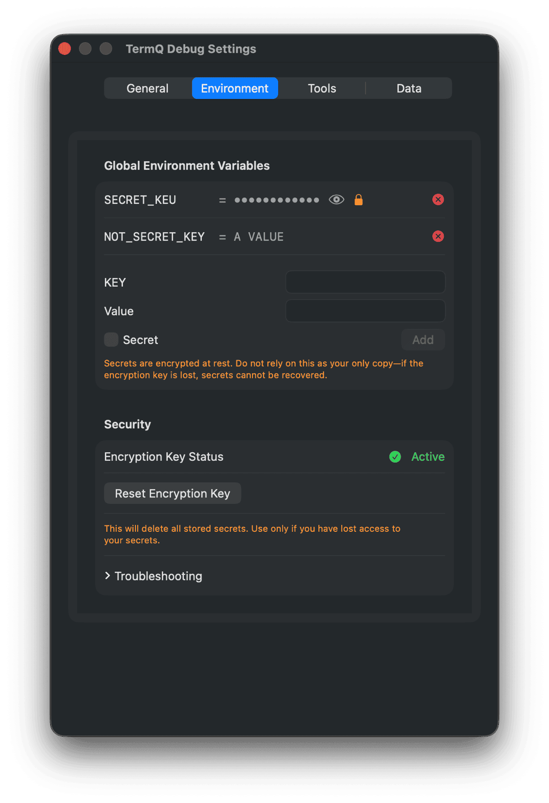
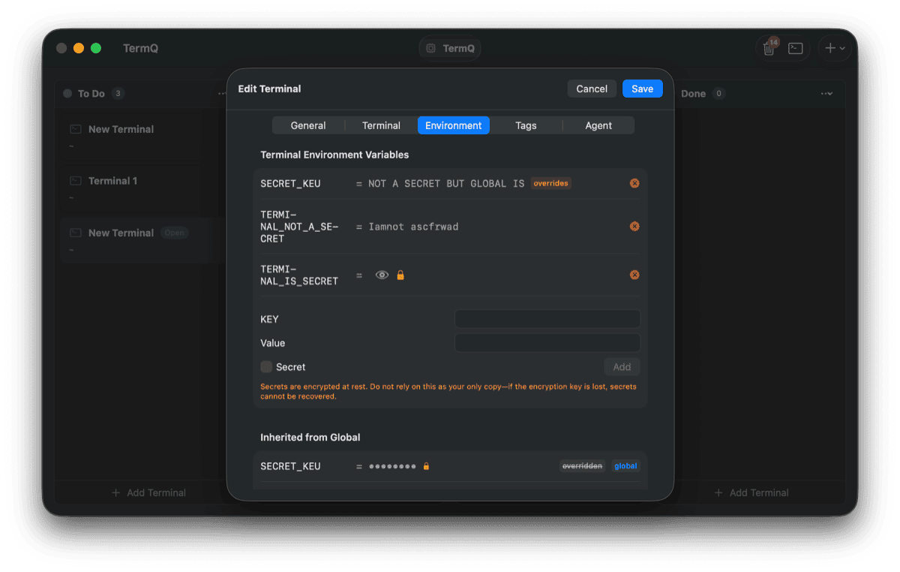
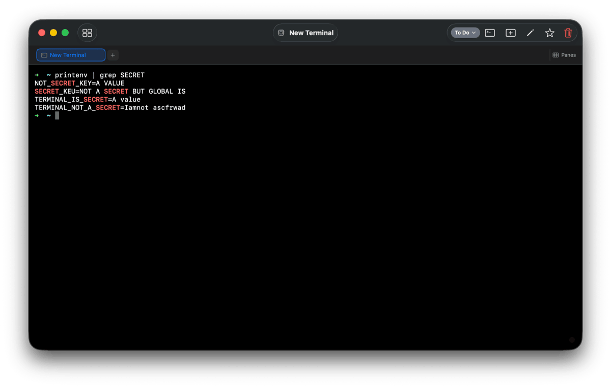

# Environment Variables & Secrets

TermQ provides two types of environment variables for your terminal sessions:

1. **User-defined variables** - Custom variables you configure (this page)
2. **Auto-injected variables** - Variables TermQ sets automatically (see [Working with Terminals](working-with-terminals.md#environment-variables))

## Overview

You can define environment variables at two levels:

- **Global variables** - Available to all terminals, configured in Settings
- **Terminal-specific variables** - Configured per terminal, override global variables

Both levels support **secrets** - sensitive values stored securely in your macOS Keychain rather than in the board JSON file.

## Global Environment Variables

Global variables are inherited by every terminal session.

### Configuring Global Variables

1. Open **Settings** (⌘,)
2. Select the **Environment** tab
3. Add variables with key/value pairs

### Use Cases

- API tokens used across multiple projects
- Common paths or configurations
- Team-shared development settings

## Terminal-Specific Variables

Each terminal can have its own environment variables that override any global variable with the same key.

### Configuring Terminal Variables

1. Open the terminal card editor (double-click or right-click > Edit)
2. Select the **Environment** tab
3. Add variables specific to this terminal

The Environment tab shows:
- **Terminal Variables** - Variables specific to this terminal
- **Inherited Variables** - Global variables (shows "overridden" if a terminal variable exists with the same key)

### Override Behavior

When a terminal has a variable with the same key as a global variable:
- The terminal-specific value is used
- The global variable shows as "overridden" in the editor
- The terminal variable shows an "overrides" badge

## Secrets

For sensitive values like API keys, tokens, or passwords, mark a variable as a **Secret**.

### How Secrets Work

- Secret values are stored in your **macOS Keychain**, not in the board JSON file
- Values are encrypted at rest using a TermQ-managed encryption key
- Secret values are masked (shown as dots) in the UI by default
- Click the eye icon to temporarily reveal a secret value

### Adding a Secret

1. Enter the key and value
2. Check the **Secret** checkbox
3. Click **Add**

The value is immediately stored in your Keychain and cleared from the input field.

### Security Notes

- Secrets are tied to your macOS user account
- Backing up your board file does **not** back up secret values
- If you reset the encryption key, all secrets are permanently lost
- Secrets are injected into terminal sessions as plain-text environment variables (as required by the shell)

## Encryption & Security

### Encryption Status

The Settings > Environment tab shows your encryption status:
- **Active** (green checkmark) - Encryption key exists, secrets are protected
- **Inactive** (red X) - No encryption key yet (created when you add your first secret)

### Reset Encryption Key

If you need to reset the encryption key:

1. Go to Settings > Environment
2. Click **Reset Encryption Key**
3. Confirm the action

**Warning**: This permanently deletes all stored secrets. You'll need to re-enter any secret values.

### Troubleshooting

If secrets aren't working:

1. Check Keychain Access for "TermQ" entries
2. Ensure TermQ has Keychain access permissions
3. Try resetting the encryption key
4. Re-add your secrets
5. Restart TermQ if issues persist

## Variable Key Rules

Environment variable keys must follow POSIX naming rules:

- Must start with a letter or underscore
- Can only contain letters, digits, and underscores
- Case-sensitive (convention is UPPERCASE)

**Valid examples**: `API_KEY`, `MY_VAR`, `_PRIVATE`

**Invalid examples**: `123KEY` (starts with digit), `MY-VAR` (contains dash), `my var` (contains space)

### Reserved Keys

Some keys are reserved by the system and will show a warning:
`PATH`, `HOME`, `USER`, `SHELL`, `TERM`, `LANG`, `PWD`, and others.

You can still use these, but overriding system variables may cause unexpected behavior.

## Auto-Injected Variables

In addition to user-defined variables, TermQ automatically injects variables into every terminal session. These are documented in [Working with Terminals - Environment Variables](working-with-terminals.md#environment-variables).

| Variable | Description |
|----------|-------------|
| `TERMQ_TERMINAL_ID` | UUID of the current terminal |
| `TERMQ_TERMINAL_TAG_<KEY>` | One variable per tag on the terminal |

These auto-injected variables enable scripts and tools to identify which terminal they're running in, and are used by the [MCP Server](mcp-server.md) for LLM agent integration.

## Variable Injection Order

When a terminal session starts, variables are injected in this order (later values override earlier):

1. System environment (inherited from TermQ process)
2. Global user-defined variables
3. Terminal-specific user-defined variables
4. Auto-injected `TERMQ_*` variables

This means terminal-specific variables always override global variables with the same key.

