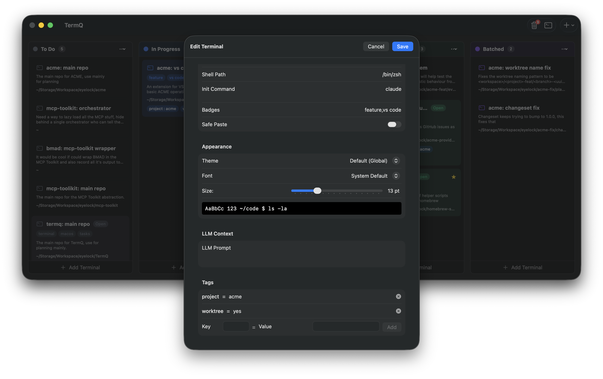

# Themes & Appearance

## Color Themes

TermQ includes 8 built-in color themes:

- Default Dark
- Dracula
- One Dark
- Nord
- Solarized Dark
- Solarized Light
- GitHub Dark
- Monokai

## Changing Theme

1. Open Settings (**⌘,**)
2. Select a theme from the Theme dropdown
3. Theme applies instantly to all terminals

## Per-Terminal Fonts

Each terminal can have its own font settings:

1. Edit a terminal card
2. Select a custom font and size
3. Save to apply

## Per-Terminal Themes

You can also set a specific color theme for individual terminals, overriding the global theme setting.

