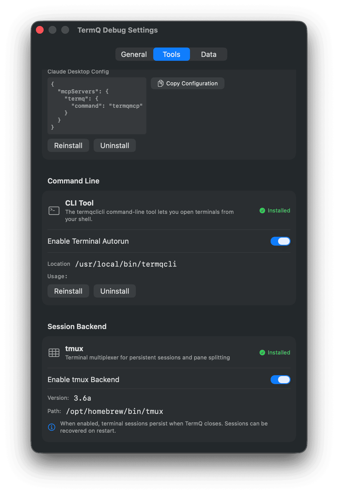
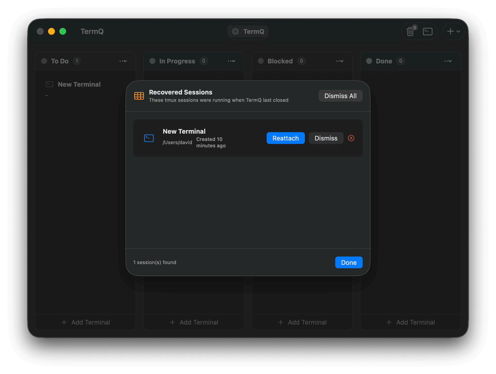
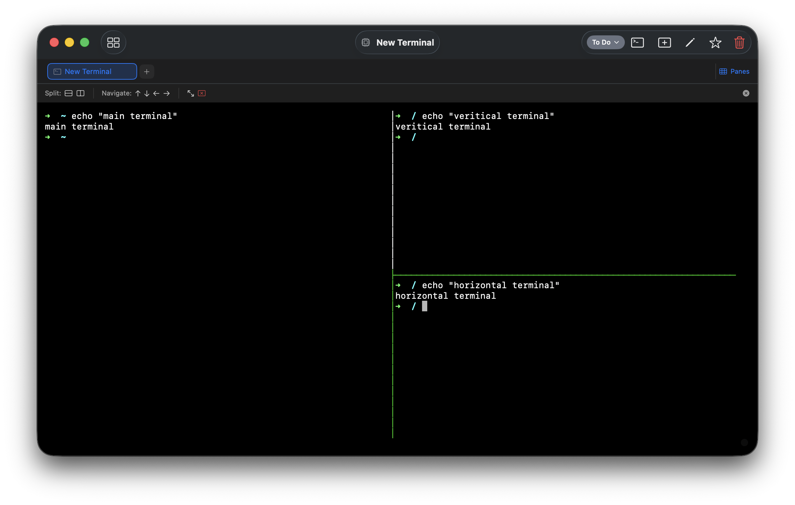
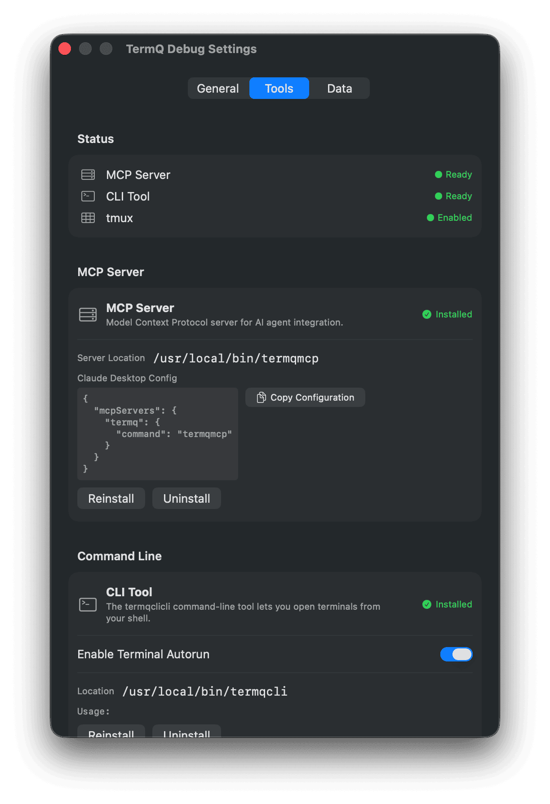

# tmux Sessions

TermQ uses tmux as its backend for terminal session management, providing persistent sessions that survive app restarts and crashes.

## What is tmux?

tmux is a terminal multiplexer that runs your shell sessions in the background. When TermQ uses tmux:

- **Sessions persist** - Your terminal sessions keep running even when TermQ closes
- **Automatic recovery** - Reconnect to running sessions when you reopen TermQ
- **Pane splitting** - Split your terminal into multiple panes within a single card

## Session Backends

Each terminal card can use one of two backends:

| Backend | Description | Use Case |
|---------|-------------|----------|
| **Direct** | Traditional shell, ends when app closes | Quick one-off commands |
| **tmux (Persistent)** | Session runs via tmux, persists across restarts | Long-running tasks, development work |

New terminals default to **Direct** backend. To use tmux persistence, you must:
1. Have tmux installed (see Troubleshooting section)
2. Enable tmux globally in Settings > Tools
3. Set the terminal's backend to "TMUX (Persistent)" in the card editor

**Note:** The backend picker only appears in the card editor when tmux is installed and enabled globally.

## Configuring Backend Mode

1. Open the terminal card editor (click the pencil icon or use the context menu)
2. Scroll to the **Session** section
3. Select your preferred backend:
   - **TMUX (Persistent)** - Recommended for most use cases
   - **Direct** - For temporary sessions



## Session Recovery

When TermQ launches, it automatically detects any tmux sessions that were running when the app last closed.

### Auto-Reattach (Default)

By default, TermQ automatically reconnects tmux sessions that have matching terminal cards. This means:

- Sessions silently reattach when you reopen TermQ
- No dialog interruption for matched sessions
- Your terminals are ready to use immediately

You can disable auto-reattach in **Settings > Tools > tmux section** by unchecking "Auto-reattach Sessions".

### Recovery Dialog

The Session Recovery dialog only appears when:

- **Auto-reattach is disabled** - Shows all recoverable sessions for manual action
- **Orphan sessions exist** - tmux sessions without matching terminal cards

Available actions:

- **Reattach** - Reconnect the session to its original terminal card
- **Dismiss** - Keep the session running but hide from the list
- **Kill** - Terminate the tmux session (unsaved work will be lost)

### Session Naming

tmux sessions are named using the pattern `termq-<cardId>` where `cardId` is the first 8 characters of the terminal card's UUID. This allows TermQ to match sessions back to their cards.



## Pane Management

tmux backend enables pane splitting within a terminal card.

### Accessing Pane Controls

1. Open a terminal with tmux backend
2. Click the **Panes** button in the tab bar
3. Use the pane control toolbar that appears

### Available Actions

| Action | Description |
|--------|-------------|
| **Split Horizontal** | Split current pane top/bottom |
| **Split Vertical** | Split current pane left/right |
| **Navigate** | Move focus between panes (↑↓←→) |
| **Zoom** | Toggle fullscreen for current pane |
| **Close** | Close the current pane |

### Keyboard Shortcuts

If you're familiar with tmux, you can use standard tmux keybindings (prefix key + command). The default prefix is `Ctrl+B`.

Common shortcuts:
- `Ctrl+B "` - Split horizontally
- `Ctrl+B %` - Split vertically
- `Ctrl+B o` - Cycle through panes
- `Ctrl+B z` - Toggle pane zoom
- `Ctrl+B x` - Close pane (with confirmation)



## tmux Status

You can verify tmux is working correctly in Settings:

1. Open **Settings** (⌘,)
2. Navigate to the **Tools** tab
3. The **tmux Status** section appears at the top (when tmux is installed)

This shows:
- tmux version and status (Ready/Disabled)
- Number of active tmux sessions
- Quick enable button if tmux is disabled

### Enabling tmux

To enable tmux backend support:

1. Open **Settings > Tools**
2. If tmux is installed, you'll see the tmux Status section
3. Enable "Enable tmux Backend" in the Session Backend section
4. Optionally enable "Auto-reattach Sessions" for seamless reconnection



### Quit Warning

When you quit TermQ with running **Direct** (non-tmux) sessions, you'll see a warning that those sessions will be terminated. tmux sessions persist automatically and don't trigger this warning.

## Troubleshooting

### tmux Not Found

If tmux is not installed:

**macOS (Homebrew):**
```bash
brew install tmux
```

**macOS (MacPorts):**
```bash
sudo port install tmux
```

### Sessions Not Persisting

1. Verify tmux is installed: `which tmux`
2. Check the terminal is using tmux backend (not Direct)
3. Look for errors in the terminal output

### Recovery Not Working

If sessions aren't being recovered:

1. Ensure the session is still running: `tmux list-sessions`
2. Check the session name starts with `termq-`
3. Verify the card ID matches an existing terminal

### Pane Controls Not Showing

The Panes button only appears for terminals using tmux backend. Check:

1. Terminal backend is set to **TMUX (Persistent)**
2. The session has been started (open the terminal at least once)

## Control Mode (Advanced)

TermQ uses tmux's control mode (`-CC` flag) for advanced pane rendering and window management. This provides a structured interface for managing tmux sessions programmatically.

### What is Control Mode?

Control mode is a special tmux interface that outputs structured messages instead of raw terminal data. This allows TermQ to:

- **Track pane layout** - Know exactly where each pane is positioned
- **Monitor window changes** - React to window creation/deletion in real-time
- **Capture output** - Receive pane output as structured data
- **Synchronize state** - Keep TermQ's UI in sync with tmux state

### Control Mode Features

| Feature | Description |
|---------|-------------|
| **Layout Tracking** | Real-time pane position and size updates |
| **Window Tabs** | Navigate between tmux windows with tab UI |
| **Pane Selection** | Click to select panes visually |
| **Native Rendering** | Display pane content in native views |

### Window Management Operations

The following window operations are available via control mode:

| Operation | Description |
|-----------|-------------|
| **New Window** | Create a new window in the session |
| **Select Window** | Switch to a specific window |
| **Rename Window** | Change the window's display name |
| **Close Window** | Close a window (kills all its panes) |
| **Next/Previous** | Navigate between windows |

### Pane Operations

Extended pane operations beyond basic splitting:

| Operation | Description |
|-----------|-------------|
| **Resize** | Grow or shrink a pane in any direction |
| **Swap** | Swap pane positions with adjacent panes |
| **Break** | Extract a pane into its own window |
| **Join** | Merge a pane from another window |
| **Zoom** | Toggle fullscreen for a single pane |

### Session Metadata Sync

TermQ automatically syncs terminal card metadata to the tmux session environment. This enables:

- **Card Recovery** - Restore card settings when reattaching
- **LLM Context** - Preserve AI prompts and context across restarts
- **Tag Preservation** - Keep tags and badges synced with the session

Metadata stored includes:
- Card title and description
- Tags and badges
- LLM prompt and next action
- Column assignment
- Favourite status

## Advanced: Manual tmux Commands

You can interact with TermQ's tmux sessions directly from any terminal:

```bash
# List all TermQ sessions
tmux list-sessions | grep termq-

# Attach to a session from external terminal
tmux attach -t termq-12345678

# Kill a specific session
tmux kill-session -t termq-12345678
```

Note: Manually killing sessions will show them as "ended" in TermQ.
