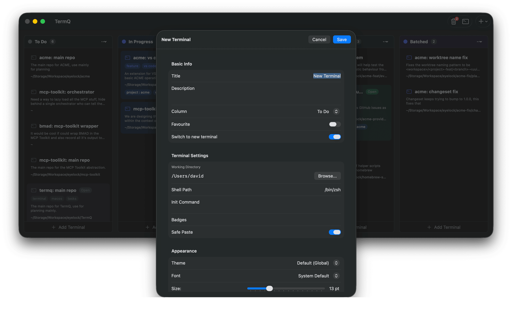
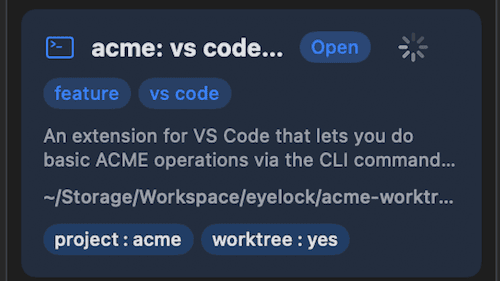
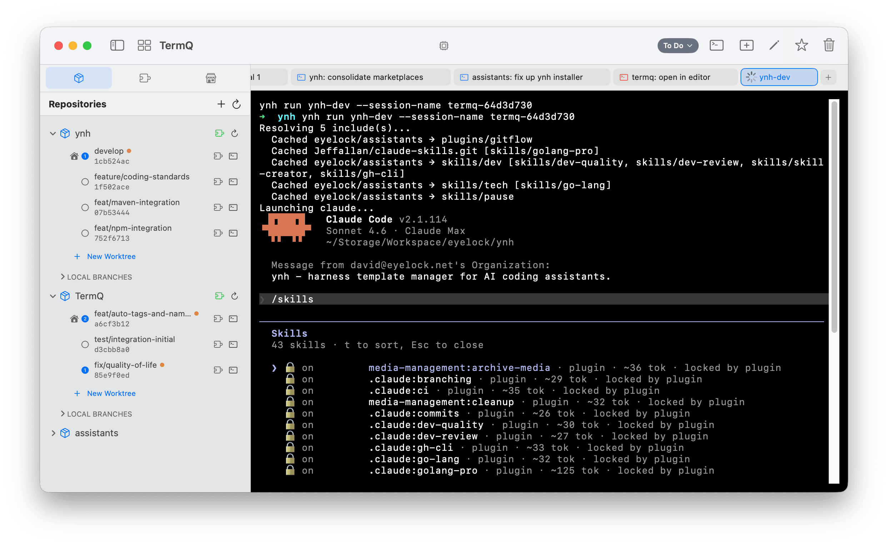
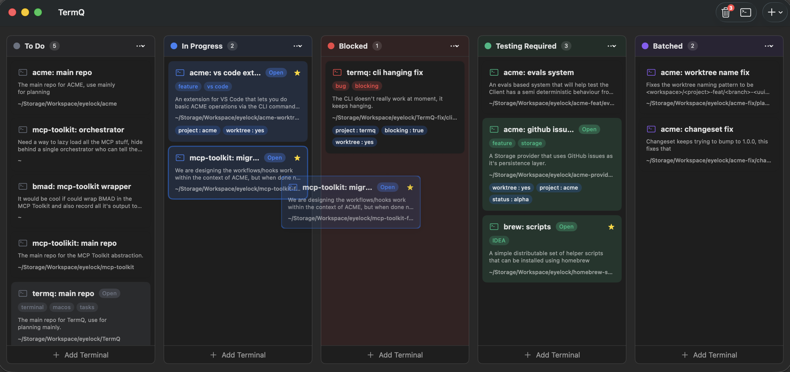

# Tutorial 1: Your First Board

In this tutorial you'll create your first terminals, see them on the board, and experience the core TermQ workflow: organize work in columns, drag cards between stages, and always know where things stand.

By the end you'll have a real board with three terminals across two columns — and the mental model for everything that follows.

**Time:** about 10 minutes  
**Requires:** TermQ installed and open

---

## 1.1 — What you're looking at

When TermQ opens, you see the **board view**: a set of columns, each containing terminal cards. If this is your first time, there are probably no cards yet — just empty columns.


The columns represent stages. TermQ starts you with a default layout, but you can rename, add, and rearrange them to match your workflow. For now, leave them as they are.

---

## 1.2 — Create your first terminal

Click the **Add Terminal** button at the bottom of the first column, or press **⌘N**.

The new terminal dialog opens. Fill it in like this:

- **Name:** `Dev Server`
- **Description:** `Local development server — npm run dev`



Click **Create**. The card appears in the column.

> **Why a description?** The name is what you scan for. The description is what you read when you've forgotten what this session is actually doing — and you always forget, eventually.

---

## 1.3 — What the card shows

The card on the board displays your terminal's name, description, and a few status indicators. This is everything you need to understand the session at a glance, without opening it.



The green dot (when visible) indicates the session is running. Right now there's nothing running — we haven't opened the terminal yet.

---

## 1.4 — Open the terminal

Click the card to open the terminal in full view. You'll see a running shell at whatever working directory you set (or your home directory by default).



Run something to confirm it works:

```
echo "Hello from TermQ"
```

Press **⌘W** or click the back arrow to return to the board. Your session is still running — the card just lives on the board now.

> **Tip:** TermQ keeps terminal sessions alive when you navigate away. The dev server you start in here will keep running even when you're looking at other cards.

---

## 1.5 — Add two more terminals

Create two more terminals so you have something to organize. Use **⌘N** or **Add Terminal** at the bottom of any column.

**Second terminal:**
- **Name:** `Database`
- **Description:** `PostgreSQL — psql -U dev myapp`

**Third terminal:**
- **Name:** `Tests`
- **Description:** `Test runner — npm test`

Put all three in the same column for now. Your board should show three cards stacked in one column.

---

## 1.6 — Drag cards between columns

Now organize them by status. Maybe your dev server and database are running (In Progress), but your test runner is just queued up (To Do).

Drag the **Tests** card to the **To Do** column.



The card highlights as you hover over a valid drop target, then snaps into place when you drop it.

This is the core workflow: cards move through stages as your work progresses. When you finish a session — when the task it represents is done — move it to Done. Not just close it: *move it*.

---

## What you learned

- A **terminal card** has a name, description, and lives in a column on the board
- Cards represent work, not just open windows — they persist whether or not a session is running
- You can **open** a card to get a full terminal view and return to the board without losing the session
- **Drag and drop** moves cards between columns — the board is how you track status at a glance
- The board is your workspace: everything you're working on, organized by stage

## Next

[Tutorial 2: Richer Cards](tutorials/02-richer-cards.md) — Add tags, badges, and working directories to make your cards carry real context.
