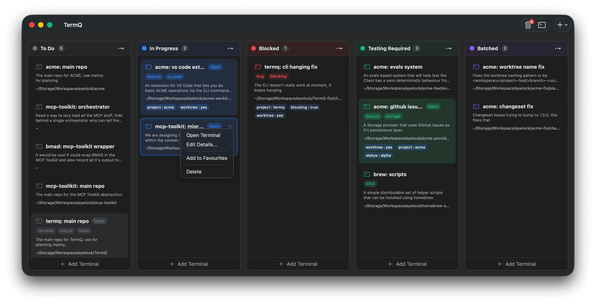
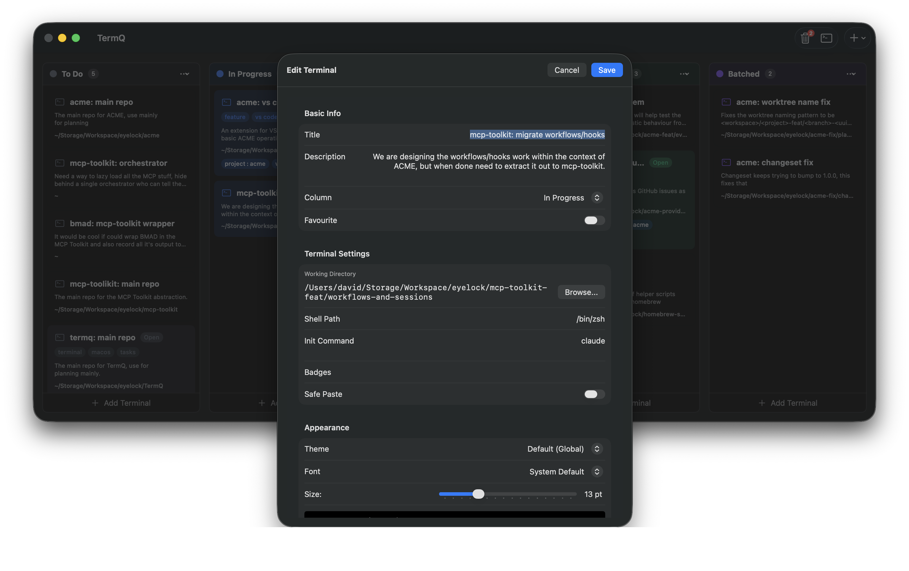
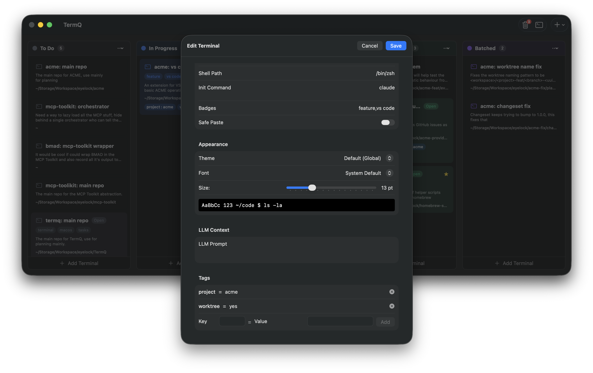

# Tutorial 2: Richer Cards

A card with just a name is better than a nameless window — but a card with a working directory, tags, and a clear description is something you can act on without even opening it.

In this tutorial you'll learn what metadata a terminal card carries, how to add it, and why it matters.

**Requires:** [Tutorial 1](tutorials/01-first-board.md) completed, or a board with a few terminals on it.

---

## 2.1 — Open the terminal editor

Right-click any card on your board to open the context menu, then choose **Edit Details**.



Or double-click the card title. The terminal editor opens in a panel on the right.

---

## 2.2 — What the editor contains

The editor has two sections. The upper section covers identity and organisation:



| Field | What it's for |
|---|---|
| **Name** | The short label you scan for on the board |
| **Description** | What this session is actually doing — write this for your future self |
| **Column** | Which stage this terminal is at |
| **Badges** | Quick visual labels (comma-separated words that appear on the card) |
| **Tags** | Structured key=value metadata for filtering and automation |

The lower section covers terminal behaviour:



| Field | What it's for |
|---|---|
| **Working Directory** | Where the shell starts — leave empty to use the app default |
| **Shell** | Override the default shell for this terminal |
| **Init Command** | A command that runs automatically when the terminal opens |
| **Backend** | Direct (default) or tmux — see [Tutorial 5](tutorials/05-persistent-sessions.md) |

---

## 2.3 — Add a working directory

If your **Dev Server** card is always for a specific project, set its working directory now. Click the field and type the path, or use the folder picker.

With a working directory set, the terminal always opens at that location — no need to `cd` every time.

---

## 2.4 — Add tags

Tags are key=value pairs that carry structured context. Click **Add Tag** and enter a few:

```
env=local
project=myapp
```

Tags appear on the card face (as small labels) and are also exported as environment variables inside the terminal session. A tag `env=local` becomes `TERMQ_TERMINAL_TAG_ENV=local` in the shell — so your scripts can inspect which terminal they're running in.

> **Example:** A tag `project=myapp` lets you filter to all terminals for that project via the CLI (`termqcli find --tag project=myapp`), and lets a script check `$TERMQ_TERMINAL_TAG_PROJECT` to behave differently per environment.

---

## 2.5 — Add a badge

Badges are short visual labels that appear prominently on the card. They're for things you want to *see instantly* — not read carefully.

Type `api` or `db` or `prod` in the **Badges** field. You'll see it rendered on the card when you return to the board.

Badges are free-form — use whatever shorthand means something to you.

---

## 2.6 — Save and return to the board

Changes in the editor save automatically. Press **⌘W** or click the back arrow to return to the board.

Your card now shows:
- The name and description
- The badge (prominent, on the card face)
- Tags (small labels below the name)
- A green dot if the session is active

This is the information that lets you make decisions from the board view — without opening every terminal to remember what it's for.

---

## What you learned

- Terminal cards carry **name, description, column, badges, tags, working directory, shell, and init command**
- **Tags** are key=value pairs — they appear on the card and become environment variables in the shell
- **Badges** are quick visual labels — for things you need to see at a glance
- The **working directory** is set once, so the shell always starts in the right place
- Changes in the editor **save automatically**

## Next

[Tutorial 3: Find Anything Fast](tutorials/03-find-anything-fast.md) — Zoom mode, search, and the command palette.
