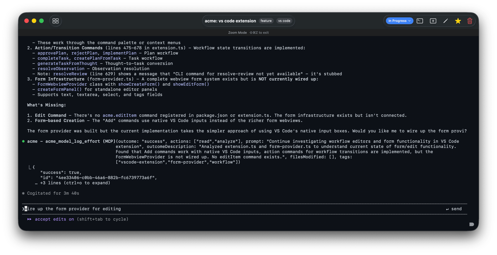
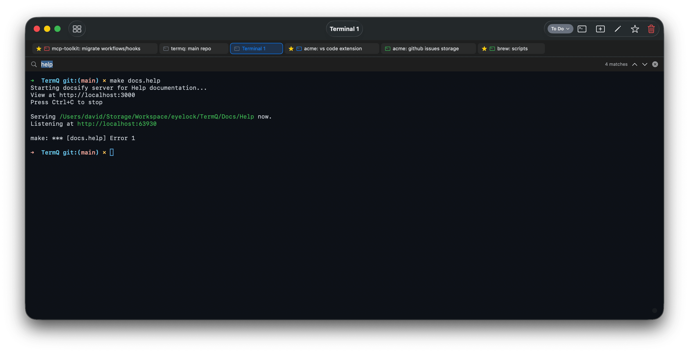
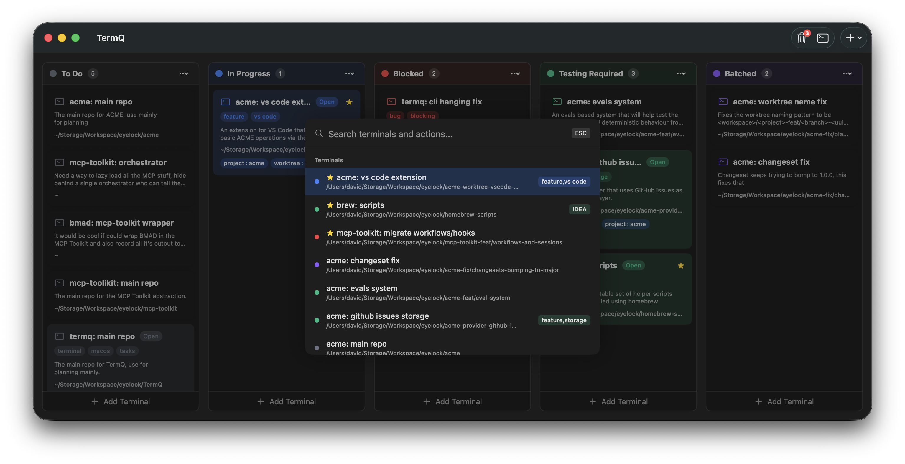
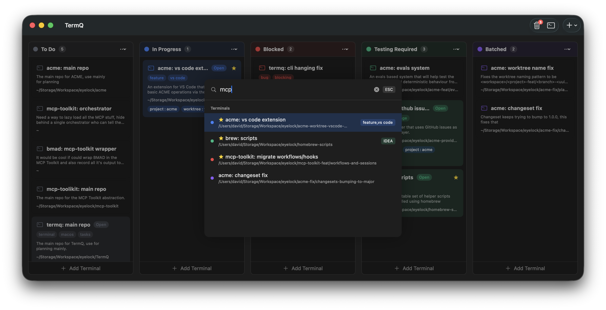
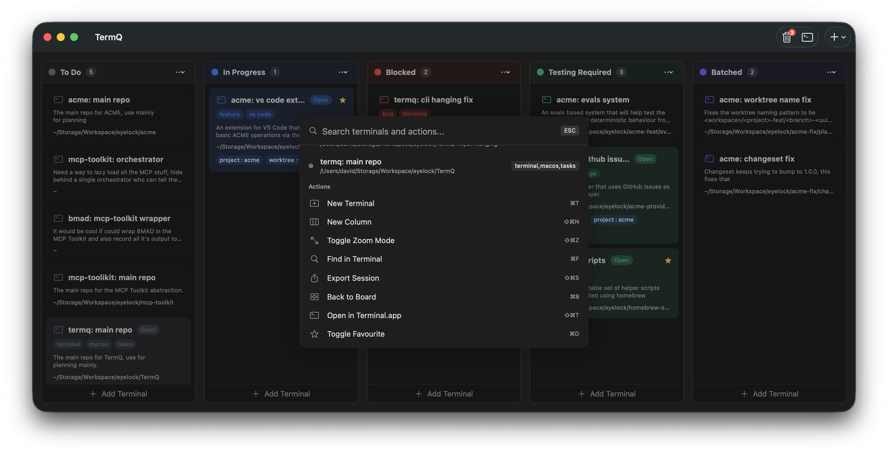

# Tutorial 3: Find Anything Fast

Once your board has more than a handful of cards, you need fast ways to get to the right terminal. TermQ has three: zoom mode for focused work, find-in-buffer for searching terminal output, and the command palette for jumping anywhere instantly.

**Requires:** A board with several terminals.

---

## 3.1 — Zoom mode

When you're working in a terminal, pressing **⌘⌥Z** expands it to fill the full window — no board, no columns, just the terminal.

Press **⌘⌥Z** again to return to the board. Zoom is useful when you need to concentrate on output — long build logs, test runs, anything where you want maximum screen space.

> **Shortcut:** **⌘B** always takes you back to the board from any view.

---

## 3.2 — Find in buffer (⌘F)

Inside any open terminal, press **⌘F** to search the terminal's scrollback buffer.

This searches the text that has already appeared in the terminal — error messages, build output, log lines. Type to filter, press **Enter** to jump to the next match, **Esc** to dismiss.

This is distinct from your shell's own history search (Ctrl+R). ⌘F searches what you can *see* — the rendered output.

---

## 3.3 — The command palette (⌘K)

Press **⌘K** from anywhere to open the command palette.

Start typing to search your terminals by name, description, path, or tags. Results update as you type.

Press **Enter** on a result to open that terminal. This is the fastest way to jump between terminals when you know roughly what you're looking for.

The command palette also surfaces **actions** — things you can do to the currently selected terminal:

Actions include opening the editor, moving to a different column, pinning, and more. If you find yourself reaching for the context menu, try **⌘K** first.

---

## 3.4 — Quick terminal (⌘T)

**⌘T** creates a new terminal in the *same column and working directory* as your current one. This is useful when you're mid-task and need a second shell alongside the one you're in — without going through the full new terminal dialog.

The new terminal inherits the working directory, so you land in the right place immediately.

---

## What you learned

- **⌘⌥Z** toggles zoom mode — full-screen terminal, no distractions
- **⌘F** searches the terminal's scrollback buffer — useful for finding output you've already seen
- **⌘K** opens the command palette — the fastest way to jump to a terminal or trigger an action
- **⌘T** creates a new terminal in the same column and working directory as the current one

## Next

[Tutorial 4: Organise Your Space](tutorials/04-organise-your-space.md) — Columns, themes, and defaults.
