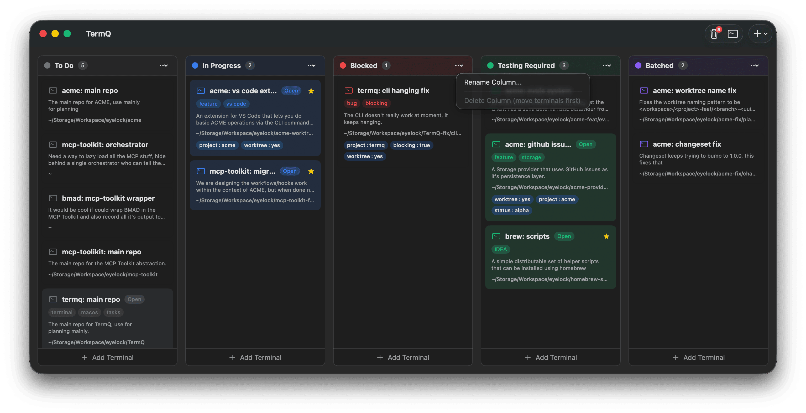
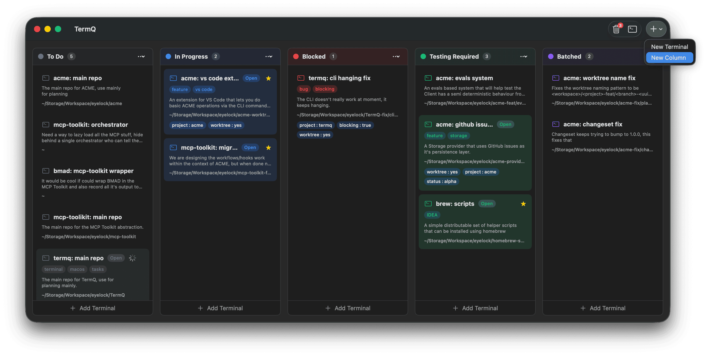
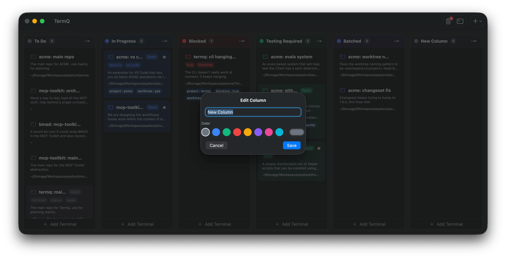
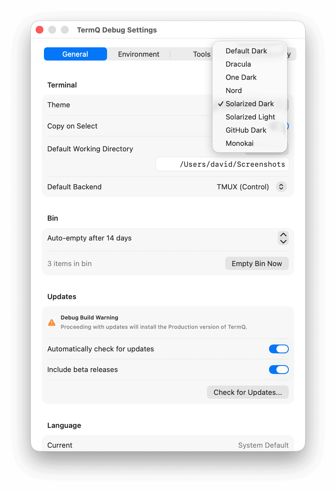
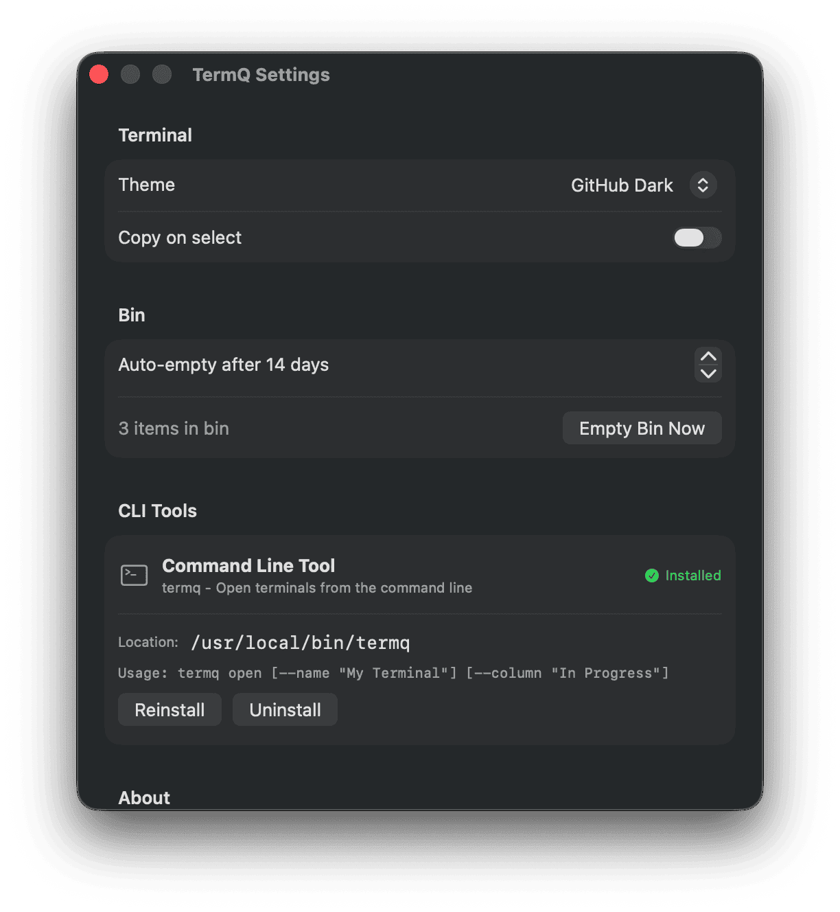

# Tutorial 4: Organise Your Space

The default column layout is a starting point, not a prescription. In this tutorial you'll customise your columns to match how you actually work, pick a theme you can live with, and set defaults so new terminals behave the way you expect.

---

## 4.1 — Rename a column

Column names should match your workflow stages. Click the **⋯** menu on any column header to edit it.

Rename the columns to whatever makes sense for you. Some patterns that work well:

| If you... | Try columns like... |
|---|---|
| Work across projects | `Active`, `Parked`, `Done` |
| Manage environments | `Local`, `Staging`, `Production` |
| Track task status | `To Do`, `In Progress`, `Blocked`, `Done` |
| Separate by concern | `Servers`, `Tools`, `Scratch` |

There's no right answer. The question is: when you glance at the board, can you immediately see what's waiting, what's running, and what's done?

---

## 4.2 — Add a column

Press **⌘⇧N** or use the **+** menu to add a new column.

Enter a name and pick a colour — colours are how you distinguish columns at a glance when your board is full.

---

## 4.3 — Reorder and delete columns

Drag column headers to reorder them. Columns can only be deleted when they contain no cards — move or delete the cards first.

---

## 4.4 — Choose a theme

Open **Settings** (⌘,) and go to the **Appearance** section. TermQ ships with eight themes — Dracula, Nord, Solarized Dark, Solarized Light, One Dark, Monokai, Gruvbox, and the default.

The theme applies to all terminal views. Pick one that works well with your other tools — if you use VS Code's Nord theme, Nord here will feel consistent.

---

## 4.5 — Set defaults for new terminals

In **Settings > General**, you can set two defaults that apply whenever you create a new terminal:

**Default Working Directory** — If most of your work lives in one directory (e.g. `~/code`), set it here. New terminals open there unless you specify otherwise.

**Default Backend** — Choose between Direct and tmux. If you've set up tmux integration (see [Tutorial 5](tutorials/05-persistent-sessions.md)), set the default to tmux so new terminals use it automatically.

**Scrollback** — Controls how many lines of output TermQ retains in each terminal's scroll history. The default is 5,000 lines. If you run long-lived sessions — AI assistant conversations, build logs, test runs — raise this to 10,000 or more so you can scroll back further. Changes apply to newly created terminals; existing terminals keep the value they were opened with.

---

## 4.6 — Keyboard shortcuts overview

TermQ is designed to be keyboard-driven once you know it. The shortcuts you'll use most:

| Action | Shortcut |
|---|---|
| New terminal (with dialog) | ⌘N |
| Quick new terminal (same column/dir) | ⌘T |
| New column | ⌘⇧N |
| Command palette | ⌘K |
| Back to board | ⌘B |
| Zoom mode | ⌘⌥Z |
| Find in buffer | ⌘F |
| Toggle favourite | ⌘D |
| Open Settings | ⌘, |

Full reference: [Keyboard Shortcuts](reference/keyboard-shortcuts.md)

---

## What you learned

- **Column names and colours** are yours to define — make them match your workflow
- **⌘⇧N** adds a new column; drag headers to reorder; delete only when empty
- **Themes** apply globally — pick once and forget
- **Default working directory and backend** save you from setting them on every new terminal
- **Scrollback** sets how many lines of history each terminal retains — raise it for long sessions

## Next

[Tutorial 5: Persistent Sessions](tutorials/05-persistent-sessions.md) — Keep your terminal sessions alive across app restarts with tmux.
