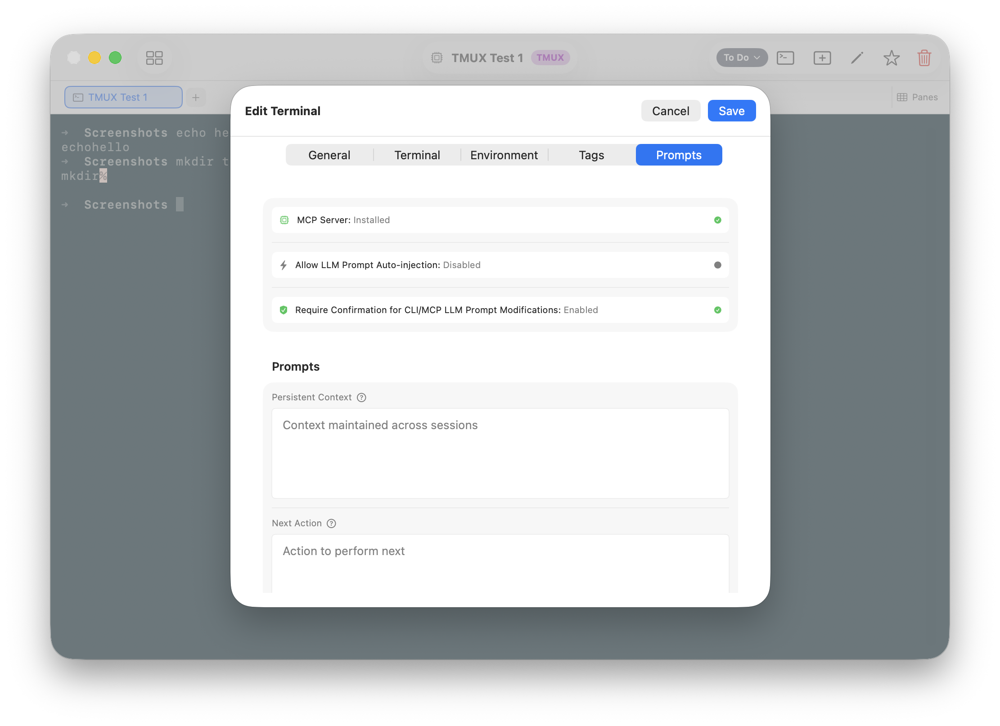

# Tutorial 9: Persistent AI Context

When you open Claude Code or another LLM assistant in a terminal, it starts with no knowledge of what you've been working on. You re-explain the project, re-establish context, re-describe what you were doing last time. Every session starts from zero.

TermQ gives LLM assistants a memory: two fields on each terminal card that carry context across sessions.

---

## 9.1 — The two context fields

Open any terminal card's editor (right-click > Edit Details) and look for the **LLM** section:



| Field | What it's for |
|---|---|
| **LLM Prompt** | Persistent context — what this terminal is for, what the LLM should know every session |
| **Next Action** | One-time queued task — what to do the next time this terminal is opened |

Both fields are plain text. Write them however is most useful to read back.

---

## 9.2 — LLM Prompt: standing context

Think of this as the standing brief for any AI assistant that opens in this terminal. Write it like you're handing off to a colleague who's never seen this project:

```
This terminal is for the API server (FastAPI, Python 3.12).
Codebase is at ~/code/myapp. The main entry point is main.py.
We are refactoring the auth module — see auth/v2/ for the WIP.
Do not touch auth/v1/ — it's in production and frozen.
Run `make test` to verify changes.
```

This prompt is there every session. There are two ways it reaches an LLM assistant:

**Automatically** — via the `{{PROMPT}}` token in the terminal's init command (see [Tutorial 11](tutorials/11-queued-actions.md)). When the terminal opens, the token is replaced with this field's content before the command runs — e.g. `claude "{{PROMPT}} {{NEXT_ACTION}}"` becomes a single prompt combining standing context and the queued task.

**On demand** — when an LLM assistant calls `termq_open` or `termq_get` via the MCP server, the response includes this field. The assistant reads it and orients itself. See [Tutorial 10](tutorials/10-mcp.md).

**When to update it:** When the nature of the work changes substantially. After finishing the auth refactor, update it to reflect what the terminal is for now.

---

## 9.3 — Next Action: one-time handoff

This is a queued task for the next session — a specific instruction for what to do when the terminal is next opened:

```
Run `make test` and check if AUTH-23 is resolved.
If tests pass, open a PR against main.
```

Like the LLM Prompt, there are two ways this reaches an LLM assistant:

**Automatically** — via the `{{NEXT_ACTION}}` token in the init command. When the terminal opens and queued actions are enabled, the token is replaced with this field's content, the command runs, and the field is cleared. It fires once and is gone. See [Tutorial 11](tutorials/11-queued-actions.md).

**On demand** — `termqcli pending` and `termq_pending` (MCP) surface terminals that have a Next Action set. The LLM reads it and acts on it, then clears it when done.

> **The key difference:** LLM Prompt is *always present* — it's standing context that doesn't change often. Next Action is *consumed once* — it's for handoffs between sessions.

---

## 9.4 — Staleness tags

A useful convention is to add a `staleness` tag to each terminal and update it as you work:

| Value | Meaning |
|---|---|
| `fresh` | Worked on recently, context is current |
| `ageing` | A few days old, context may have drifted |
| `stale` | Hasn't been touched in a while |

`termqcli pending` sorts stale terminals first, so the ones most likely to need attention surface at the top.

```bash
# Mark fresh when you finish a session
termqcli set "API Server" --tags staleness=fresh

# Mark ageing when handing off
termqcli set "API Server" --tags staleness=ageing
```

---

## 9.5 — The manual session workflow

If you're not using autorun, or want to manage context explicitly, the recommended flow is:

**At the start of a session:**
1. Run `termqcli pending` to see which terminals have queued actions or are going stale
2. Open the specific terminal: `termqcli open "API Server"` — the response includes both the LLM Prompt and Next Action
3. Orient the session using the LLM Prompt; address the Next Action first if one is set

**At the end of a session:**
1. Set a Next Action if work is incomplete
2. Update `staleness=fresh` on terminals you worked on
3. Update the LLM Prompt if the standing context has materially changed

This discipline means the next session — whether it's you tomorrow or an AI assistant picking up automatically — has the context to continue exactly where you left off.

---

## What you learned

- **LLM Prompt** is persistent context — always present, updated when the work changes substantially
- **Next Action** is a one-time queued task — consumed once, then cleared
- Both fields can be delivered **automatically** via init command tokens, or **on demand** via the CLI and MCP server
- **Staleness tags** help surface what needs attention — `termqcli pending` sorts by them

## Next

[Tutorial 10: MCP Integration](tutorials/10-mcp.md) — Wire up Claude Code to your TermQ board directly via the Model Context Protocol.
