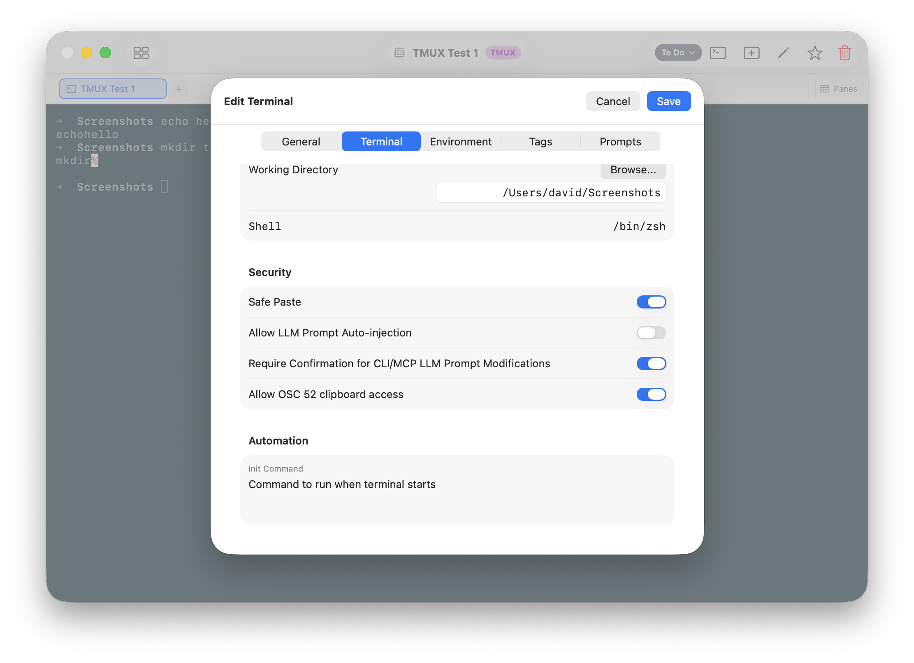
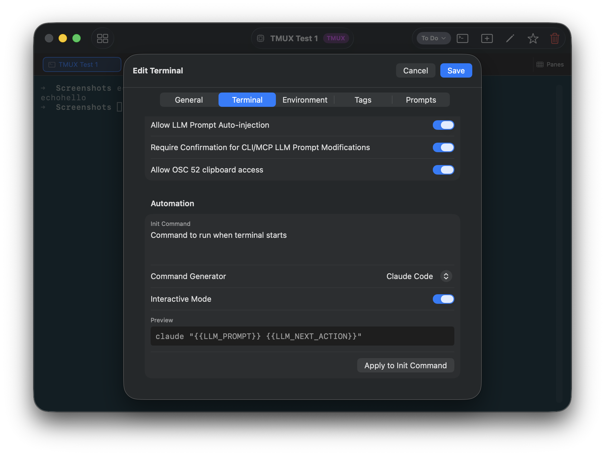

# Tutorial 11: Queued Actions

In [Tutorial 9](tutorials/09-ai-context.md) you learned about the **Next Action** field — a queued instruction an AI assistant can set on a terminal for the next session. Queued Actions takes that one step further: instead of waiting for you to open the terminal and manually start an AI session, the action executes automatically the moment the terminal opens.

This is an opt-in feature that requires two deliberate permissions — both off by default.

---

## 11.1 — How init commands work

Before explaining queued actions, it helps to understand init commands.

When a terminal opens, TermQ waits for the shell to start, then types the **Init Command** into it automatically — exactly as if you had typed it yourself and pressed Enter. It's a normal shell command; the shell receives it and runs it.

For example, if your init command is:

```bash
claude "What is the current status of this project?"
```

...then every time you open that terminal, it launches Claude Code with that question as the starting prompt. No typing required.

Init commands appear in the terminal editor under **Terminal > Init Command**.

---

## 11.2 — The tokens

TermQ provides two tokens you can embed in an init command. When the terminal opens, they are replaced with values from the terminal's card before the command is typed into the shell:

| Token | Replaced with |
|---|---|
| `{{PROMPT}}` | The terminal's **LLM Prompt** field — the persistent standing context |
| `{{NEXT_ACTION}}` | The terminal's **Next Action** field — the one-time queued task |

Both tokens go into a single quoted string passed to the CLI tool. For Claude Code:

```bash
claude "{{PROMPT}} {{NEXT_ACTION}}"
```

...which becomes something like:

```bash
claude "FastAPI service, entry point is main.py. Auth refactor in progress. Run the test suite and check if AUTH-23 is resolved."
```

That's the entire command typed into the shell. Claude Code starts with the standing context and the specific task combined into one prompt, and gets to work immediately.

For non-interactive use (Claude Code print mode):

```bash
claude -p "{{PROMPT}} {{NEXT_ACTION}}"
```

---

## 11.3 — Queued Actions and the Next Action

The **Prompt** token is always substituted — it's just standing context that goes in on every session.

The **Next Action** token is different: it's a one-time queued task. Once it's injected, it's cleared from the card so it doesn't repeat next time. This is the queued action mechanism — the queued action fires once when the terminal opens, then is gone.

For either token to be substituted, two permissions must both be on:

| Permission | Where |
|---|---|
| **Enable Queued Actions** (global) | Settings > Data & Security |
| **Allow Queued Actions** (per-terminal) | Terminal editor > Terminal tab > Security |

If either is off, both tokens are replaced with empty strings, the Next Action field is not consumed, and the terminal opens normally.

---

## 11.4 — Enable queued actions

**Step 1 — Global switch:**

Open **Settings** (⌘,), go to the **Data & Security** tab, and enable **Enable Queued Actions**.


**Step 2 — Per-terminal switch:**

Open the terminal card editor, go to the **Terminal** tab, scroll to the **Security** section, and enable **Allow Queued Actions**.



---

## 11.5 — Set up the init command

Once both permissions are enabled, a **Command Generator** section appears in the terminal editor. This is the easiest way to set up the init command.

Pick your LLM tool from the dropdown — Claude Code, Cursor, Aider, GitHub Copilot, or Custom. For Claude Code and Cursor you can also choose:

- **Interactive Mode** on — Claude starts and waits for input, useful when you want to supervise the session
- **Interactive Mode** off — Claude runs the task and exits without prompts, useful for fully automated pipelines

A preview of the generated command is shown beneath the picker. Click **Apply to Init Command** to write it into the Init Command field.



The generated command for Claude Code (interactive) looks like:

```bash
claude "{{PROMPT}} {{NEXT_ACTION}}"
```

And non-interactive:

```bash
claude -p "{{PROMPT}} {{NEXT_ACTION}}"
```

When no Next Action is queued, `{{NEXT_ACTION}}` becomes an empty string and Claude Code launches with just the Prompt — normal behaviour.

You can edit the generated command after applying it. For example, to source an env file first:

```bash
source .env && claude "{{PROMPT}} {{NEXT_ACTION}}"
```

---

## 11.6 — Queue a Next Action

Set the Next Action on a terminal — either manually in the editor's **Next Action** field, or via the CLI:

```bash
termqcli set "API Server" --llm-next-action "Run the test suite and check if AUTH-23 is resolved."
```

Or via MCP (what Claude does at session end):

```
termq_set identifier="API Server" llmNextAction="Run the test suite and check if AUTH-23 is resolved."
```

Now the next time that terminal opens, the queued action fires.

---

## 11.7 — The full workflow

1. **Session ends** — Claude sets the Next Action field on the terminal with the next task
2. **Next session** — you open TermQ and click that terminal card
3. **Init command runs** — TermQ types `claude --system "..." "Run the test suite..."` into the shell
4. **Claude starts** — receives the standing context and the specific task, begins work immediately
5. **Next Action cleared** — the field is emptied so it won't repeat
6. **Session ends** — Claude sets the Next Action again for the following session

The human's role is opening the terminal. The handoff between Claude sessions happens through the card metadata.

---

## 11.8 — What happens when queued actions are disabled

If either permission is off when the terminal opens:
- Both `{{PROMPT}}` and `{{NEXT_ACTION}}` are replaced with empty strings
- The Next Action field is **not** consumed — it's preserved for when queued actions are re-enabled
- The init command still runs, but with the tokens removed — so `claude ""` would be the result if nothing else is in the command
- The terminal opens normally

---

## What you learned

- The **init command** is text typed into the terminal's shell automatically when it opens
- `{{PROMPT}}` and `{{NEXT_ACTION}}` are tokens replaced with the terminal's card fields before the command runs
- **Next Action** is a one-shot trigger — consumed when injected, then cleared
- **Prompt** is injected every session — it's standing context, not a one-time action
- Both tokens require the same two permissions: global (**Settings > Data & Security**) and per-terminal (**Terminal tab > Security**)

---

You've reached the end of the tutorials. From here:

- **[CLI Reference](reference/cli.md)** — Complete `termqcli` command reference
- **[MCP Reference](reference/mcp.md)** — All MCP tools, resources, and prompts
- **[Keyboard Shortcuts](reference/keyboard-shortcuts.md)** — Full shortcut list
- **[Security](reference/security.md)** — Safe paste, clipboard, queued action permissions, and data security
