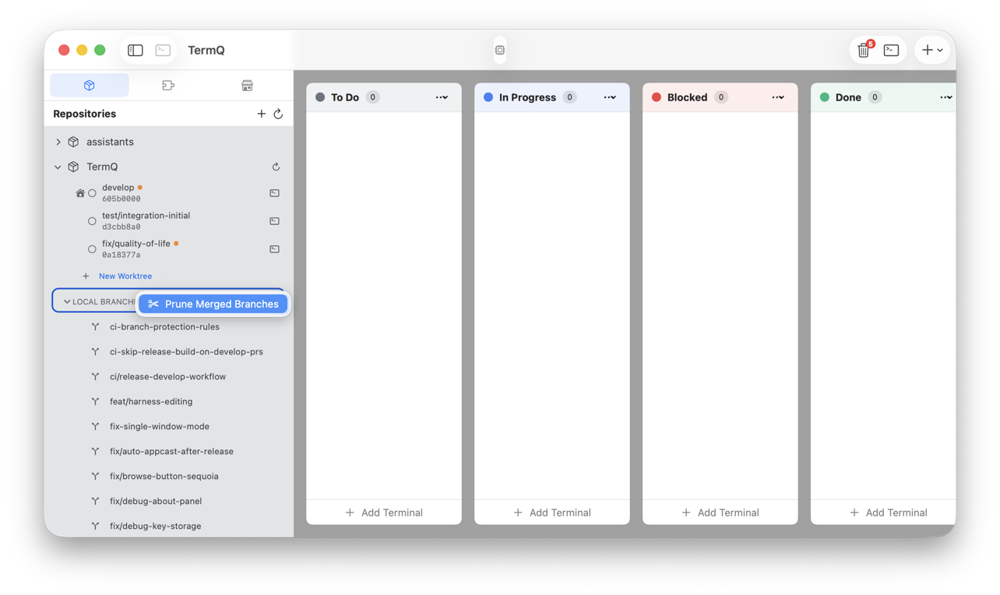
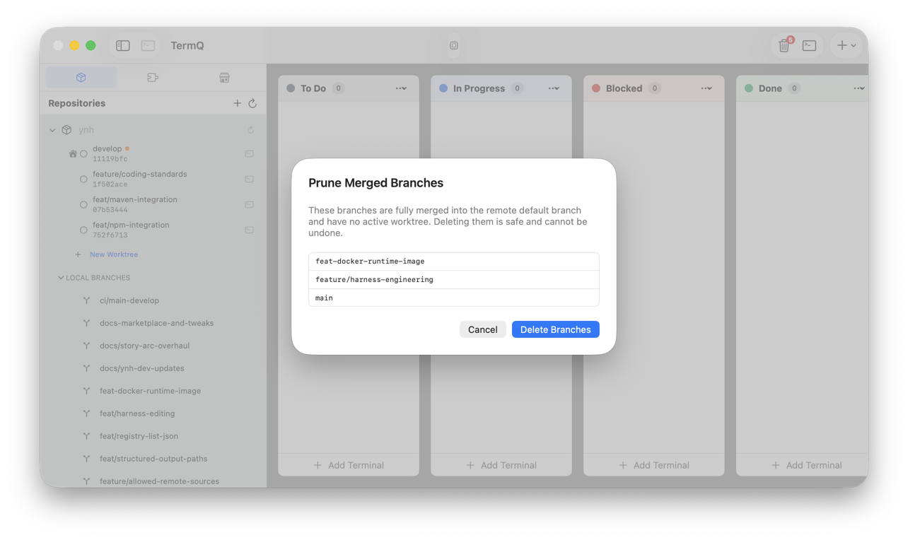
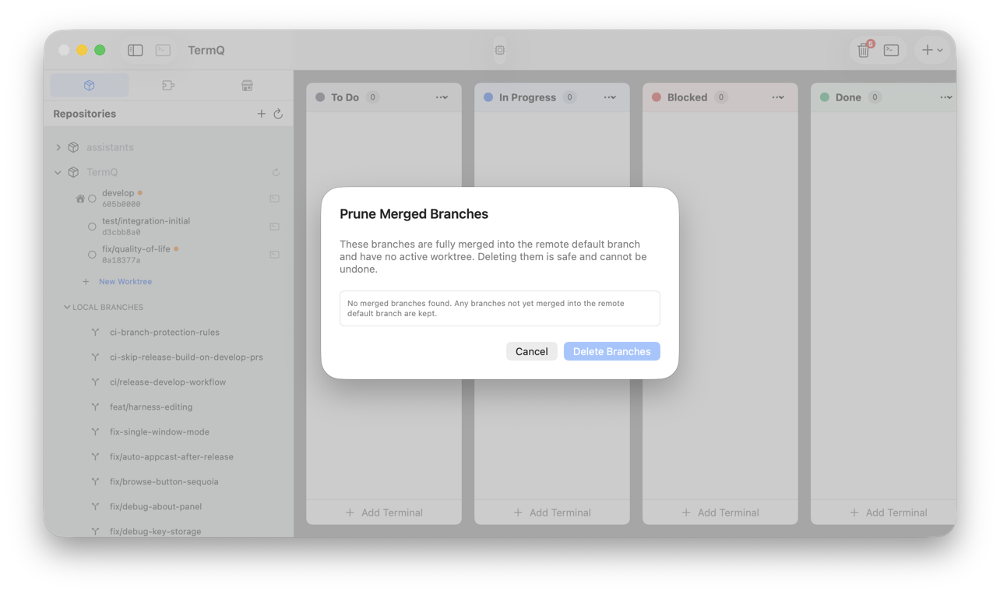
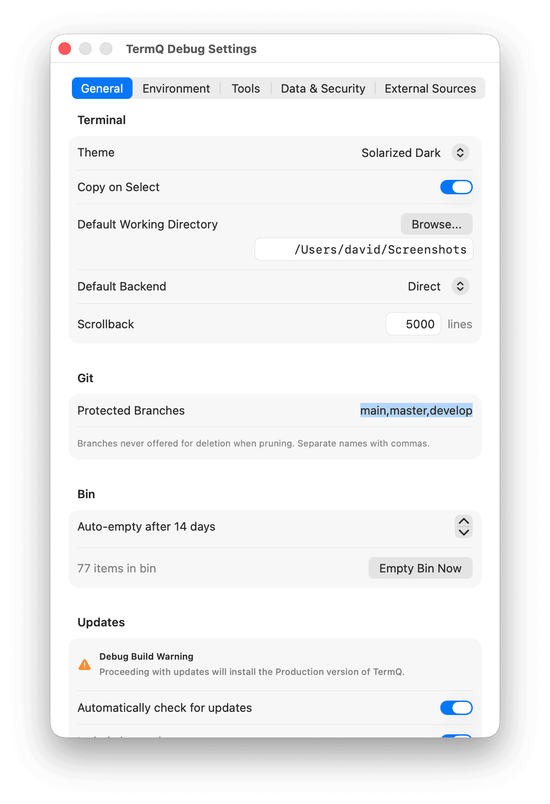

# Tutorial 12: Git Worktrees

In this tutorial you'll connect a git repository to TermQ and use the worktree sidebar to manage branches, open terminals at the right directory, and jump between active sessions — all without leaving the app.

By the end you'll know how to register a repository, create and remove worktrees, understand when to lock vs remove vs force-delete, and keep the worktree list tidy with pruning.

**Time:** about 15 minutes  
**Requires:** TermQ 0.8 or later, at least one local git repository

---

## 12.1 — What the worktree sidebar is for

A **git worktree** lets you check out multiple branches of the same repository simultaneously, each in its own directory. Instead of stashing, switching branches, and losing your place, you have a separate working tree per branch — each with its own terminal session in TermQ.

The worktree sidebar brings this into TermQ directly:

- Register a repository once
- See all its worktrees listed with branch name, commit hash, and dirty state
- Open a terminal at any worktree with one click
- Jump to an existing terminal from the worktree row

Open the sidebar using the sidebar toggle button in the toolbar, or press **⌘⇧W**.

---

## 12.2 — Register a repository

Click the **+** button at the top of the sidebar.

The **Add Repository** sheet opens.

Fill in the fields:

- **Path** — the root of your git repository (type a path or drag a folder in). TermQ validates this against `git rev-parse --git-dir` before letting you proceed.
- **Name** — what to call this repo in the sidebar. Leave it blank and TermQ infers the name from the remote URL (e.g. `my-app` from `git@github.com:org/my-app.git`).
- **Worktree Base Path** — where new worktrees will be created. Defaults to `{repo}/.worktrees`. Change this if you prefer a different location, such as a directory outside the repo entirely.

### The .gitignore checkbox

If your worktree base path is inside the repository (the default), a checkbox appears offering to add it to `.gitignore`. This prevents the `.worktrees/` directory from appearing as an untracked file in `git status`. Leave it checked unless you have a reason not to.

> **Base path validation:** TermQ blocks paths that equal the repo root or are a parent of it — both would be dangerous locations to place worktrees.

Click **Add**. The repository appears in the sidebar, expanded to show its worktrees.

---

## 12.3 — Reading a worktree row

Each worktree appears as a row with two icon slots on the left, branch name and commit hash in the centre, and a **+** terminal button on the right.

**Left icon — status badge (optional):**
- `⌂` (house) — this is the main worktree (the primary checkout)
- `🔒` (lock, orange) — this worktree is locked against removal
- *(empty)* — a regular linked worktree

**Right icon — terminal count:**
- `○` (empty circle) — no open terminals at this path
- `①` `②` … — one or more open terminals; the number matches the count. Tap to see a popover list.

**Harness badge (jigsaw icon, far right):**
When YNH is installed, a jigsaw icon can appear on worktree rows and the repo header to indicate which harness applies:
- `🟢` (green, on repo header) — a repository-level default harness is set for this repo
- `🟠` (orange, on worktree row) — this specific worktree has its own harness override
- `○` (dim, on worktree row) — no own harness, but inheriting the repo default
- *(absent)* — no harness applies at any level

Tapping the jigsaw badge navigates to that harness in the Harnesses sidebar.

**Dirty indicator:**
An orange dot next to the branch name means the worktree has uncommitted changes — either staged or unstaged. TermQ checks this on every branch switch and every 15 seconds for expanded repos.

---

## 12.4 — Open a terminal or launch a harness

**Clicking the branch name** is the primary action:
- If a harness is linked to this worktree (or inherited from the repo default) and YNH is running, clicking launches the harness directly — no sheet, no prompts. A transient terminal card opens running `ynh run <harness>` at the worktree path.
- If no harness applies, clicking opens a plain new terminal at that path.

The **terminal button** (`⌞`) on the right of the row always opens a plain terminal, bypassing harness lookup — useful when you want a shell without the harness environment.

If you already have terminals open at a worktree, the number badge on the left icon shows the count. Click it to see the list and jump directly to one.

When you jump to a terminal from the popover, the tab bar scrolls to bring that tab into view — useful when you have many terminals open across several worktrees.

**Context menu ordering:** Right-clicking a row when a harness is linked puts **Launch `<harness>`** at the top of the menu — the most contextual action is always first.

---

## 12.5 — Create a new worktree

Right-click a repository row and choose **New Worktree**, or click **+ New Worktree** at the bottom of the expanded worktree list.

Fill in the fields:

- **Branch Name** — the new branch to create. Type any name; slashes are supported (`fix/my-bug` creates a `fix/my-bug` subdirectory under the base path).
- **Base Branch** — the starting point for the new branch. Defaults to the repository's default branch (`origin/HEAD`). Type to search existing local branches.
- **Path** — auto-filled from the branch name and worktree base path. Override if needed.

Click **Create**. Git runs `git worktree add -b <branch> <path> <base>` and the new row appears in the sidebar immediately.

---

## 12.5b — Harness integration from the sidebar

If you have YNH installed, you can link harnesses directly from the worktree sidebar — no need to leave the Repositories tab.

### Setting a repository default harness

Right-click the **repository header row** (the row showing the repo name, e.g. "my-app"). If harnesses are installed, a **Set Harness…** submenu appears. Choose one to set it as the repository default — every worktree that doesn't have its own override will inherit it.

Once set, a green jigsaw icon appears on the repo header. Clear it via the same submenu → **Clear Harness**.

### Setting a per-worktree override

Right-click any worktree row — including the **main worktree** row — and choose **Set Harness…** to pick a harness for that specific worktree. An orange jigsaw badge appears on the row to signal the override.

Worktrees that inherit from the repo default (no own override) show a dimmed jigsaw badge instead.

### What takes precedence

1. Worktree-level override — always wins
2. Repository default — used when no override is set
3. Nothing — no harness, plain terminal

---

## 12.6 — Worktree lifecycle: lock, remove, and force-delete

Right-click any linked worktree (non-main) to see the full set of actions:

### Lock Worktree

Marks the worktree as locked. A locked worktree cannot be accidentally removed with `git worktree remove` or from the sidebar's **Remove Worktree** action.

Use this when a worktree contains important in-progress work — a long-running experiment, a half-done refactor — that you want protected while you work on other branches.

The lock icon appears orange in the left slot of the row.

To unlock: right-click and choose **Unlock Worktree**. The lock is removed and the worktree can be removed normally again.

### Remove Worktree

Runs `git worktree remove` — the standard, safe removal.

This succeeds when:
- The worktree has no uncommitted changes
- The worktree is not locked

If either condition is not met, the operation fails and TermQ shows an error. This is intentional: git protects you from accidentally discarding work.

Use **Remove Worktree** as the default. It's the same as `git worktree remove` at the command line.

> **Cannot remove the main worktree.** The main checkout (marked with the house icon) cannot be removed from the sidebar. To remove the repository entirely, use **Remove Repository** from the repo row's context menu.

### Force Delete Worktree

Runs `git worktree remove --force`, then deletes the directory.

This **bypasses all safety checks**: it removes the worktree even if it is locked or has uncommitted changes. The working directory is deleted from disk.

A confirmation alert appears before TermQ proceeds.

Use this only when you are certain the work in the worktree is not needed. Uncommitted changes will be lost permanently.

---

## 12.7 — Prune stale worktrees

Over time, git can accumulate stale worktree records — entries in `.git/worktrees/` for directories that no longer exist on disk. This happens if a worktree directory is deleted manually rather than via `git worktree remove`.

Right-click a repository row and choose **Prune Worktrees**.

TermQ runs a dry-run first and shows you exactly which entries will be removed. Review the list, then click **Prune** to confirm. This runs `git worktree prune` and clears the stale records.

If there is nothing to prune, TermQ says so and dismisses the sheet.

---

## 12.8 — Checkout a local branch as a worktree

Every git repository accumulates local branches that live only in the main checkout. The **Local Branches** section makes these visible in the sidebar and lets you promote any of them to a full worktree with a single action — no typing required.

### The Local Branches section

When a repository has local branches that are not already checked out as worktrees, a **Local Branches** disclosure group appears below the worktree list. Click the arrow to expand it.

Each branch row shows a branch icon and the branch name. The list is automatically filtered — a branch disappears from this section as soon as you create a worktree for it.

### Create a worktree from a branch

Right-click any branch row and choose **New Worktree**.

The **New Worktree from Branch** sheet opens with the branch pre-filled. Only the worktree path needs confirming — TermQ infers it from the branch name and your configured base path, the same way **New Worktree** does.

Click **Create Worktree**. TermQ runs `git worktree add <path> <branch>` — checking out the existing branch, not creating a new one.

You can also reach this sheet from two other entry points without knowing which branch you want in advance:

- **Repository row** → right-click → **New Worktree from Branch…** — opens the sheet with a branch picker, filtered to branches that don't already have a worktree.
- **Main worktree row** → right-click → **New Worktree from Branch…** — same picker, same filter.

> **Difference from New Worktree:** The standard **New Worktree** action creates a fresh branch (`git worktree add -b`). **New Worktree from Branch** checks out an existing branch without creating anything new.

### Prune merged branches

Over time, the **Local Branches** list fills with branches whose work is long since merged and forgotten. **Prune Merged Branches** removes them all at once.

Right-click the **LOCAL BRANCHES** section header and choose **Prune Merged Branches**.

TermQ opens a sheet and runs `git branch --merged` against the remote default branch in the background. Once analysis completes, the sheet lists every branch that is safe to delete: fully merged into the remote default branch and not currently checked out as a worktree. Branches with active worktrees are always excluded.

If every branch is still live, TermQ says so inline.

Review the list, then click **Delete Branches**. TermQ deletes each branch with `git branch -d` — the safe-delete flag that refuses to remove anything not fully merged, so there is no risk of losing unmerged work. The **Local Branches** section updates immediately when the sheet closes.

> **How branches are protected:** The remote default branch is detected dynamically via `git symbolic-ref refs/remotes/origin/HEAD` — no branch names are hardcoded. Any branch that is checked out in an active worktree is also excluded. In addition, branches listed in the **Protected Branches** setting (see Settings → General → Git) are always excluded from the prune list, regardless of merge state. By default this list contains `main`, `master`, and `develop`. You can also override the protected branches list for a specific repository via **Edit Repository** (right-click the repo row → **Edit Repository…**).

---

## 12.9 — Remote links

From any worktree row, right-click to access remote links:

- **Open Remote Branch** — opens the branch page on GitHub or GitLab in your browser
- **Open Remote Commit** — opens the specific commit page

TermQ constructs the URL from the repo's `origin` remote, converting SSH remotes (`git@github.com:…`) to HTTPS automatically. These actions are no-ops if the repo has no remote configured.

---

## What you learned

- The **worktree sidebar** lists all git worktrees for registered repositories, with branch, commit, and dirty state
- The **dual icon** on each row shows the worktree's status (main/locked/regular) and how many TermQ terminals are open there
- **Clicking the branch name** launches the linked harness (if any) or opens a plain terminal — the harness action is always first in the context menu too
- **Jigsaw badges** show harness state: green on the repo header (default set), orange on a worktree (override), dim (inherited from repo default)
- **Set Harness** is available on the repo header row (sets a default for all worktrees) and on individual worktree rows (including the main worktree)
- **Add Repository** registers a repo with a configurable worktree base path; the `.gitignore` checkbox prevents clutter in `git status`
- **Lock** protects a worktree from accidental removal; **Unlock** reverses it
- **Remove Worktree** is the safe default — it fails if the worktree is locked or dirty
- **Force Delete** bypasses all safety checks and deletes the directory; use with caution
- **Prune** cleans up stale git records for worktrees whose directories no longer exist
- **Local Branches** shows branches that exist locally but have no worktree; right-click any row → **New Worktree** to check it out as a worktree instantly
- **Prune Merged Branches** removes branches fully merged into the remote default; right-click the **LOCAL BRANCHES** header to access it — active worktrees, the default branch, and any **Protected Branches** are always excluded
- **Protected Branches** — a configurable deny-list (default: `main`, `master`, `develop`) prevents those branches from ever appearing in the prune list; set globally in Settings → General → Git, or override per-repo in **Edit Repository**

## Next

[Reference: Keyboard Shortcuts](../reference/keyboard-shortcuts.md) — A complete list of all keyboard shortcuts in TermQ.
