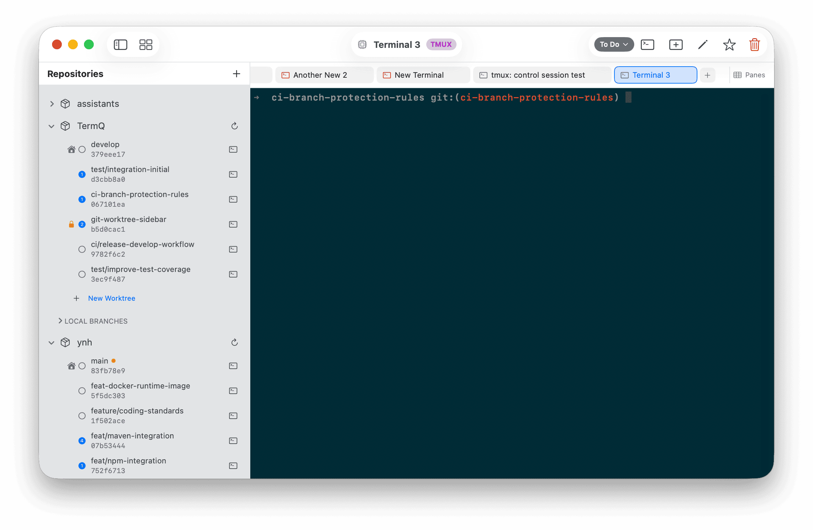
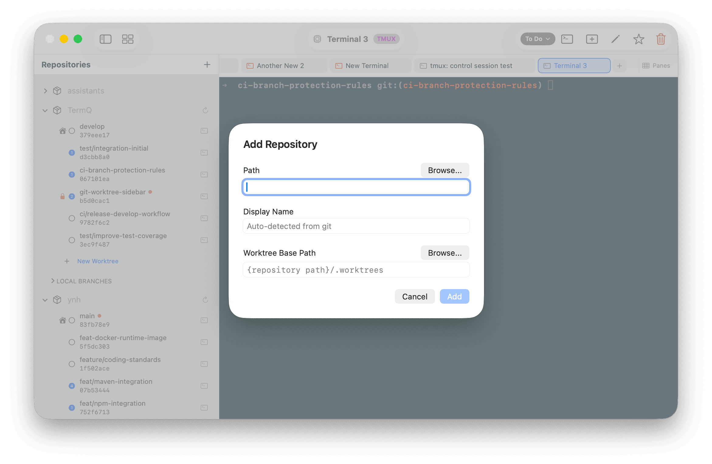
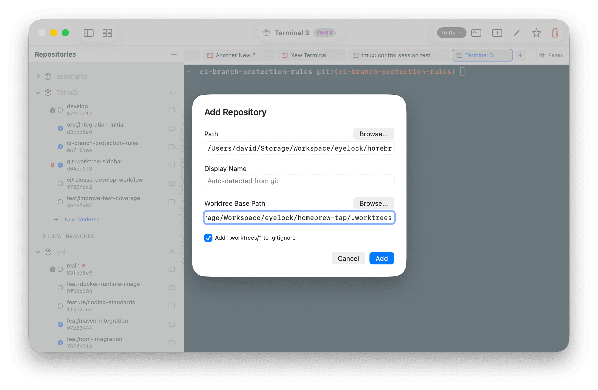
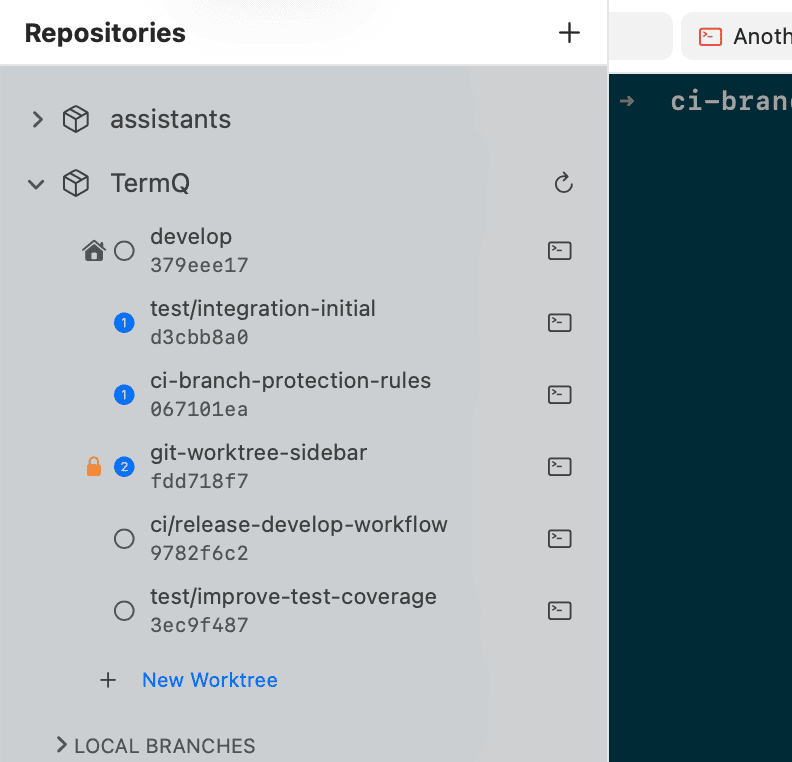
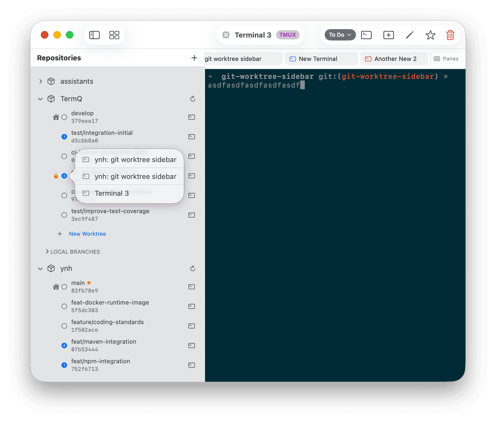
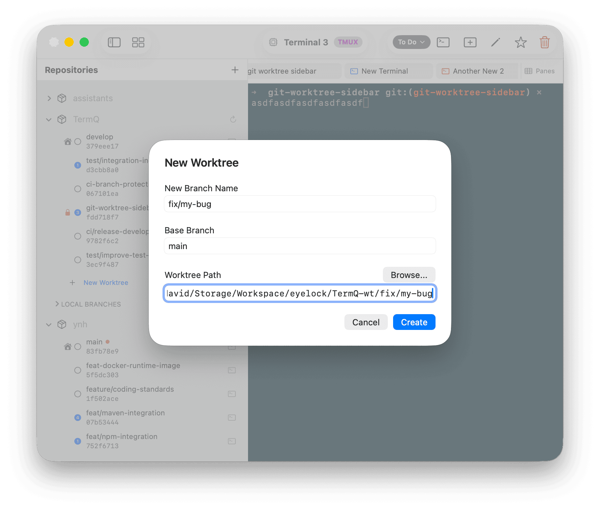
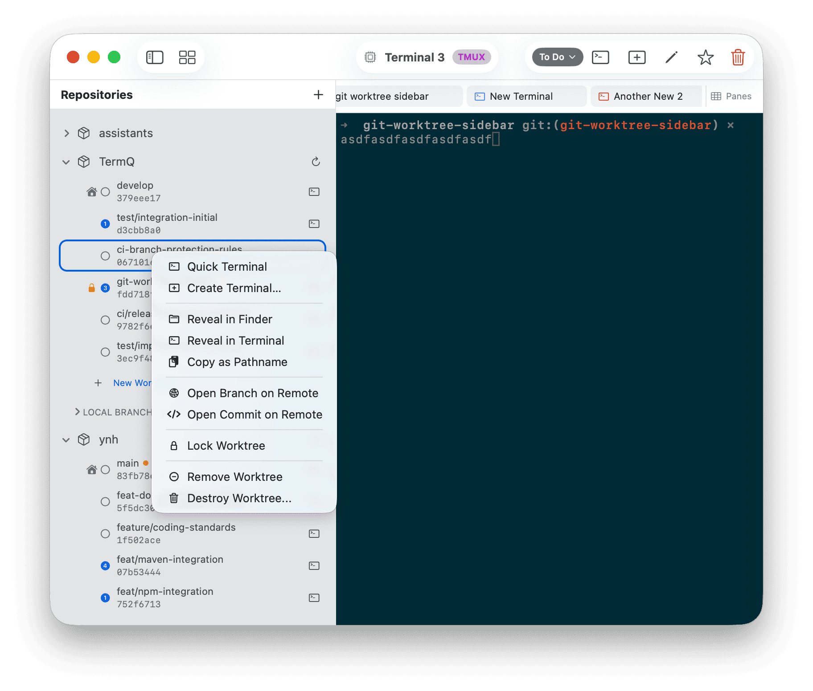
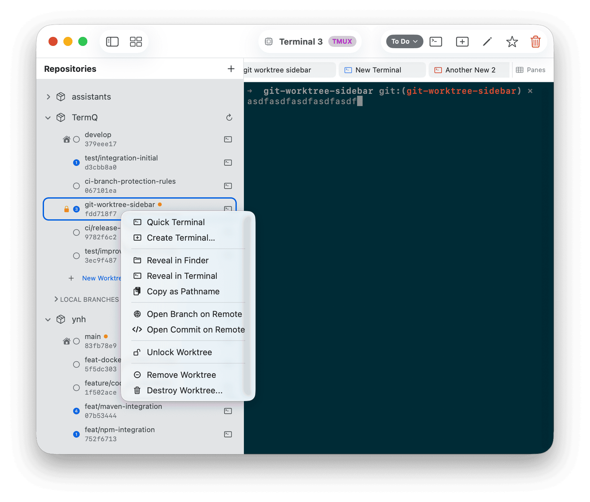
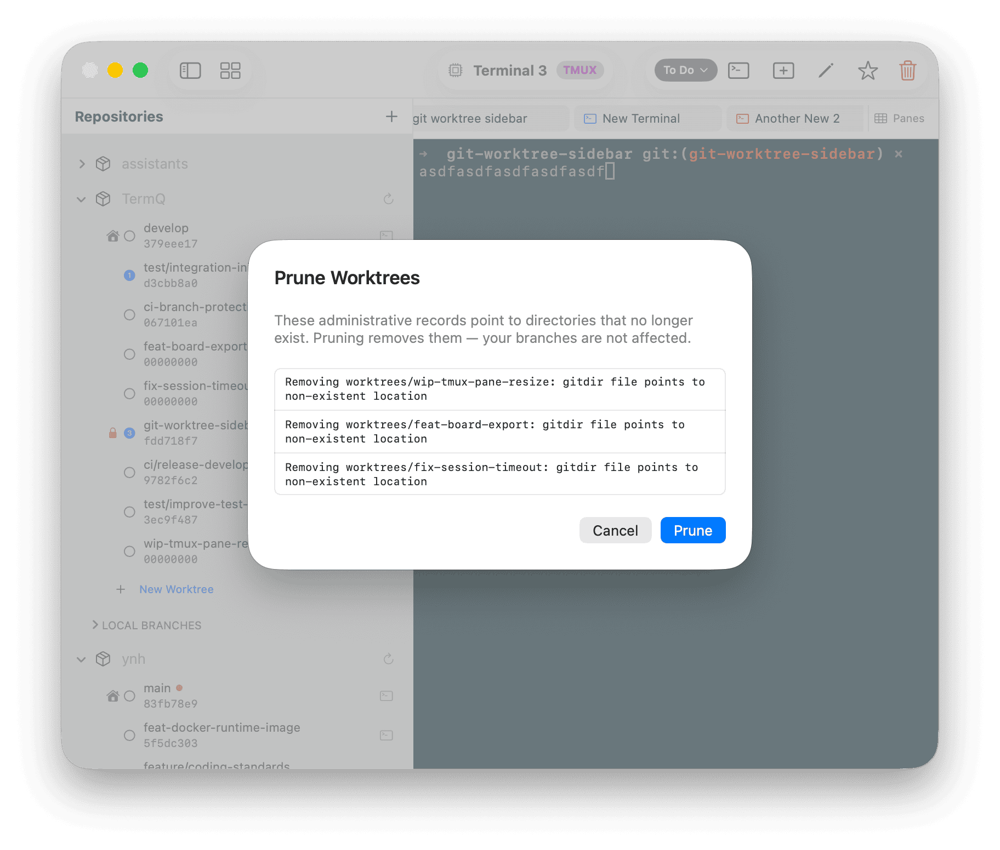
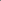

# Tutorial 12: Git Worktree Sidebar

In this tutorial you'll connect a git repository to TermQ and use the worktree sidebar to manage branches, open terminals at the right directory, and jump between active sessions — all without leaving the app.

By the end you'll know how to register a repository, create and remove worktrees, understand when to lock vs remove vs force-delete, and keep the worktree list tidy with pruning.

**Time:** about 15 minutes  
**Requires:** TermQ 0.8 or later, at least one local git repository

---

## 12.1 — What the worktree sidebar is for

A **git worktree** lets you check out multiple branches of the same repository simultaneously, each in its own directory. Instead of stashing, switching branches, and losing your place, you have a separate working tree per branch — each with its own terminal session in TermQ.

The worktree sidebar brings this into TermQ directly:

- Register a repository once
- See all its worktrees listed with branch name, commit hash, and dirty state
- Open a terminal at any worktree with one click
- Jump to an existing terminal from the worktree row

Open the sidebar using the sidebar toggle button in the toolbar, or press **⌘⇧W**.

---

## 12.2 — Register a repository

Click the **+** button at the top of the sidebar.

The **Add Repository** sheet opens.

Fill in the fields:

- **Path** — the root of your git repository (type a path or drag a folder in). TermQ validates this against `git rev-parse --git-dir` before letting you proceed.
- **Name** — what to call this repo in the sidebar. Leave it blank and TermQ infers the name from the remote URL (e.g. `my-app` from `git@github.com:org/my-app.git`).
- **Worktree Base Path** — where new worktrees will be created. Defaults to `{repo}/.worktrees`. Change this if you prefer a different location, such as a directory outside the repo entirely.

### The .gitignore checkbox

If your worktree base path is inside the repository (the default), a checkbox appears offering to add it to `.gitignore`. This prevents the `.worktrees/` directory from appearing as an untracked file in `git status`. Leave it checked unless you have a reason not to.

> **Base path validation:** TermQ blocks paths that equal the repo root or are a parent of it — both would be dangerous locations to place worktrees.

Click **Add**. The repository appears in the sidebar, expanded to show its worktrees.

---

## 12.3 — Reading a worktree row

Each worktree appears as a row with two icon slots on the left, branch name and commit hash in the centre, and a **+** terminal button on the right.

**Left icon — status badge (optional):**
- `⌂` (house) — this is the main worktree (the primary checkout)
- `🔒` (lock, orange) — this worktree is locked against removal
- *(empty)* — a regular linked worktree

**Right icon — terminal count:**
- `○` (empty circle) — no open terminals at this path
- `①` `②` … — one or more open terminals; the number matches the count. Tap to see a popover list.

**Dirty indicator:**
An orange dot next to the branch name means the worktree has uncommitted changes — either staged or unstaged. TermQ checks this on every branch switch and every 15 seconds for expanded repos.

---

## 12.4 — Open a terminal at a worktree

Click the **terminal** button (`⌞`) on the right of any worktree row to open a new terminal at that path.

If you already have terminals open there, the number badge on the left icon shows the count. Click it to see the list and jump directly to one.

When you jump to a terminal from the popover, the tab bar scrolls to bring that tab into view — useful when you have many terminals open across several worktrees.

---

## 12.5 — Create a new worktree

Right-click a repository row and choose **New Worktree**, or click **+ New Worktree** at the bottom of the expanded worktree list.

Fill in the fields:

- **Branch Name** — the new branch to create. Type any name; slashes are supported (`fix/my-bug` creates a `fix/my-bug` subdirectory under the base path).
- **Base Branch** — the starting point for the new branch. Defaults to the repository's default branch (`origin/HEAD`). Type to search existing local branches.
- **Path** — auto-filled from the branch name and worktree base path. Override if needed.

Click **Create**. Git runs `git worktree add -b <branch> <path> <base>` and the new row appears in the sidebar immediately.

---

## 12.6 — Worktree lifecycle: lock, remove, and force-delete

Right-click any linked worktree (non-main) to see the full set of actions:

### Lock Worktree

Marks the worktree as locked. A locked worktree cannot be accidentally removed with `git worktree remove` or from the sidebar's **Remove Worktree** action.

Use this when a worktree contains important in-progress work — a long-running experiment, a half-done refactor — that you want protected while you work on other branches.

The lock icon appears orange in the left slot of the row.

To unlock: right-click and choose **Unlock Worktree**. The lock is removed and the worktree can be removed normally again.

### Remove Worktree

Runs `git worktree remove` — the standard, safe removal.

This succeeds when:
- The worktree has no uncommitted changes
- The worktree is not locked

If either condition is not met, the operation fails and TermQ shows an error. This is intentional: git protects you from accidentally discarding work.

Use **Remove Worktree** as the default. It's the same as `git worktree remove` at the command line.

> **Cannot remove the main worktree.** The main checkout (marked with the house icon) cannot be removed from the sidebar. To remove the repository entirely, use **Remove Repository** from the repo row's context menu.

### Force Delete Worktree

Runs `git worktree remove --force`, then deletes the directory.

This **bypasses all safety checks**: it removes the worktree even if it is locked or has uncommitted changes. The working directory is deleted from disk.

A confirmation alert appears before TermQ proceeds.

Use this only when you are certain the work in the worktree is not needed. Uncommitted changes will be lost permanently.

---

## 12.7 — Prune stale worktrees

Over time, git can accumulate stale worktree records — entries in `.git/worktrees/` for directories that no longer exist on disk. This happens if a worktree directory is deleted manually rather than via `git worktree remove`.

Right-click a repository row and choose **Prune Worktrees**.

TermQ runs a dry-run first and shows you exactly which entries will be removed. Review the list, then click **Prune** to confirm. This runs `git worktree prune` and clears the stale records.

If there is nothing to prune, TermQ says so and dismisses the sheet.

---

## 12.8 — Checkout a local branch as a worktree

Every git repository accumulates local branches that live only in the main checkout. The **Local Branches** section makes these visible in the sidebar and lets you promote any of them to a full worktree with a single action — no typing required.

### The Local Branches section

When a repository has local branches that are not already checked out as worktrees, a **Local Branches** disclosure group appears below the worktree list. Click the arrow to expand it.

Each branch row shows a branch icon and the branch name. The list is automatically filtered — a branch disappears from this section as soon as you create a worktree for it.

### Create a worktree from a branch

Right-click any branch row and choose **New Worktree**.

The **New Worktree from Branch** sheet opens with the branch pre-filled. Only the worktree path needs confirming — TermQ infers it from the branch name and your configured base path, the same way **New Worktree** does.

Click **Create Worktree**. TermQ runs `git worktree add <path> <branch>` — checking out the existing branch, not creating a new one.

You can also reach this sheet from two other entry points without knowing which branch you want in advance:

- **Repository row** → right-click → **New Worktree from Branch…** — opens the sheet with a branch picker, filtered to branches that don't already have a worktree.
- **Main worktree row** → right-click → **New Worktree from Branch…** — same picker, same filter.

> **Difference from New Worktree:** The standard **New Worktree** action creates a fresh branch (`git worktree add -b`). **New Worktree from Branch** checks out an existing branch without creating anything new.

---

## 12.9 — Remote links

From any worktree row, right-click to access remote links:

- **Open Remote Branch** — opens the branch page on GitHub or GitLab in your browser
- **Open Remote Commit** — opens the specific commit page

TermQ constructs the URL from the repo's `origin` remote, converting SSH remotes (`git@github.com:…`) to HTTPS automatically. These actions are no-ops if the repo has no remote configured.

---

## What you learned

- The **worktree sidebar** lists all git worktrees for registered repositories, with branch, commit, and dirty state
- The **dual icon** on each row shows the worktree's status (main/locked/regular) and how many TermQ terminals are open there
- **Add Repository** registers a repo with a configurable worktree base path; the `.gitignore` checkbox prevents clutter in `git status`
- **Lock** protects a worktree from accidental removal; **Unlock** reverses it
- **Remove Worktree** is the safe default — it fails if the worktree is locked or dirty
- **Force Delete** bypasses all safety checks and deletes the directory; use with caution
- **Prune** cleans up stale git records for worktrees whose directories no longer exist
- **Local Branches** shows branches that exist locally but have no worktree; right-click any row → **New Worktree** to check it out as a worktree instantly

## Next

[Reference: Keyboard Shortcuts](../reference/keyboard-shortcuts.md) — A complete list of all keyboard shortcuts in TermQ.
