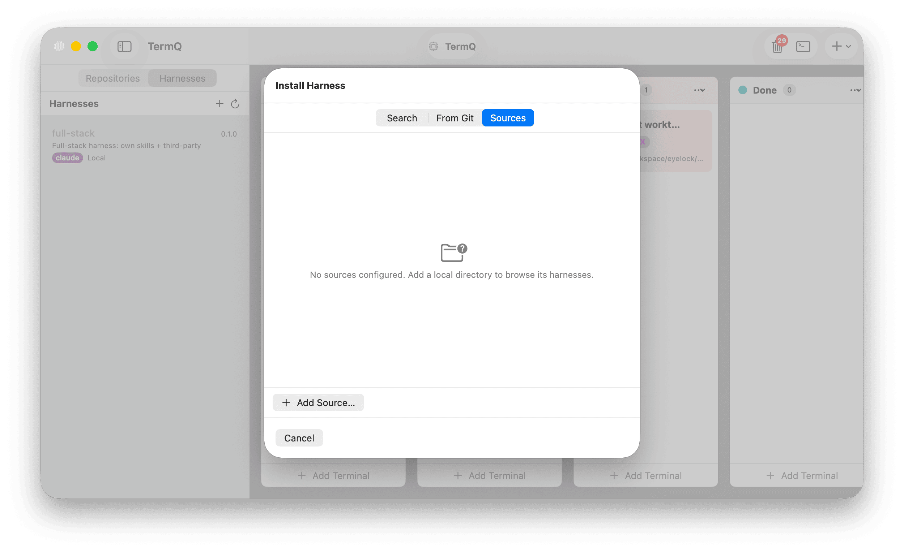

# Tutorial 13: Harnesses

In this tutorial you'll connect TermQ to [YNH](https://github.com/eyelock/ynh), browse and install AI harnesses from registries, Git URLs, and local sources, then launch them in dedicated terminal sessions — all without leaving the app.

By the end you'll know how to enable the Harnesses tab, run through the YNH detection and setup flow, install your first harness, link it to a git worktree, and manage the full lifecycle including updates and uninstalls.

**Time:** about 20 minutes
**Requires:** TermQ 0.8 or later, [YNH CLI](https://github.com/eyelock/ynh) installed

---

## 13.1 — What the Harnesses tab is for

A **harness** is a reusable bundle of AI configuration — skills, rules, MCP servers, prompt profiles — that you can apply to any directory. Instead of re-configuring Claude, Cursor, or your other AI tools per project, you install a harness once and tell TermQ which worktrees should use it.

The Harnesses tab brings this workflow into TermQ directly:

- Detect whether YNH is installed and ready on this machine
- Browse and install harnesses from registries, Git, or local source directories
- View a full breakdown of what each harness contains (hooks, MCP servers, profiles, focuses)
- Link git worktrees to harnesses so launching a terminal "just works"
- Update, duplicate, and uninstall harnesses with one right-click


The tab sits alongside **Repositories** as a segmented picker at the top of the sidebar.

---

## 13.2 — Enabling the Harnesses tab

The Harnesses tab is **opt-in** for 0.8. Open Settings (**⌘,**) and find the **YNH Harness Toolchain** section.


Toggle **Enable Harnesses tab**. The sidebar now shows a two-segment picker at the top.

Switching tabs in the sidebar persists across launches — if you end a session in Harnesses, you come back to Harnesses next time.

---

## 13.3 — YNH detection

TermQ auto-detects the `ynh` binary on launch and on app focus. If it's not found, the tab shows an install prompt:


Install YNH via its documented method (Homebrew, release binary, `go install`), then click the refresh button in the tab header. No restart needed — TermQ rechecks on every app-focus event.

When YNH is installed and ready, the harness list appears.

> **Where TermQ looks:** `PATH`, then common fallbacks (`/opt/homebrew/bin`, `/usr/local/bin`, `~/go/bin`). If yours is elsewhere, set a custom path in Settings → YNH Harness Toolchain.

---

## 13.4 — Installing a harness

Click the **+** button in the Harnesses tab header. The **Install Harness** sheet opens with three tabs: **Search**, **From Git**, and **Sources**.

### Search tab — browse and discover


The Search tab opens in **browse mode** immediately — no typing required. TermQ queries all configured registries and local sources in the background and organises results into three sections:

- **Installed** — harnesses you already have, shown for reference
- **Available from Registries** — harnesses in your configured YNH registries that aren't yet installed. Each row shows a coloured registry pill (blue) alongside the vendor chips.
- **Available Locally** — harnesses found in configured local sources that aren't installed. These show a grey source pill and are typically your own forks or experiments.


Type in the search field to filter. Results update live across all configured registries and sources as you type. Clear the field to return to browse mode.

Click **Install** on any row. TermQ opens a transient terminal running `ynh install <name>`, streams the output, and auto-closes on success. The harness appears in the sidebar immediately.

> **Empty registries section?** Add a registry first — click the **globe** button in the Harnesses sidebar header. See §13.3 for a walk-through.

> **No locally available section?** Local sources aren't configured yet — use the **Sources** tab to add one.

### From Git


Install directly from any Git URL. The Subpath field is optional — use it when a monorepo has a harness at `ynh/my-harness` rather than the repo root.

A live command preview shows the exact `ynh install` invocation TermQ will run, so you can verify before clicking **Install**.

### Sources



Local source directories are places YNH searches when you run `ynh search` or `ynh install <name>`. They're ideal for harnesses you're authoring locally and iterating on — changes you make on disk are picked up immediately without reinstalling.

Click **Add Source…** to pick a directory. The row shows the source name, path, and harness count — the count renders in orange when zero, which usually means the directory doesn't contain any `.harness.json` files yet.

---

## 13.5 — Reading the detail pane

Click a harness in the list to open its detail pane on the right.


The pane is split into sections:

- **Header** — name, version, description, vendor badge, source chip, and action buttons (Launch, ⋯ menu, close ×)
- **Linked Worktrees** — any git worktrees configured to use this harness; each row has a quick Launch button
- **Information** — install path, source, install timestamp
- **Artifacts** — summary counts from the harness's own configuration
- **Composition** — resolved hooks, MCP servers, profiles, and focuses after `ynd compose` merges includes
- **Dependencies** — other harnesses this one includes, delegates to, or picks from
- **Manifest** — the raw `.harness.json`, collapsible, copyable

---

## 13.6 — Linking a worktree to a harness

This is the connective tissue that makes harnesses useful: tell TermQ which harness a worktree should use, and clicking the worktree row will launch it automatically.

### Repository default vs. worktree override

There are two levels of linkage, both accessible from the **Repositories** sidebar:

**Repository default:** Right-click the **repo header row** (the row showing the repo name). Choose **Set Harness…** to pick a default that applies to every worktree in that repo unless overridden. A green jigsaw icon appears on the repo header.

**Worktree override:** Right-click any **worktree row** — including the main worktree. Choose **Set Harness…** to assign a harness specifically to that worktree. An orange jigsaw icon appears on the row.

Worktrees that inherit from the repo default (no own override) show a dimmed jigsaw badge.

The choice persists in TermQ's `ynh.json` (never in YNH's own storage — TermQ owns its side of the mapping).

### Auto-launch

Once a harness is linked, **clicking the branch name** in the worktree row launches it immediately — no sheet, no prompts. TermQ creates a transient terminal running `ynh run <harness>` at the worktree path.

The context menu also gains a **Launch `<harness>`** item as the first entry, for when you want the full launch sheet (vendor, focus, backend, prompt options).

---

## 13.7 — Launching a harness

Click **Launch** on any harness row in the sidebar (or the Launch button in the detail header). The launch sheet opens.


Fields:

- **Vendor** — which AI client to launch under (Claude, Cursor, etc.). The default is taken from the harness's `default_vendor`, or the worktree link if one exists.
- **Focus** — optionally narrow the launch to a specific profile within the harness. Mutually exclusive with Prompt.
- **Working Directory** — where the vendor client runs. Pre-filled when launched from a worktree context.
- **Prompt** — optional text sent directly to the client on launch. Mutually exclusive with Focus.
- **Backend** — direct shell or tmux session (see Tutorial 5).

Click **Launch**. TermQ creates a new transient terminal card running `ynh run \<harness\> …` and immediately focuses it.

---

## 13.8 — Updating a harness

Open the harness detail pane and click the **⋯** menu next to Launch.


Click **Update**. TermQ opens a transient terminal running `ynh update \<name\>`, streams the output, and auto-closes on success. The detail cache is invalidated so the next detail view you open shows fresh data.

If the update fails (non-zero exit), the terminal stays open so you can read the error — no silent failures.

---

## 13.9 — Uninstalling a harness

From the same **⋯** menu, click **Uninstall**. A confirmation alert appears.


The alert warns you about:

- **Linked worktrees** — if any worktrees are configured for this harness, their associations will be cleared
- **Open terminals** — if any active terminal cards are tagged with this harness, they stay open (the harness itself goes away but existing sessions keep their environment)

Click **Uninstall** to proceed. TermQ runs `ynh uninstall \<name\>` in a transient terminal, auto-closes on success, clears any worktree associations, and refreshes the list.

The same action is also in the right-click menu on any harness row, if you prefer not to open the detail first.

---

## 13.10 — Exporting a harness as a marketplace package

If you author harnesses and want to share them — or turn a private harness into a marketplace that other TermQ users can browse — you can export it directly from the sidebar.

**Requires:** YND CLI installed (the `ynd` authoring toolchain).

Right-click a harness row and choose **Export as Marketplace…**.

A directory picker opens. Choose where you want the export to land. TermQ then opens a transient terminal running:

```
ynd export <harness-path> -o <output-dir>
```

The output directory receives a `marketplace.json` index (in the appropriate vendor format) that TermQ — or any other YNH-compatible client — can consume as a marketplace source.

The terminal stays open so you can read any output or errors. It auto-closes on success.

> **Note:** Export requires the `ynd` binary (part of the YNH toolchain) in addition to `ynh`. If `ynd` is not detected, the menu item is absent.

---

## 13.11 — Duplicating a harness

Duplicating creates a new locally-owned harness that starts from the same configuration as an existing one — same vendor, same includes, same hooks. Use it when you want to build a customised variant of a registry harness without modifying the original.

Right-click any harness row and choose **Duplicate**.


The **Duplicate Harness** sheet opens with a suggested name (`copy-of-<original>`) and your default harness directory pre-filled as the destination.


Change the name to whatever you want, adjust the destination if needed, then click **Duplicate**. TermQ:

1. Reads the source harness manifest
2. Writes a new `harness.json` with your chosen name at `<destination>/<name>/`
3. Runs `ynh install <path>` to register it

The new harness appears in the **Local** group of the sidebar immediately. From there you can add artifacts, modify includes, attach MCP servers, or link it to worktrees — the same as any other locally-authored harness.

> **Tip:** The destination is independent of the original. The duplicate is fully self-contained — updating or uninstalling the original has no effect on the copy.

---

## 13.12 — What's next

The Harnesses tab covers install, update, duplicate, uninstall, launching, worktree linkage, and export.

To go further — creating a new harness from scratch and populating it with skills and agents from community marketplaces — continue to **[Tutorial 14: Marketplace Browser &amp; Harness Authoring](14-marketplace.md)**.

> **Feedback:** the Harnesses tab is deliberately feature-flagged for 0.8 so we can iterate on the rough edges. If something feels wrong, please [open an issue](https://github.com/eyelock/termq/issues).
