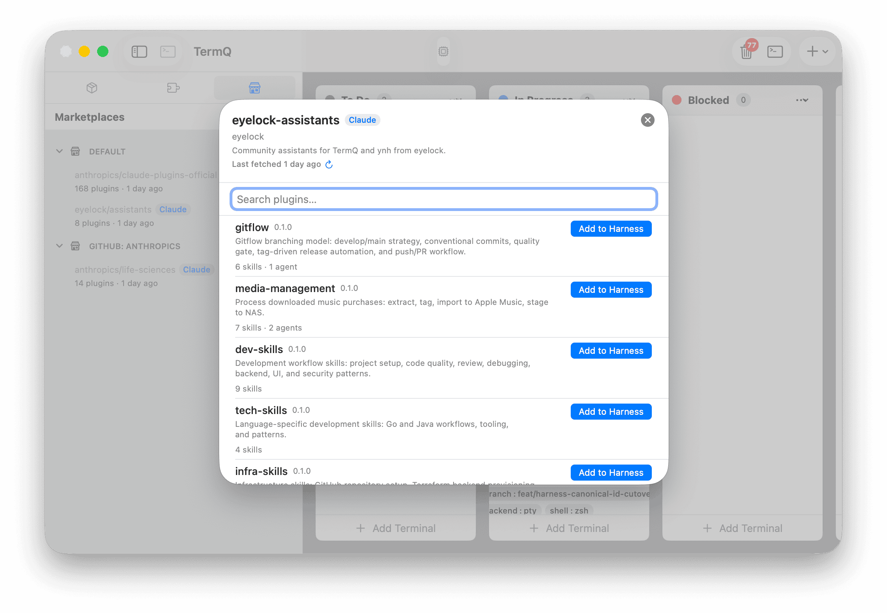
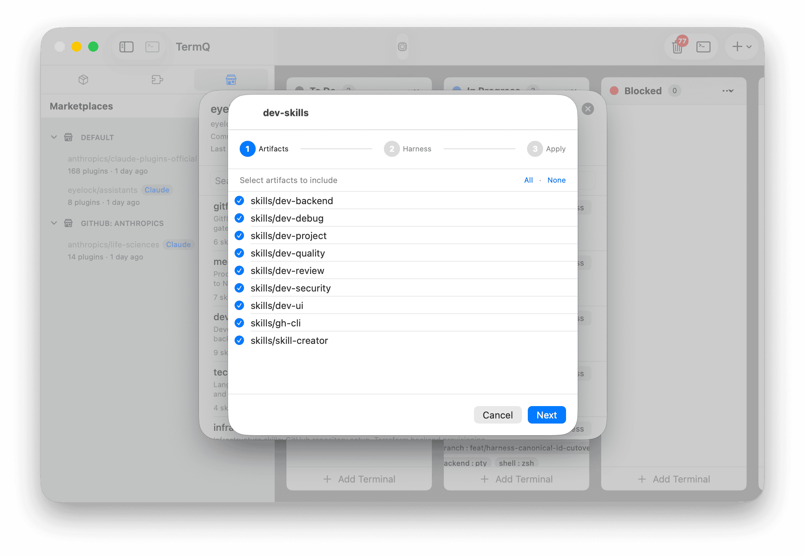
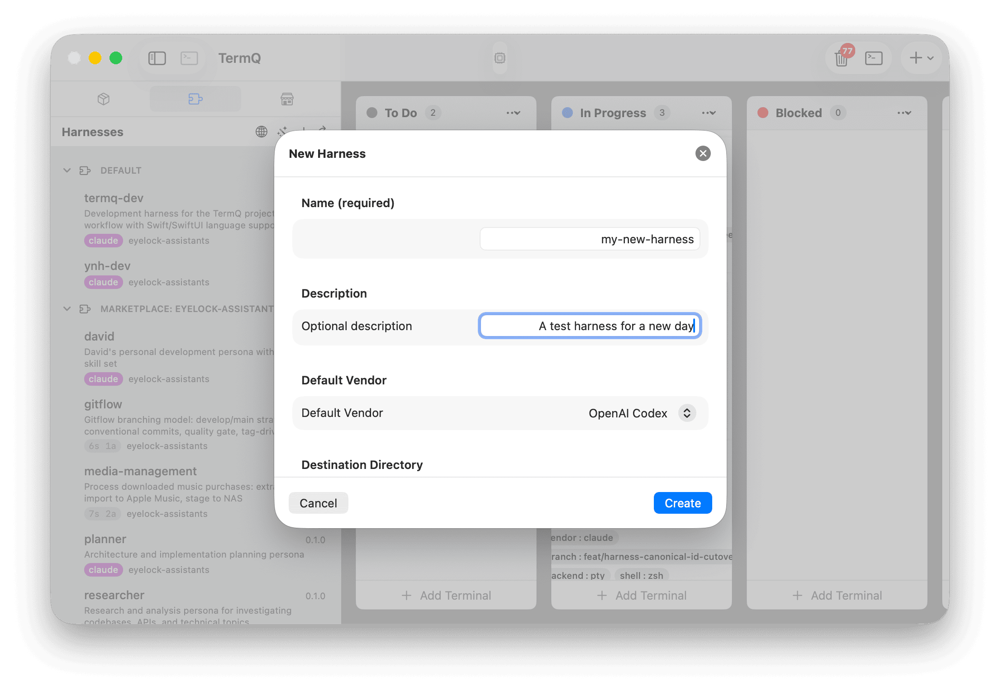
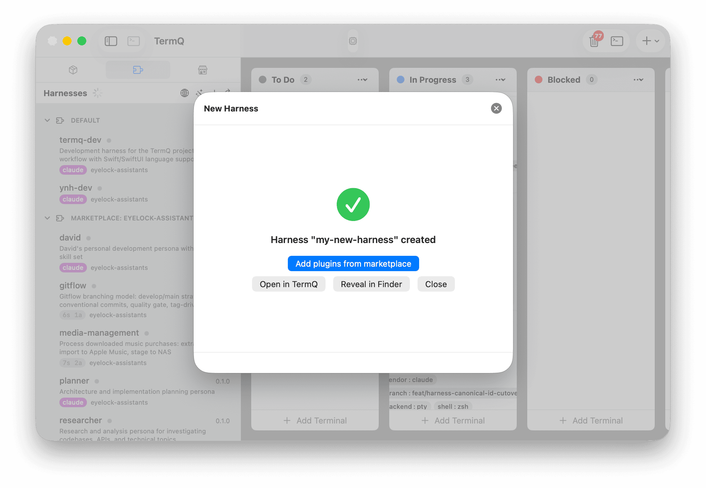

# Tutorial 14: Marketplace Browser & Harness Authoring

In this tutorial you'll connect TermQ to a community marketplace, browse its plugins, add content to an existing harness, then scaffold a brand-new harness from scratch — all without leaving the app.

By the end you'll know how to add a marketplace, browse and filter plugins, selectively pick skills and agents into a harness, create a new harness with the wizard, and understand how these two flows fit together.

**Time:** about 15 minutes
**Requires:** TermQ 0.8 or later, [YNH CLI](https://github.com/eyelock/ynh) and [YND CLI](https://github.com/eyelock/ynd) installed

---

## 14.1 — What are marketplaces?

A **marketplace** is a Git repository that publishes a curated index of plugins — skills, agents, commands, and rules — packaged for YNH harnesses. Adding a marketplace to TermQ gives you a searchable catalogue you can browse without leaving the app.

Marketplaces follow a vendor-specific layout:
- Claude marketplaces keep their index at `.claude-plugin/marketplace.json`
- Cursor marketplaces keep theirs at `.cursor-plugin/marketplace.json`

TermQ clones the marketplace repo on demand and reads the index directly — no intermediary registry, no account required.

---

## 14.2 — Default marketplaces

On first launch, TermQ automatically adds two default marketplaces:

- **Claude Plugins Official** (`github.com/anthropics/claude-plugins-official`) — Anthropic's curated catalogue
- **eyelock assistants** (`github.com/eyelock/assistants`) — community plugins for TermQ and YNH workflows

These are fetched in the background immediately after being added. If you remove them and want them back, open the **Marketplaces** sidebar tab and click **Restore Defaults** — it re-adds any defaults that are missing without duplicating ones you still have.

The Marketplaces sidebar header has two buttons: **+** (add a new marketplace) and **↺** (refresh all). Use **↺** to manually re-fetch all marketplace indices at once.

---

## 14.3 — Adding a custom marketplace

Click **+** in the Marketplaces sidebar header, or open **Settings** (**⌘,**) → **Marketplaces**.

The **Add Marketplace** sheet has two tabs:

- **Known** — a list of well-known marketplaces TermQ recognises; click **Add** on any row
- **Custom** — paste any HTTPS Git URL and pick the vendor layout (Claude or Cursor)

Click **Add**. TermQ stores the marketplace in its own config (under `~/Library/Application Support/TermQ/marketplaces.json`) and immediately kicks off the first fetch in the background.

> **Known marketplaces:** If TermQ recognises the URL you pasted in Custom tab, it auto-fills the vendor and a friendly display name.

The settings row updates once the fetch completes, showing the last-fetched timestamp. If the fetch fails (bad URL, no network), the row shows the error inline.

---

## 14.4 — Browsing the marketplace

The marketplace browser lives in the **Sidebar** under the Marketplaces section. Select a marketplace from the list to open its plugin catalogue.

The browser shows all plugins from the index. Use the search field to filter by name, category, or tag. Each row displays:
- Plugin name and version
- Description (if provided)
- Category and tag chips
- Source indicator (relative — bundled in the repo, or external — fetched on demand)

Click a plugin to open the detail pane, which shows the full description, tags, and the list of pickable artifacts (skills, agents, commands, rules) the plugin exposes.

**External plugins:** If a plugin lives in a separate repository (source type `github`, `url`, etc.), TermQ fetches and caches it when you first open the detail. This is a one-time shallow clone — subsequent visits use the cache.

---

## 14.5 — Adding plugins to a harness

With the plugin detail pane open, click **Add to Harness…**. The **HarnessIncludePicker** sheet opens.

The picker has two sections:

**Target harness** — choose which of your installed harnesses should receive the plugin. The picker pre-selects the last-used harness.

**Artifacts to pick** — the plugin's skills, agents, commands, and rules are listed as a checklist. All are checked by default; untick anything you don't want. The preview at the bottom shows the exact `ynh include add` command TermQ will run.

Click **Add**. TermQ runs the command in a transient terminal pane at the bottom of the sheet, streams the output, and reports success or failure inline. On success, the harness immediately reflects the new includes — no restart needed.

> **Picking vs. including the whole plugin:** Picking individual artifacts (`--pick skills/foo,agents/bar`) is the default because it gives you only what you need. Unchecking *all* artifacts and clicking Add includes the entire plugin source without a pick filter — useful when you want everything and want future updates to pick up new additions automatically.

---

## 14.6 — Default author directory

Before creating a harness, tell TermQ where to scaffold new harnesses by default. Open **Settings → Marketplaces → Default Author Directory** and click **Browse…**.

This is the directory where `ynd create harness <name>` will run. It's also pre-filled as the **Destination** in the harness wizard. You can override it per-harness in the wizard.

If you don't set a default, the wizard falls back to the harnesses directory YNH reported during detection.

---

## 14.7 — Creating a harness with the wizard

Click the **wand** button (✦) in the Harnesses sidebar header. The **New Harness** wizard opens.

**Step 1 — Identity & Destination:**

- **Name** — a slug for the harness (`my-project-harness`). Only alphanumerics, hyphens, and underscores are allowed; TermQ validates this before letting you proceed.
- **Description** — optional free-text summary.
- **Vendor** — which AI client this harness targets (Claude, Cursor, etc.). Affects which default profile and hook templates `ynd` scaffolds.
- **Destination** — where the harness directory will be created. Pre-filled from Settings → Default Author Directory or the YNH-detected path.
- **Install after create** — when checked, TermQ runs `ynh install <path>` immediately after scaffolding. Requires YNH to be installed and ready.

Click **Create**. The wizard moves to Step 2.

**Step 2 — Progress:**

TermQ runs:
1. `ynd create harness <name>` — scaffolds the harness directory
2. `ynh install <destination>/<name>` — installs it into YNH (if *Install after create* was checked)

Each step shows a status icon (pending → spinning → checkmark or X) and streams live output below.

If any step fails, a **Retry** button appears so you can re-attempt without starting over.

On success, the wizard shows a completion overlay with three options:

- **Browse Marketplaces** — opens the marketplace browser with this harness pre-selected as the target in the include picker, ready for you to add content
- **Open Harness** — switches the Harnesses tab to this harness's detail view
- **Reveal in Finder** — opens the scaffolded directory in Finder

---

## 14.8 — The typical authoring loop

A complete session — from idea to populated harness — looks like this:

1. **Create** the harness with the wizard (§14.6). Check *Install after create*.
2. Click **Browse Marketplaces** in the success overlay.
3. **Browse** marketplace plugins (§14.3) and use **Add to Harness** (§14.4) to pull in the content you want.
4. The harness is now installed and populated. **Launch** it from the Harnesses tab.

For iterative authoring (adding more plugins later), just open the harness detail, switch to Marketplaces, and repeat step 3.

---

## 14.9 — What's next

You've covered the complete lifecycle: add a marketplace, browse plugins, add content to a harness, and create new harnesses from scratch.

The next tutorials cover automation and AI integration:

- [Tutorial 11: CLI Automation](08-cli.md) — drive TermQ from the command line
- [Tutorial 12: Persistent AI Context](09-ai-context.md) — feed project context to your AI sessions automatically
