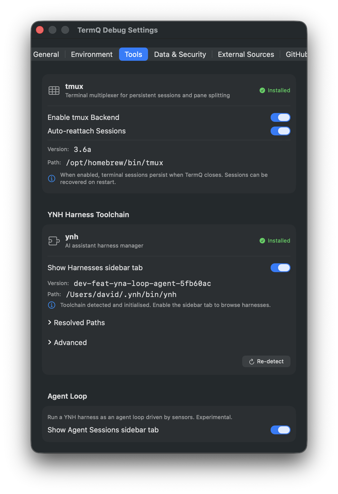
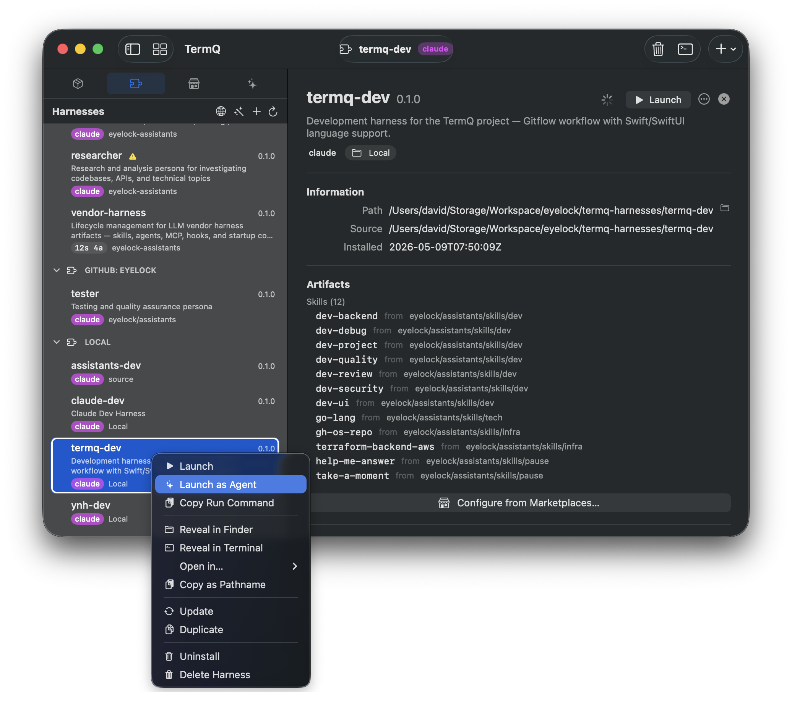
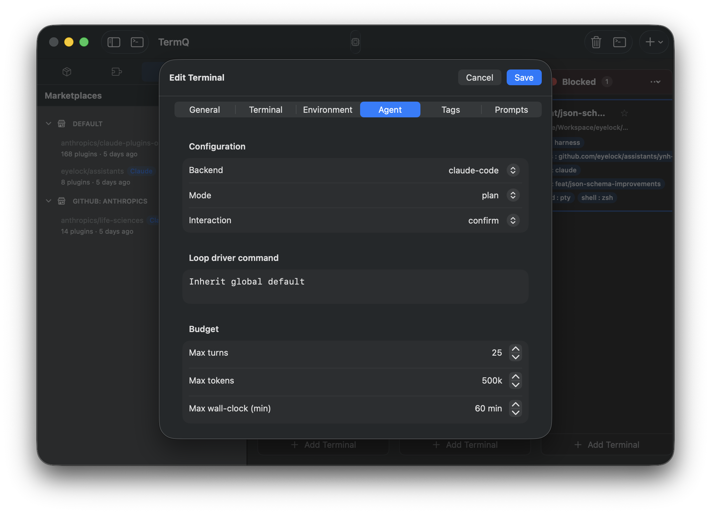
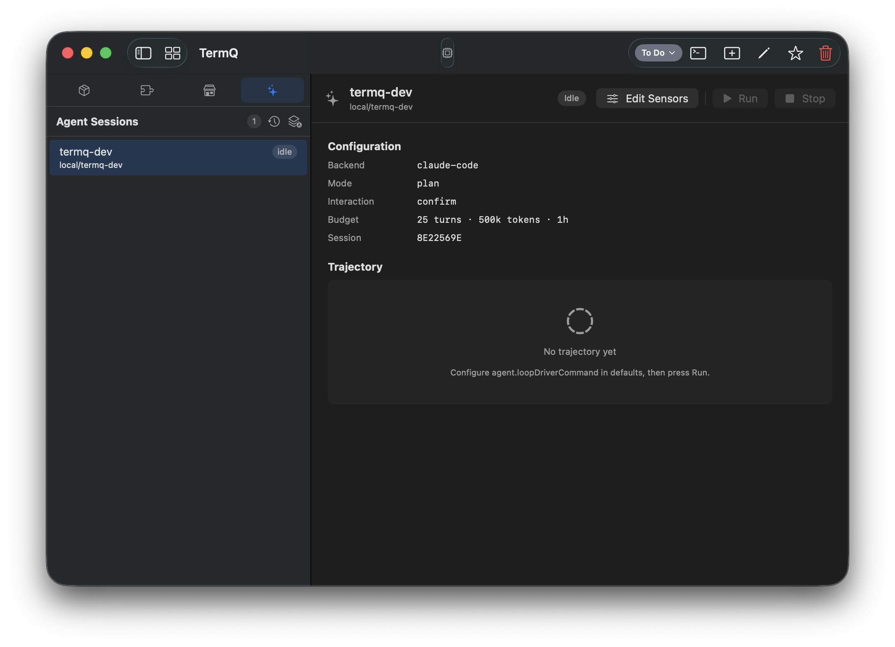
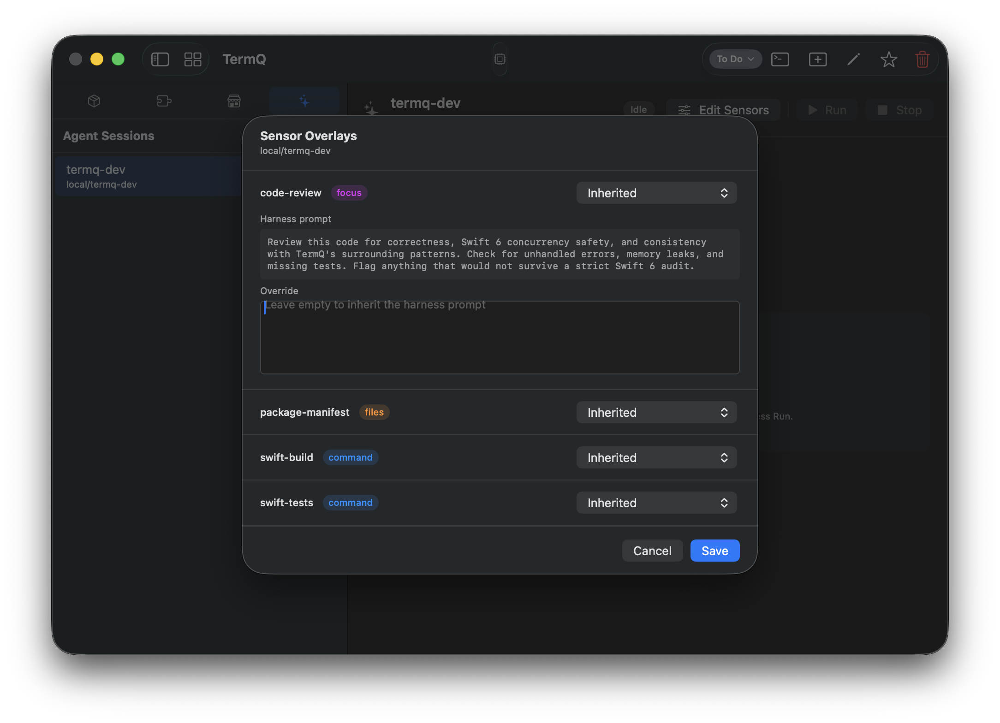

# Coding Agent

In this tutorial you'll turn a YNH harness into an **agent session** — an autonomous loop that plans work, executes it turn-by-turn, and is observed by sensors that decide when it's done. The tutorial follows the actual journey: set things up once, run a session, then look at what comes next.

By the end you'll have launched an agent against a real harness, walked through both approval gates, adjusted a sensor mid-flight, and reviewed the trajectory after the fact.

**Time:** about 25 minutes
**Requires:** TermQ 0.12 or later, [YNH CLI](https://github.com/eyelock/ynh) on `PATH`, and an installed harness — see the [Harnesses tutorial](harnesses.md). The harness you use needs at least one **sensor** declared in its `plugin.json`; §3 walks you through adding sensors to a harness that doesn't have any yet, using the bundled `termq-dev` harness as the worked example.

> **Experimental.** The agent loop is feature-flagged for 0.12 so we can iterate on the rough edges. The label in Settings says *Experimental*; treat it the same way.

---

# Act 1 — Before your first session

The first two steps (enable the tab, install YNH) really are one-time. The third — declaring sensors — is the start of harness engineering: you'll come back to it whenever you change what "done" or "stuck" mean for a project, which in practice is often.

## 1 — What an agent session is

An interactive harness launch hands you a terminal — you type, the AI replies, you read, you type again. An **agent session** removes the typing. TermQ runs a loop driver (the `ynh agent` subcommand by default) that:

1. Asks the harness for a plan.
2. Executes turns of work, calling tools the harness exposes.
3. Runs **sensors** between turns — small probes that check whether the agent is making progress, has converged, or is stuck.
4. Streams a structured **trajectory** of events back to TermQ as JSONL.
5. Pauses for your approval at two configurable gates: plan approval (start of session) and per-turn approval (every turn).

> **JSONL** — also known as JSON Lines: one self-contained JSON object per line, no enclosing array. Reader-friendly for streaming since each line can be parsed as soon as it arrives. The file we write uses the `.jsonl` extension; some tools call the same format *NDJSON*.


An agent session lives as a normal TermQ card with an `agentConfig` attached. It shows up in two places: in the **Agent Sessions** sidebar tab (an index), and on the board in whatever column you put it (the canonical object). Selecting it anywhere opens the **Inspector** in the main pane, which is the live view onto the loop.

## 2 — Enable the Agent Sessions sidebar tab

The Agent tab is **opt-in**. Open Settings (**⌘,**) and go to **Tools → Agent Loop**.



Toggle **Show Agent Sessions sidebar tab**. The sidebar's tab picker now has a fourth icon (the sparkles), and the Harnesses sidebar's right-click menu gains a **Launch as Agent** item.

The Agent Loop section in Settings has just this one toggle for 0.12 — the loop driver binary is resolved from `PATH`. Per-card overrides for the binary live under the card's *Advanced* disclosure (see §5).

## 3 — Prepare your harness: declare sensors

**Sensors are required.** A harness without any sensors can technically launch as an agent, but the loop has no convergence signal (so it'll never finish on its own) and no observation between turns (so it can't recover from getting stuck). The first thing to do with a candidate harness is to make sure its `plugin.json` declares some.

### 3.1 — How sensors work

Each sensor has four conceptual pieces:

- **`source`** — strict one-of: `command` (run a shell command), `focus` (re-use a named focus the harness already declares), or `files` (snapshot the contents of one or more files on each tick).
- **`output`** — `format` (free-text identifier — `text`, `markdown`, `json`, `junit-xml`, `lcov-summary`, `sarif`, `ndjson`, …) plus an optional `channel` (`stdout`, `stdout+exit`, `file`, `files`) and `path`.
- **`role`** (optional) — `regular` (run between turns; informational), `convergence-verifier` (passing means the loop is done), or `stuck-recovery` (run when the stuckness watchdog fires; output fed back as recovery context).
- **`category`** (optional) — Fowler-bucket triage hint: `behaviour`, `architecture`, or `maintainability`.

You declare them under a top-level `"sensors"` object in `plugin.json`. The role drives loop behaviour, the source picks the probe shape, the output describes what the loop driver should expect.

### 3.2 — A worked example: termq-dev

The reference harness shipped alongside TermQ (`termq-dev`) carries one example of each source kind:

```json
"sensors": {
  "swift-build": {
    "category": "behaviour",
    "role": "regular",
    "source":  { "command": "swift build 2>&1 | tail -50" },
    "output":  { "format": "text", "channel": "stdout+exit" }
  },
  "swift-tests": {
    "category": "behaviour",
    "role": "convergence-verifier",
    "source":  { "command": "swift test --parallel 2>&1 | tail -80" },
    "output":  { "format": "text", "channel": "stdout+exit" }
  },
  "code-review": {
    "category": "maintainability",
    "role": "regular",
    "source":  { "focus": "code-review" },
    "output":  { "format": "markdown", "channel": "stdout" }
  },
  "package-manifest": {
    "category": "architecture",
    "role": "regular",
    "source":  { "files": ["Package.swift", "Package.resolved"] },
    "output":  { "format": "text", "channel": "files" }
  }
}
```

What each one does, and why it's shaped this way:

- **`swift-build` (command, regular).** Runs the project build between turns. The loop driver reads stdout and the exit code — non-zero exit signals a broken state the agent should address before doing anything else. `tail -50` keeps the payload bounded for the LLM's context.
- **`swift-tests` (command, convergence-verifier).** The done-check. While `swift test` is failing, the loop keeps iterating; once it passes the session converges and ends. There can be more than one convergence-verifier — they're AND-ed.
- **`code-review` (focus, regular).** Re-uses the harness's own `code-review` focus as a sensor. The loop driver runs the focus's prompt through the AI client between turns and feeds the markdown review back into the next turn as context. The `focus` value can be either the bare focus name (as here) or an inline `{ "profile": "...", "prompt": "..." }` object.
- **`package-manifest` (files, regular).** A files sensor doesn't run anything — it snapshots the named files on each tick so the loop driver can show the agent when its dependencies changed. Useful as a low-cost context refresher between turns.

### 3.3 — Install the harness and verify

After editing `plugin.json`, re-install so `ynh` re-reads the manifest:

```
cd <harness directory>
ynh install .
ynh sensors ls local/<harness-name> --format json
```

The second command should return one JSON object per sensor. You're now ready to run sessions against this harness.

> **Sensor schema reference.** Full schema at <https://eyelock.github.io/ynh/schema/plugin.schema.json> (see `$defs.sensor`, `$defs.sensor_source`, `$defs.sensor_output`). The `ynh sensors` subcommand offers `ls`, `show <name>`, and `run <name>` for inspecting and exercising sensors from the terminal.

---

# Act 2 — Run a session

This is the per-session flow. You'll repeat steps 4 through 9 every time you start a new agent.

## 4 — Launch a harness as an agent

Open the **Harnesses** sidebar tab (the puzzle-piece icon). Right-click any harness row.



Choose **Launch as Agent** (sparkles icon, right below **Launch**). TermQ:

1. Creates a card with `agentConfig` populated from the harness's defaults (Backend, Mode, Interaction, Budget all preset).
2. Registers a session in the `AgentSessionRegistry`.
3. **Does not yet start the loop driver.** The card lands in `idle` status, waiting for you to configure it and click Run.

The card now appears in two places — the board (in the column it landed in), and the Agent Sessions sidebar tab.


## 5 — Configure the card before you Run

This step decides what gates you'll hit later. Right-click the session in the Agent Sessions sidebar (or the card on the board) and choose **Edit Details…**.



For cards with an agent configuration, the editor opens directly on the **Agent** tab — no hunting required.

### Configuration

- **Backend** — Claude, Codex, or Cursor. Which AI provider the loop driver talks to.
- **Mode** — `plan` (the loop produces a written plan and pauses for your approval before executing — gate 1, §7) or `continuous` (skip the plan gate; just run).
- **Interaction** — `auto` (run uninterrupted between turns) or `confirm` (pause for your approval after every turn — gate 2, §8). This is the choice with the biggest impact on how hands-on the session feels.

### Budget

- **Max turns** — hard cap on how many turns the loop is allowed.
- **Max tokens** — cumulative token budget; the loop stops once crossed.
- **Max wall-clock (min)** — kills the session after the elapsed time, regardless of turns or tokens.

Whichever budget trips first ends the session. The status pill goes to `done` (clean exhaustion) or `errored` (hard kill).

### Advanced (disclosure, collapsed by default)

- **Loop driver command** — override the binary TermQ runs as the loop driver. Empty means `ynh agent` from `PATH` (the standard choice). Set this to point at a custom build, a wrapper script, or any other JSONL-emitting binary that implements the same protocol. Most users never touch this; the disclosure stays collapsed unless you've already set a value.

Save the editor when you're done. Configuration is now baked into the card.

## 6 — The Inspector

Select the session in the sidebar (or the card on the board). The Inspector takes over the main pane.



Top-to-bottom:

- **Header** — title, harness, status pill, **Edit Sensors** button, **Run** / **Stop** buttons.
- **Plan Approval banner** — appears only when the loop is waiting at gate 1 (§7).
- **Turn Approval banner** — appears only when waiting at gate 2 (§8).
- **Configuration** — read-only summary of what you set in §5, plus the session ID (useful for finding the on-disk trajectory file).
- **Last Sensors** — the most recent sensor run results: name, exit code, duration, summary. Empty until the loop has actually run sensors at least once.
- **Trajectory** — the full event log, grouped by turn. Empty until the first event arrives.

**Click Run in the header to actually start the loop.** Up until this point the session has been a configured-but-dormant card — the Trajectory panel shows *No trajectory yet — Press Run to spawn the loop driver.* The status pill then flips to `planning`, then to `plan?` (gate 1, if Mode = plan) or directly to `running` (if Mode = continuous).

> **What Run actually launches.** By default, `ynh agent` from your `$PATH`. If you set a global override at the `agent.loopDriverCommand` UserDefault or a per-card override in the editor's *Advanced* disclosure (§5), that wins. Hover the Run button to see the exact command that will be spawned.

Closing and reopening the Inspector is non-destructive — events are persisted to disk continuously and the view rehydrates from the JSONL file (see §10).

You can view sensors in the Inpspector via `Edit Sensors`.



## 7 — Gate 1: Approve the plan (Mode = plan)

If you set Mode = `plan` in §5, the first thing the loop does after you click Run is write a plan and pause. The Inspector grows an orange banner.


The banner shows:

- The plan title.
- The full plan text in a scrollable monospaced view.
- **Reject** and **Approve** buttons.

**Approve** sends the go-ahead and the loop transitions into `running`. **Reject** cancels — the session ends in a terminal state and you can decide what to do next (edit the prompt, change sensors, re-launch).

If Mode = `continuous`, this gate doesn't fire at all and the loop goes straight from `planning` to `running`.

> **Auto-error on unexpected stream end.** If the loop driver process exits while the session is still in `awaitingPlanApproval`, TermQ marks the session as `errored` rather than leaving it stuck. The Trajectory section will show the last events received before the driver died.

## 8 — Gate 2: Approve each turn (Interaction = confirm)

If you set Interaction = `confirm` in §5, the loop pauses after every turn and asks for your input. The Inspector grows a blue banner.


The banner shows:

- The turn number (e.g. *Turn 3 — Review feedback*).
- A TextEditor pre-filled with the agent's draft feedback for the next turn.
- **Reset** — restores the original draft. Only appears once you've edited the text.
- **Send** — submits your edits and lets the loop proceed.

Use this to nudge the agent without restarting the session: tighten a vague step, point it at a specific file, or add a hard constraint that wasn't in the original prompt.

If Interaction = `auto`, this gate doesn't fire and the loop runs to convergence (or budget exhaustion) without further input. You can switch from `auto` to `confirm` mid-session via Edit Details — the next turn boundary will pause.

## 9 — Adjust mid-flight: the sensor overlay sheet

The sensors you declared in §3 are the harness's defaults. You can override them for a single session without touching the harness manifest — useful when you want to promote a sensor to convergence-verifier just for this run, or rephrase a focus sensor's prompt.

Click **Edit Sensors** in the Inspector header.


TermQ runs `ynh sensors ls <harness> --format json` and renders one row per declared sensor. **The sheet only shows sensors that already exist in the harness manifest** — if it's empty, jump back to §3.

Per-sensor controls:

- **Name + source-kind badge** — `focus`, `command`, or `files`.
- **Role** — picker with four values:
  - **Inherited** — use whatever the harness declared.
  - **regular** — informational; ignored by the convergence and stuckness checks.
  - **convergence-verifier** — when this sensor passes, the session converges and ends.
  - **stuck-recovery** — runs when other sensors indicate the agent is stuck; output fed back as additional context.
- **Prompt override** (focus sensors only) — for sensors implemented as a harness focus, the harness's prompt is shown read-only above an editable TextEditor. Leave the editor empty to inherit; type to override.

Click **Save**. Overlays live per-session in the `SensorOverlayStore` — restarting the same session reuses them; launching a fresh session of the same harness gets a clean slate.

> **Why no "Add sensor" button?** Sensor declaration is plugin-manifest-only — even for local harnesses — because a sensor's identity belongs to the harness, not to a single TermQ session. An inline declaration editor for local harnesses is on the roadmap.

---

# Act 3 — After & advanced

## 10 — Trajectories and the transcript viewer

Every agent session writes its trajectory as JSONL to:

```
~/Library/Application Support/TermQ/agent-sessions/<sessionId>/trajectory.jsonl
```

(`TermQ-Debug` instead of `TermQ` for a debug build.)

Each line is one event — plan emitted, turn started, tool invoked, sensor result, etc. The Inspector's Trajectory section is a live view of this file; closing and re-opening the card rehydrates from disk.

You can also load an arbitrary `.jsonl` file. In the Agent Sessions sidebar header, click **Open Transcript**.


The viewer is a read-only modal showing the file name, a summary banner (harness, turns, tokens, exit code or *converged*), and the full trajectory with the same turn-grouped layout as the Inspector. This is how you review sessions you ran somewhere else — most often, CI.

## 11 — Running an agent in CI

The same loop driver runs headless under GitHub Actions. The branch ships a workflow at `.github/workflows/agent.yml` (job name: **Agent Loop**) you can copy into your own project.

Workflow inputs:

| Input | Default | Description |
|---|---|---|
| `harness` | _(required)_ | Canonical id of the YNH harness to install |
| `task` | _(required)_ | Path to a task file or inline task text |
| `backend` | `claude` | `claude` or `codex` |
| `max_turns` | `25` | Hard cap on turns |
| `max_tokens` | `500000` | Cumulative token budget |
| `max_wall` | `60m` | Wall-clock limit |

The job:

1. Checks out the repo.
2. Installs the harness via `ynh install`.
3. Runs `ynh agent run …` with the dispatch inputs, redirecting JSONL to `agent-trajectory.jsonl`.
4. Uploads the trajectory as a workflow artifact named `agent-trajectory-<run-number>` with 30-day retention.


Once the run finishes, download the artifact, unzip to get `agent-trajectory.jsonl`, then **Open Transcript** in the Agent Sessions sidebar and pick the file. The transcript viewer renders it identically to a local session.

## 12 — Fleet runs: explore the same task in parallel

A **fleet** is N agent sessions launched against the same task, in separate worktrees, sharing a coordinating parent. You'd use one when you want to explore variant approaches to the same problem without committing to one upfront — let three sessions race, then promote the winner.

Click the **New Fleet** button in the Agent Sessions sidebar header. The launch sheet opens.

- **Harness** — picker of your installed harnesses (the same list `ynh ls` returns). Choose the one you want every parallel session to run.
- **Parallel sessions** — 2, 3, 4, or 5.
- **Worktree base path** — directory under which each session gets its own git worktree (defaults to `~/fleet-runs`).
- **Task** — free-text task description handed to every session.

Click **Launch**. TermQ creates N cards, all sharing one `fleetId`, each pointing at a separate worktree under the base path. They appear in the Agent Sessions sidebar grouped under a collapsible fleet header.

The fleet header shows aggregate status: *2/5 running*, *3/5 converged*, etc. As sessions converge, a **Promote Winner** affordance appears on each converged row — selecting one promotes that card out of the fleet (you'll typically open it as a regular session, merge its branch, and discard the rest).

The same trajectory persistence (§10) applies to every session in the fleet — each has its own `<sessionId>/trajectory.jsonl`.

---

# Reference

## 13 — Sidebar quick reference

**Status pills.** Every session row carries one:

| Pill | Meaning |
|---|---|
| `idle` | Configured but not yet started — click Run in the Inspector |
| `planning` | Loop driver is producing a plan |
| `plan?` | Awaiting plan approval (gate 1, §7) |
| `running` | Executing turns |
| `turn?` | Awaiting per-turn approval (gate 2, §8) |
| `paused` | Manually paused |
| `done` | Budget exhausted cleanly |
| `converged` | A convergence-verifier passed; session ended |
| `stuck` | Stuckness watchdog tripped |
| `error` | Loop driver exited unexpectedly or hard error |

**Right-click menu** on any sidebar row (and the equivalent on the board card):

- **Open** — selects the card and opens the Inspector.
- **Edit Details…** — opens the editor on the Agent tab (§5).
- **Duplicate** — clones the card and its agent configuration into a fresh session.
- **Pin / Unpin terminal** — toggles the favourite flag.
- **Delete** — destructive; confirmation alert.

**Sidebar header buttons:**

- **Open Transcript** — opens any `.jsonl` trajectory file (§10).
- **New Fleet** — opens the fleet launch sheet (§12).

---

## 14 — What's next

You've covered the full agent surface: prerequisites, the two-gate run, mid-flight adjustment, trajectory review, CI, and fleet runs.

Related tutorials:

- [Harnesses](harnesses.md) — the underlying harness format and how to author one
- [Queued Actions](queued-actions.md) — batch and sequence non-agent work
- [MCP Integration](mcp.md) — expose TermQ state to external AI clients

> **Feedback:** the agent loop is deliberately feature-flagged so we can iterate quickly. If a button doesn't do what you expected, a state pill is misleading, or the sensor overlay editor is missing something obvious, please [open an issue](https://github.com/eyelock/termq/issues).
