# Harnesses

In this tutorial you'll connect TermQ to [YNH](https://github.com/eyelock/ynh), browse and install AI harnesses from registries, Git URLs, and local sources, populate them with marketplace plugins, fork registry harnesses to customise them, and create new harnesses from scratch.

By the end you'll know how to enable the Harnesses tab, run through the YNH detection and setup flow, install your first harness, add marketplace plugins to it, link it to a git worktree, and manage the full lifecycle including updates, forks, uninstalls, and authoring new harnesses.

**Time:** about 25 minutes
**Requires:** TermQ 0.8 or later, [YNH CLI](https://github.com/eyelock/ynh) installed. We assume you've already added at least one marketplace per the [Marketplace Browser tutorial](marketplace-browser.md) — without one, the Library tab in Add Include / Install Harness will be empty.

---

## 1 — What the Harnesses tab is for

A **harness** is a reusable bundle of AI configuration — skills, rules, MCP servers, prompt profiles — that you can apply to any directory. Instead of re-configuring Claude, Cursor, or your other AI tools per project, you install a harness once and tell TermQ which worktrees should use it.

The Harnesses tab brings this workflow into TermQ directly:

- Detect whether YNH is installed and ready on this machine
- Browse and install harnesses from registries, Git, or local source directories
- View a full breakdown of what each harness contains (hooks, MCP servers, profiles, focuses)
- Link git worktrees to harnesses so launching a terminal "just works"
- Update, duplicate, and uninstall harnesses with one right-click

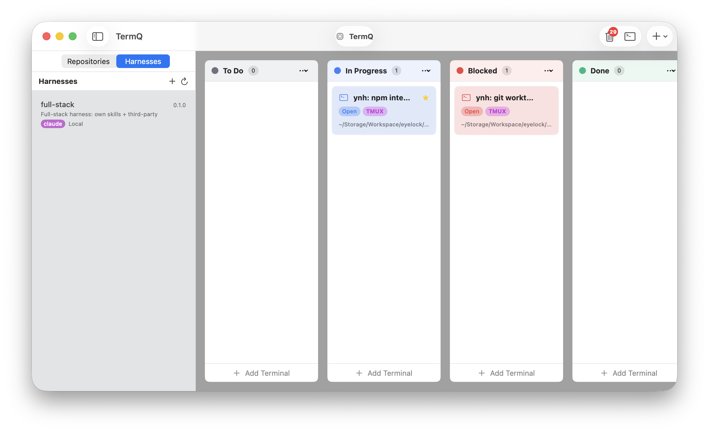

The tab sits alongside **Repositories** as a segmented picker at the top of the sidebar.

---

## 2 — Enabling the Harnesses tab

The Harnesses tab is **opt-in** for 0.8. Open Settings (**⌘,**) and find the **YNH Harness Toolchain** section.

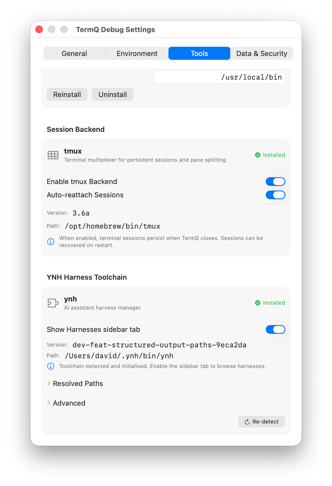

Toggle **Enable Harnesses tab**. The sidebar now shows a two-segment picker at the top.

Switching tabs in the sidebar persists across launches — if you end a session in Harnesses, you come back to Harnesses next time.

---

## 3 — YNH detection

TermQ auto-detects the `ynh` binary on launch and on app focus. If it's not found, the tab shows an install prompt:

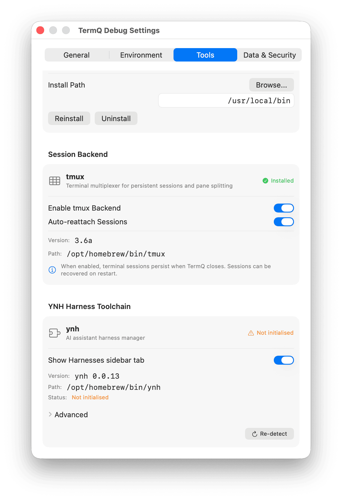

Install YNH via its documented method (Homebrew, release binary, `go install`), then click the refresh button in the tab header. No restart needed — TermQ rechecks on every app-focus event.

When YNH is installed and ready, the harness list appears.

> **Where TermQ looks:** `PATH`, then common fallbacks (`/opt/homebrew/bin`, `/usr/local/bin`, `~/go/bin`). If yours is elsewhere, set a custom path in Settings → YNH Harness Toolchain.

---

## 4 — Installing a harness

Click the **+** button in the Harnesses tab header. The **Install Harness** sheet opens with two tabs: **Library** and **Git URL**.

### Library tab — browse and discover

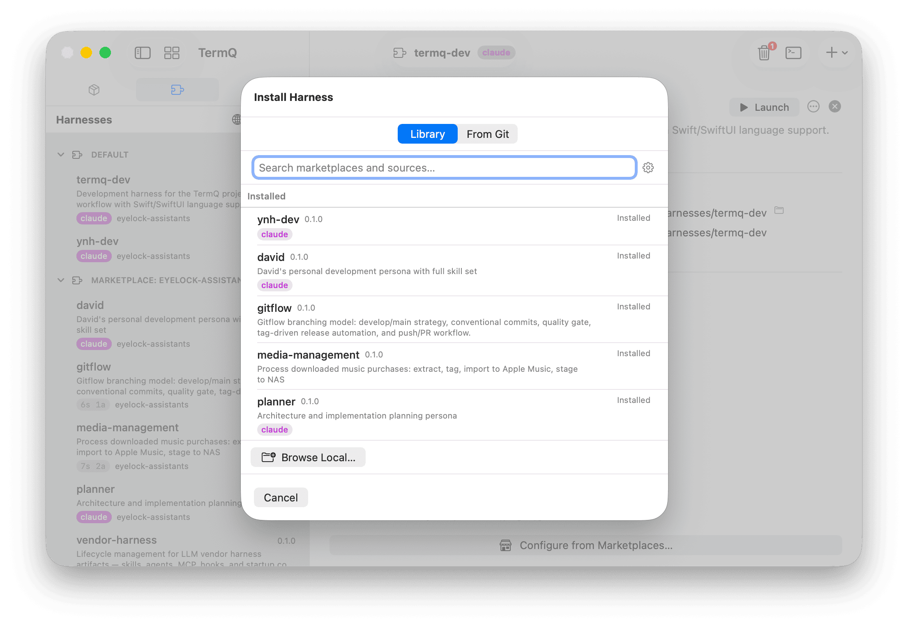

The Library tab opens in **browse mode** immediately — no typing required. TermQ queries all configured marketplaces and YNH registries in the background and organises results into three sections:

- **Installed** — harnesses you already have, shown for reference
- **Available from Registries** — harnesses in your configured YNH registries that aren't yet installed. Each row shows a coloured registry pill (blue) alongside the vendor chips.
- **Available from Marketplaces** — plugins from your TermQ-side marketplaces, ready to add as harnesses or includes.

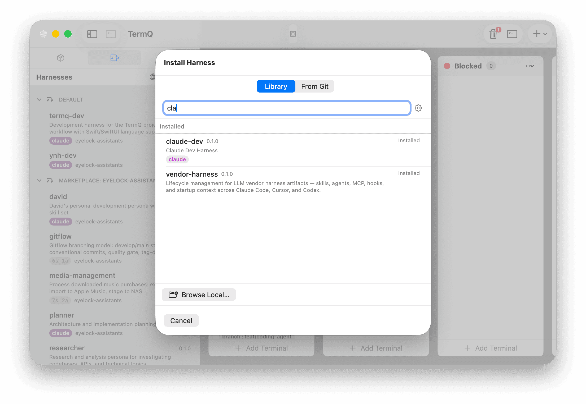

Type in the search field to filter. Results update live across all configured marketplaces and registries as you type. Clear the field to return to browse mode.

Click **Install** on any row. TermQ opens a transient terminal running `ynh install <id>`, streams the output, and auto-closes on success. The harness appears in the sidebar immediately.

> **Empty registries section?** Add a registry first — click the **globe** button in the Harnesses sidebar header. See §3 for a walk-through.

> **Manage your sources without leaving the picker:** click the **gear** icon next to the search field to open the Manage Sources sheet — a quick alternative to Settings → External Sources.

### Git URL tab

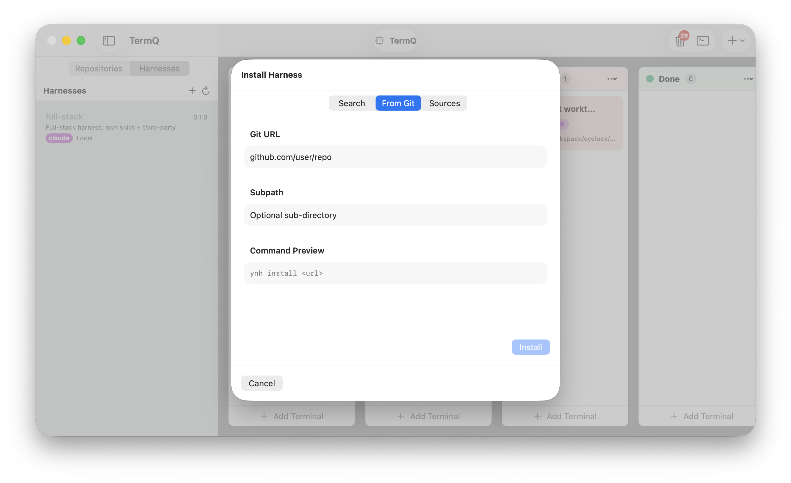

Install directly from any Git URL. Three fields:

- **URL** — the base repo URL (e.g. `https://github.com/eyelock/assistants`). Don't paste a `tree/branch/path` URL from the GitHub web UI; use the bare repo URL plus the **Subpath** field for the path.
- **Ref** — optional branch, tag, or commit SHA. Leave empty to track the default branch.
- **Subpath** — optional. Use it when a monorepo holds a harness at `ynh/my-harness` rather than the repo root.

A live command preview shows the exact `ynh install` invocation TermQ will run, so you can verify before clicking **Install**.

---

## 5 — Reading the detail pane

Click a harness in the list to open its detail pane on the right.

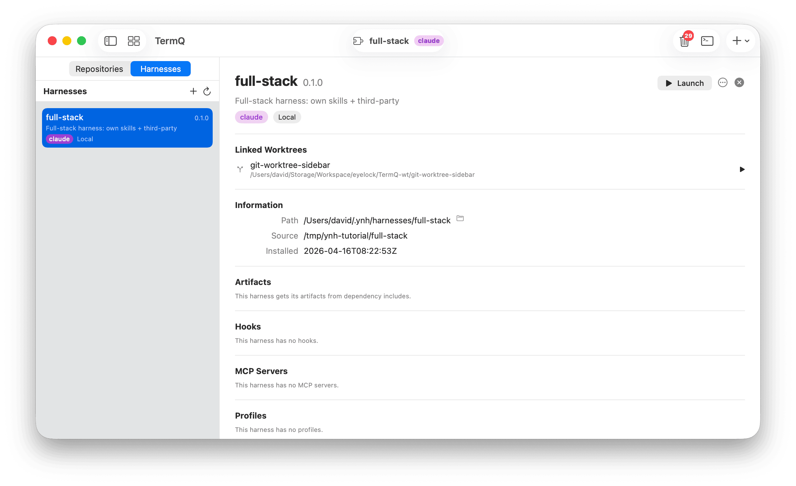

The pane is split into sections:

- **Header** — name, version, description, vendor badge, source chip, and action buttons (Launch, ⋯ menu, close ×)
- **Linked Worktrees** — any git worktrees configured to use this harness; each row has a quick Launch button
- **Information** — install path, source, install timestamp
- **Artifacts** — summary counts from the harness's own configuration
- **Composition** — resolved hooks, MCP servers, profiles, and focuses after `ynd compose` merges includes
- **Dependencies** — other harnesses this one includes, delegates to, or picks from
- **Manifest** — the raw manifest (`plugin.json`), collapsible, copyable

### Source badges

Every harness row and the detail header shows a small provenance chip:

| Chip | Meaning |
|---|---|
| Registry name (e.g. `eyelock`) | Installed from a YNH registry |
| Short Git URL (e.g. `github.com/org/repo`) | Installed from a Git source |
| `local` | Installed from a local directory |

Forked harnesses inherit their fork origin in the chip. This tells you at a glance whether a harness is community-managed (registry), self-hosted (git), or locally owned (local/fork).

### Update dots

When TermQ detects that a newer version is available — either for the harness itself or for any of its includes — a small blue dot appears next to the harness name in the sidebar.


A grey pulse appears while a check is in flight. No dot means either the harness is up to date or no check has run yet.

Update checks are driven by `ynh ls --check-updates` and run in the background when the Harnesses tab is open.

---

## 6 — Linking a worktree to a harness

This is the connective tissue that makes harnesses useful: tell TermQ which harness a worktree should use, and clicking the worktree row will launch it automatically.

### Repository default vs. worktree override

There are two levels of linkage, both accessible from the **Repositories** sidebar:

**Repository default:** Right-click the **repo header row** (the row showing the repo name). Choose **Set Harness…** to pick a default that applies to every worktree in that repo unless overridden. A green jigsaw icon appears on the repo header.

**Worktree override:** Right-click any **worktree row** — including the main worktree. Choose **Set Harness…** to assign a harness specifically to that worktree. An orange jigsaw icon appears on the row.

Worktrees that inherit from the repo default (no own override) show a dimmed jigsaw badge.

The choice persists in TermQ's `ynh.json` (never in YNH's own storage — TermQ owns its side of the mapping).

### Auto-launch

Once a harness is linked, **clicking the branch name** in the worktree row launches it immediately — no sheet, no prompts. TermQ creates a transient terminal running `ynh run <harness>` at the worktree path.

The context menu also gains a **Launch `<harness>`** item as the first entry, for when you want the full launch sheet (vendor, focus, backend, prompt options).

---

## 7 — Launching a harness

Click **Launch** on any harness row in the sidebar (or the Launch button in the detail header). The launch sheet opens.

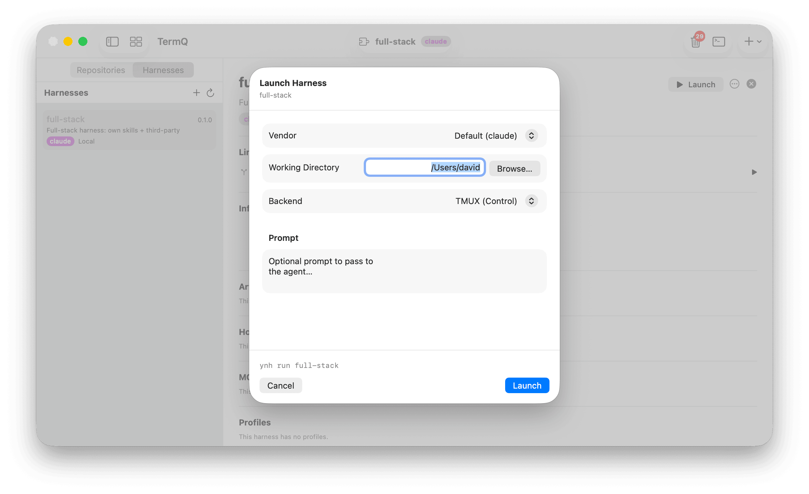

Fields:

- **Vendor** — which AI client to launch under (Claude, Cursor, etc.). The default is taken from the harness's `default_vendor`, or the worktree link if one exists.
- **Focus** — optionally narrow the launch to a specific profile within the harness. Mutually exclusive with Prompt.
- **Working Directory** — where the vendor client runs. Pre-filled when launched from a worktree context.
- **Prompt** — optional text sent directly to the client on launch. Mutually exclusive with Focus.
- **Backend** — direct shell or tmux session (see Tutorial 5).

Click **Launch**. TermQ creates a new transient terminal card running `ynh run \<harness\> …` and immediately focuses it.

---

## 8 — Updating a harness

Open the harness detail pane and click the **⋯** menu next to Launch.

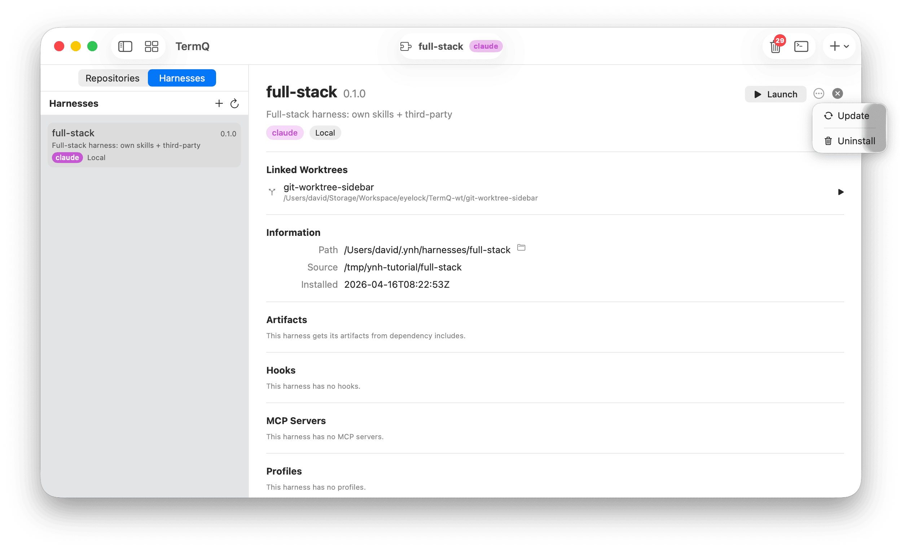

Click **Update**. TermQ opens a transient terminal running `ynh update \<name\>`, streams the output, and auto-closes on success. The detail cache is invalidated so the next detail view you open shows fresh data.

If the update fails (non-zero exit), the terminal stays open so you can read the error — no silent failures.

---

## 9 — Uninstalling a harness

From the same **⋯** menu, click **Uninstall**. A confirmation alert appears.

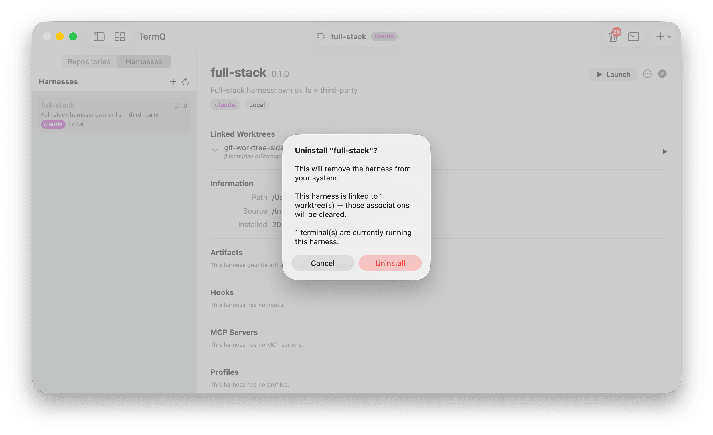

The alert warns you about:

- **Linked worktrees** — if any worktrees are configured for this harness, their associations will be cleared
- **Open terminals** — if any active terminal cards are tagged with this harness, they stay open (the harness itself goes away but existing sessions keep their environment)

Click **Uninstall** to proceed. TermQ runs `ynh uninstall \<name\>` in a transient terminal, auto-closes on success, clears any worktree associations, and refreshes the list.

The same action is also in the right-click menu on any harness row, if you prefer not to open the detail first.

---

## 10 — Exporting a harness as a marketplace package

If you author harnesses and want to share them — or turn a private harness into a marketplace that other TermQ users can browse — you can export it directly from the sidebar.

**Requires:** YND CLI installed (the `ynd` authoring toolchain).

Right-click a harness row and choose **Export as Marketplace…**.

A directory picker opens. Choose where you want the export to land. TermQ then opens a transient terminal running:

```
ynd export <harness-path> -o <output-dir>
```

The output directory receives a `marketplace.json` index (in the appropriate vendor format) that TermQ — or any other YNH-compatible client — can consume as a marketplace source.

The terminal stays open so you can read any output or errors. It auto-closes on success.

> **Note:** Export requires the `ynd` binary (part of the YNH toolchain) in addition to `ynh`. If `ynd` is not detected, the menu item is absent.

---

## 11 — Forking a registry harness

**Requires:** YNH ≥ 0.3.0

Registry harnesses are read-only — TermQ shows their content but hides edit controls, because changes would be overwritten the next time you update. Forking creates a locally-owned copy that you can modify freely.

When a registry harness is selected and YNH 0.3.0 or later is installed, a **Fork to local** button appears in the detail pane header.

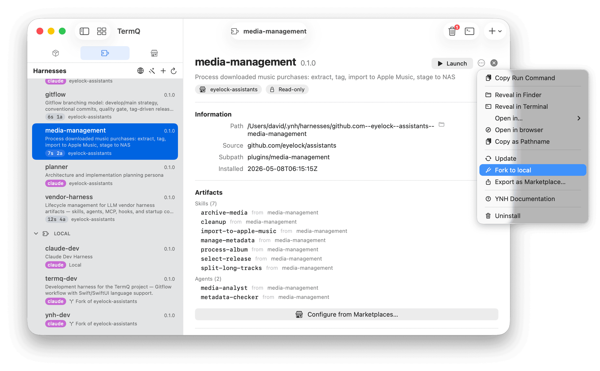

Click **Fork to local**. The **Fork Harness** sheet opens:


- **Destination** — where to put the forked copy (pre-filled from your default author directory)
- **Name (optional)** — leave empty to keep the source's name, or type a new name. The new fork's canonical id will be `local/<name>`.

Click **Fork**. The sheet streams live output from `ynh fork <id> --to <destination> [--name <new-name>] --format json`. YNH self-registers the fork via its pointer model — no follow-up `ynh install` is needed. The new harness appears in the **Local** group in the sidebar.

The forked copy records where it came from (the registry source), so TermQ can show you the fork origin in its source badge even after the original is uninstalled.

> **Forked vs. duplicate:** Fork creates a local copy of a read-only registry harness and is the intended upgrade path when you need to customise a community harness. Duplicate clones any harness — local, git, or registry — and is better for creating a variant of one of your own harnesses.

---

## 12 — Editing a harness in place

Once a harness is editable — local, git-cloned, or forked — the detail pane gains inline editing affordances.

**Includes** — the Includes section lists every include the harness pulls in. Each row carries Edit and Remove buttons. Edit opens a sheet that lets you change the source, ref pin, or path; Remove drops the include after a confirmation. Add a new include via the **+** button at the top of the section, which opens the unified Source Picker (Library / Git URL).


**Delegates** — harnesses that delegate to other harnesses get a parallel Delegates section. Same row affordances: Edit, Remove, plus an Add button that opens the Source Picker scoped to delegate-shaped sources.


> **Local harnesses cannot be delegate targets.** The Add Delegate library only lists harnesses with a shareable remote source (registry or Git). A delegate's identity is its source URL — persisting a local filesystem path in `plugin.json` would bake one machine's directory layout into the harness manifest, breaking silently for anyone else who clones it. Use a Git URL instead, or push the local harness to a registry first.

**Manifest** — the manifest editor opens from the detail action menu. It exposes the harness-level fields (name, version, default vendor, description) without making you hand-edit `plugin.json`. Submit reflects in the detail pane immediately.

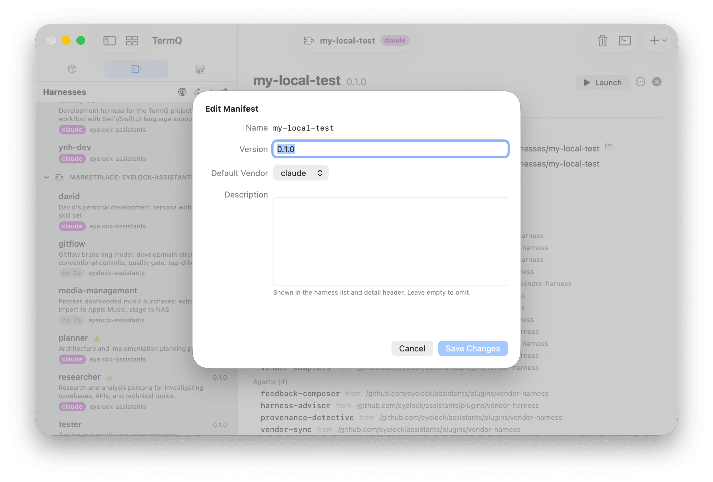

**Hooks** — the Hooks section of the Composition area lists every resolved hook by event. For editable harnesses, a `+` button below each section adds a new hook. Clicking it opens the Add Hook sheet:

- **Event** — pick one of `before_tool`, `after_tool`, `before_prompt`, or `on_stop` from the segmented picker.
- **Command** — the shell command to run.
- **Matcher** — optional tool-name pattern (most useful for `before_tool` / `after_tool` to limit which tool calls trigger the hook).

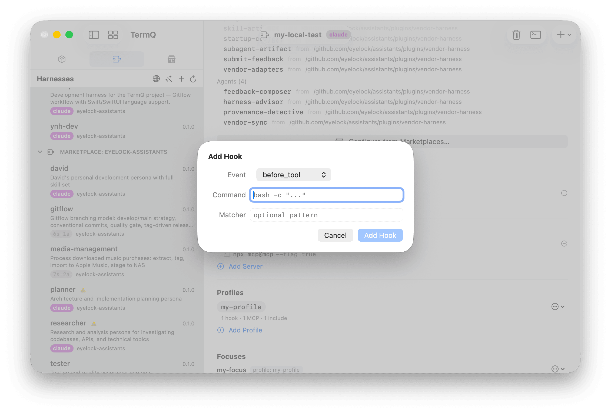

Each existing hook row carries a `−` button to remove it. Removal is immediate — no confirmation sheet. Hook entries are ordered; removal targets by index, so TermQ re-fetches composition state on each change.

**MCP Servers** — the MCP Servers section works the same way. The `+` button opens the Add MCP Server sheet, where you choose between a **Command** server (executable + args) or a **URL** server (SSE endpoint), supply a name, and click Add. The `−` button on each server row removes it by name.

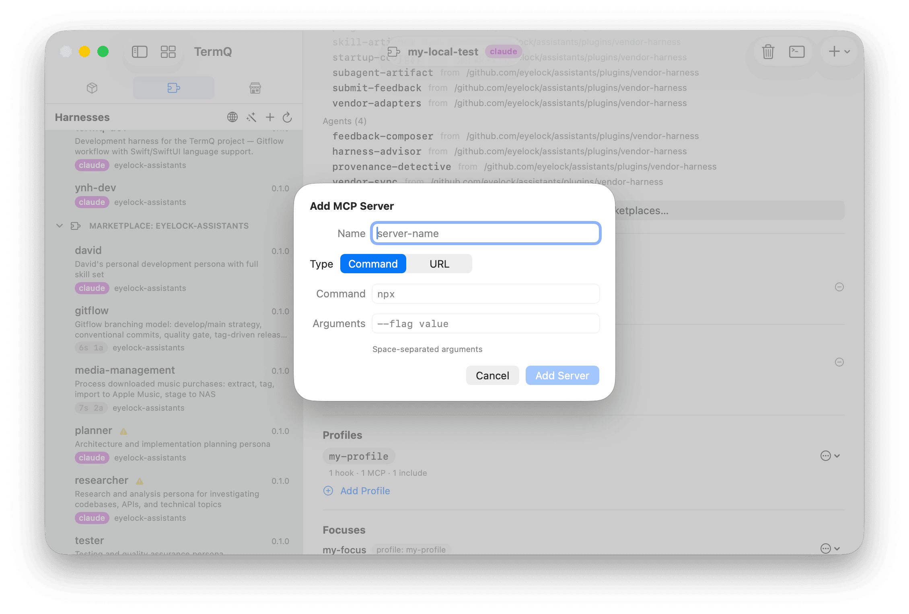

**Profiles** — the Profiles section lists every resolved profile as a card. For editable harnesses each card has an **⋯** menu with two actions:

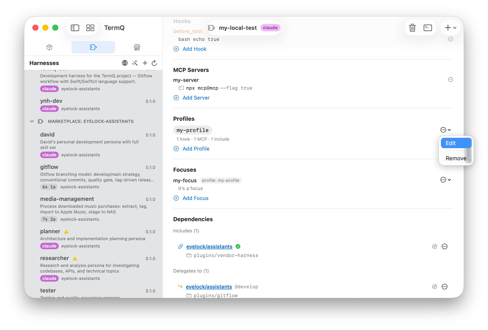

- **Edit** — opens the Profile edit sheet (see §12a below).
- **Remove** — drops the profile after a confirmation alert.

A `+` button below the list adds a new profile by name.

**Focuses** — the Focuses section works similarly. Each focus row's **⋯** menu offers **Edit** and **Remove**.

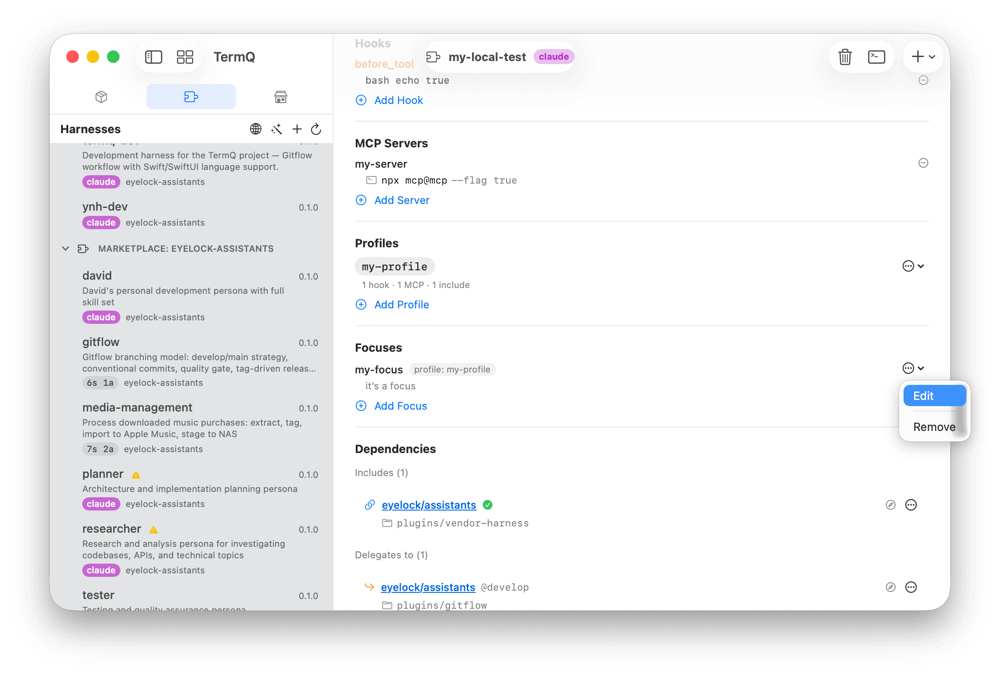

The Edit sheet exposes:

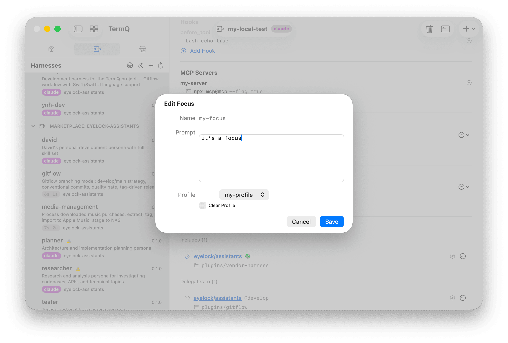

- **Name** — the focus identifier (read-only once created; remove and re-add to rename).
- **Prompt** — the text sent to the AI client at launch. Multi-line is supported.
- **Profile** (optional) — bind this focus to one of the harness's profiles, or leave unset for an unprofile launch.

A `+` button below the list adds a new focus.

All edits stream their YNH command output through the same progress sheet you see during install — so you can watch what TermQ is asking YNH to do.

### §12a — Editing a profile

Clicking **Edit** on a profile card opens the Profile edit sheet. The sheet is a scrollable form with four sub-sections:

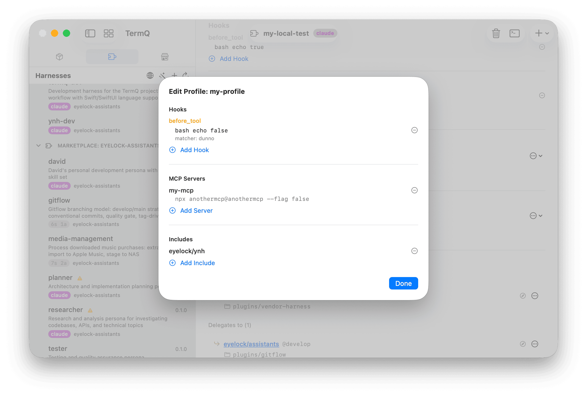

**Hooks** — lists the profile's own hooks by event. The `+` button opens the same Add Hook sheet described above. The `−` button on each row removes that hook entry. Because hooks are ordered, TermQ re-reads composition state after each change to keep remove-by-index accurate.

**MCP Servers** — lists the profile's own MCP server overrides. The `+` button opens the Add MCP Server sheet. The `−` button removes by name. Servers added here layer on top of (or suppress, using the null flag) the harness-level servers in composed output — they do not replace the harness-level entries in `plugin.json`.

> **Null server:** checking the **Suppress inherited server** option in the Add MCP sheet creates a `null` entry for that server name. This explicitly removes an inherited harness-level server from the composed output for sessions running this profile. It has no analogue at the harness level (nothing to suppress there).

**Includes** — lists the profile's own source includes. The `+` button opens the unified **Source Picker** (Library / Git URL tabs), the same picker used for harness-level includes. The `−` button removes an include entry.

**Changes take effect immediately** — after each mutation, TermQ reloads the composition and updates the sheet in place. You do not need to close and reopen the sheet to see the current state.

---

## 13 — Quarantined harnesses

If YNH cannot load a harness — for example, the manifest is missing required fields, or a recent migration moved the install away from a still-referenced path — YNH places the offending entry into `~/.ynh/.quarantine/broken/` rather than dropping it silently.

TermQ surfaces these in a **QUARANTINED** group below LOCAL in the sidebar. Each quarantined row shows the harness name and the reason YNH couldn't load it.


Two actions per row:

- **Restore** — runs `ynh quarantine restore <name>`. If YNH can re-load the entry, it moves back into LOCAL or MARKETPLACE depending on its install origin. If the underlying problem hasn't been fixed, the entry stays in QUARANTINED with an updated reason.
- **Drop** — permanent delete with confirmation. Removes the entry from `~/.ynh/.quarantine/broken/` entirely; this cannot be undone.

This group only appears when there are quarantined entries. A clean install has no QUARANTINED group at all.

---

## 14 — Automatic schema migration

If your YNH installation predates the canonical-id schema (anything that wrote to `~/.ynh` before YNH adopted host-prefixed canonical ids), TermQ runs a one-shot migration on first launch:

1. Calls `ynh migrate --json --skip-broken`.
2. Reads the migration manifest YNH emits.
3. Rewrites TermQ-side persisted ids — your worktree↔harness associations, repo defaults, vendor overrides — from the old shape (`<namespace>/<name>`) to the new canonical id shape (`<host>/<org>/<repo>/<name>`).
4. Surfaces any entries YNH could not migrate in the QUARANTINED group described above.

This runs once and is idempotent — relaunching after a successful migration is silent. If migration fails, the sidebar shows an inline error; rerunning TermQ retries.

---

## 15 — Duplicating a harness

Duplicating creates a new locally-owned harness that starts from the same configuration as an existing one — same vendor, same includes, same hooks.

Right-click any harness row and choose **Duplicate**.

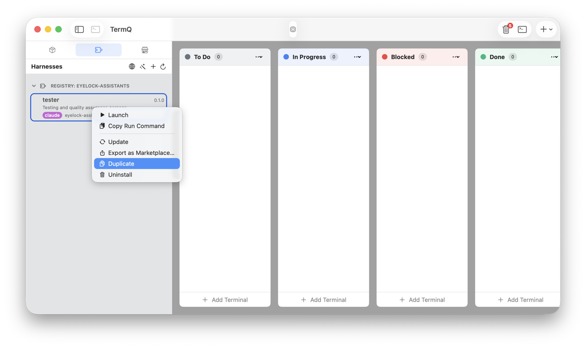

The **Duplicate Harness** sheet opens with a suggested name (`copy-of-<original>`) and your default harness directory pre-filled as the destination.

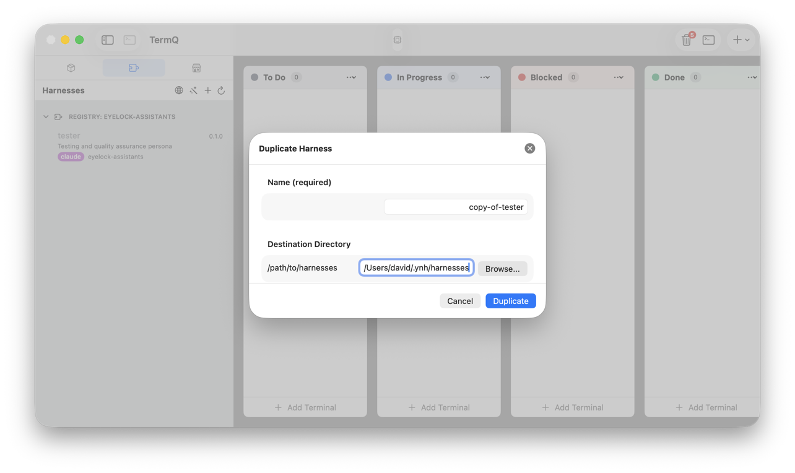

Change the name to whatever you want, adjust the destination if needed, then click **Duplicate**. TermQ:

1. Runs `ynh fork <original> --to <destination>/<name>/` to copy the harness files
2. Renames the manifest (`plugin.json`) to use your chosen name
3. Runs `ynh install <path>` to register it

The new harness appears in the **Local** group of the sidebar immediately. From there you can add artifacts, modify includes, attach MCP servers, or link it to worktrees — the same as any other locally-authored harness.

> **Tip:** The destination is independent of the original. The duplicate is fully self-contained — updating or uninstalling the original has no effect on the copy.

---

## 16 — Adding marketplace plugins to a harness

Once a harness is installed, you populate it with content from your configured marketplaces.

There are two paths into the same flow, suited to different starting contexts:

**From the marketplace browser.** When you're discovering plugins and want to bring one into a harness, open the marketplace, click a plugin, and click **Add to Harness…**. The HarnessIncludePicker sheet opens.


The picker has two sections:

- **Target harness** — choose which of your installed harnesses should receive the plugin. The picker pre-selects the last-used harness.
- **Artifacts to pick** — the plugin's skills, agents, commands, and rules are listed as a checklist. All are checked by default; untick anything you don't want. The preview at the bottom shows the exact `ynh include add` command TermQ will run.

Click **Add**. TermQ runs the command in a transient terminal pane at the bottom of the sheet, streams the output, and reports success or failure inline. On success, the harness immediately reflects the new includes — no restart needed.

> **Picking vs. including the whole plugin:** picking individual artifacts (`--pick skills/foo,agents/bar`) is the default because it gives you only what you need. Unchecking *all* artifacts and clicking Add includes the entire plugin source without a pick filter — useful when you want everything and want future updates to pick up new additions automatically.

**From the harness detail pane.** When you already know which harness you're editing, the **Add Include…** affordance in the harness detail's Includes section opens the unified Source Picker (Library / Git URL). The Library tab covers the same marketplace catalogue. The Configure step has a dedicated Artifacts → Apply two-step wizard for picking what to include. See §12 above for the inline editing surface.

---

## 17 — Default author directory

Before creating a harness, tell TermQ where to scaffold new harnesses by default. Open **Settings → External Sources → Default Author Directory** and click **Browse…**.

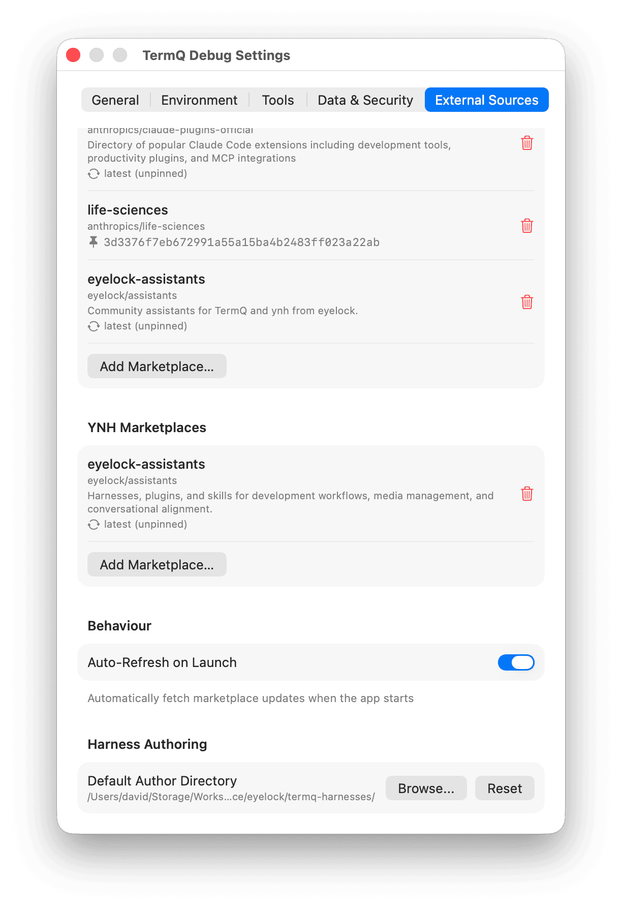

This is the directory where `ynd create harness <name>` will run. It's also pre-filled as the **Destination** in the harness wizard, in fork sheets, and in duplicate sheets. You can override it per-harness from any of those sheets.

If you don't set a default, the wizard falls back to the harnesses directory YNH reported during detection.

---

## 18 — Creating a harness with the wizard

Click the **wand** button (✦) in the Harnesses sidebar header. The **New Harness** wizard opens.


**Step 1 — Identity & Destination:**

- **Name** — a slug for the harness (`my-project-harness`). Becomes the leaf segment of the canonical id (`local/my-project-harness`). Only alphanumerics, hyphens, and underscores are allowed; TermQ validates this before letting you proceed.
- **Description** — optional free-text summary.
- **Vendor** — which AI client this harness targets (Claude, Cursor, etc.). Affects which default profile and hook templates `ynd` scaffolds.
- **Destination** — where the harness directory will be created. Pre-filled from Settings → External Sources → Default Author Directory or the YNH-detected path.
- **Install after create** — when checked, TermQ runs `ynh install <path>` immediately after scaffolding. Requires YNH to be installed and ready.

Click **Create**. The wizard moves to Step 2.

**Step 2 — Progress:**

TermQ runs:
1. `ynd create harness <name>` — scaffolds the harness directory
2. `ynh install <destination>/<name>` — installs it into YNH (if *Install after create* was checked)

Each step shows a status icon (pending → spinning → checkmark or X) and streams live output below.


If any step fails, a **Retry** button appears so you can re-attempt without starting over.

On success, the wizard shows a completion overlay with three options:

- **Browse Marketplaces** — opens the marketplace browser with this harness pre-selected as the target in the include picker, ready for you to add content
- **Open Harness** — switches the Harnesses tab to this harness's detail view
- **Reveal in Finder** — opens the scaffolded directory in Finder

---

## 19 — The typical authoring loop

A complete session — from blank slate to a harness you can launch with one click from any worktree:

1. **Scaffold** — create a new harness with the wizard (§18) and check *Install after create*, or fork an existing community harness (§11) to start from a known-good baseline.

2. **Pull in community content** — from the wizard's success overlay click **Browse Marketplaces**, or open the **Add Include…** picker from the detail pane later. The Library tab lists your configured marketplaces; pick the skills, agents, and rules your workflow needs (§16).

3. **Wire up your tooling** — in the detail pane's **Hooks** section, add the lifecycle hooks your workflow depends on: `before_tool` guards, `on_stop` notifications, `before_prompt` context injectors. In the **MCP Servers** section, add the servers your AI client should connect to during sessions. Both sections have `+` / `−` buttons that round-trip immediately through `ynh` (§12).

4. **Define profiles** — if different tasks need different hook or MCP configurations (e.g., a "review" mode vs. a "ship" mode), create profiles in the **Profiles** section. Each profile can override hooks, MCP servers, and includes independently. Use the profile edit sheet (§12a) to build each one up.

5. **Write focuses** — a focus is the unit you actually launch with. Each one binds a profile to a prompt. Write one focus per repeating task: *code review*, *architecture walkthrough*, *debugging session*. Keep prompts concise — they're sent to the AI client at launch, not pasted into a chat. Add focuses from the `+` button in the **Focuses** section (§12).

6. **Test end-to-end** — right-click a linked worktree in the Repositories sidebar and choose **Run with Focus…** (or **Quick Launch Focus ▶** for a one-click launch). Verify the prompt loads, the right profile is active, and the MCP servers connect.

7. **Iterate** — tweak focus prompts, adjust hooks, add or remove MCP servers. Changes are visible in the Composition view the moment `ynh` writes them. No restart needed.

---

## 20 — What's next

You've covered the complete harness lifecycle: install, link to worktrees, launch, update, uninstall, fork, duplicate, edit includes and delegates in place, edit hooks, MCP servers, profiles, and focuses inline, manage quarantined entries, populate from marketplaces, create new harnesses with the wizard, and the full authoring loop from scaffold to launchable focus.

The next tutorials cover automation and AI integration:

- [CLI Automation](cli.md) — drive TermQ from the command line
- [Persistent AI Context](ai-context.md) — feed project context to your AI sessions automatically

> **Feedback:** the Harnesses tab is deliberately feature-flagged for 0.8 so we can iterate on the rough edges. If something feels wrong, please [open an issue](https://github.com/eyelock/termq/issues).
