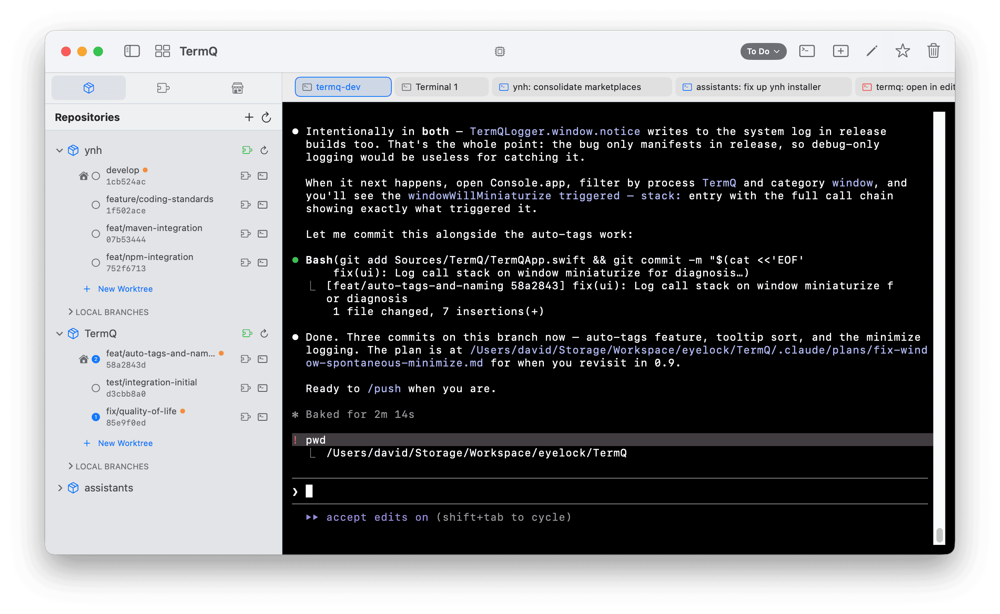
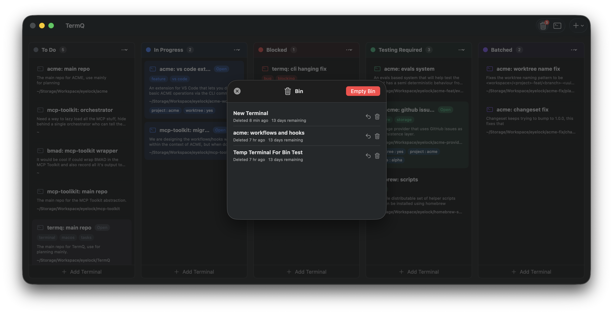
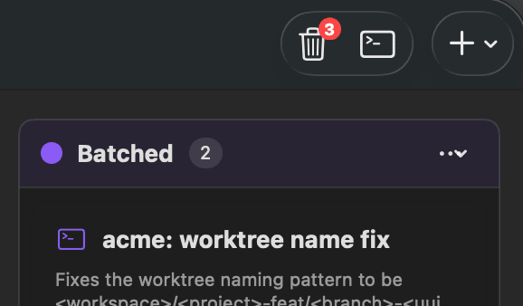

# Tutorial 7: Lifecycle

Not all terminals deserve the same treatment. Some you open ten times a day; others you create for a single task and never need again. TermQ has features for both ends of that spectrum — and for everything that happens in between.

---

## 7.1 — Pinning frequently-used terminals

Pin a terminal to make it always accessible as a tab, regardless of where it lives on the board.

Click the **⭐** button on any card, or press **⌘D** while a terminal is open. Pinned terminals appear as tabs at the top of the terminal view.

Navigate between pinned terminals with **⌘]** and **⌘[**, or click the tabs directly. Hover over a tab to reveal Edit and Delete buttons.

**When to pin:** Your always-on dev server, your primary database connection, your go-to scratch terminal. Anything you reach for multiple times a day.

---

## 7.2 — Quick terminal in tab view

While in the tab view (a pinned terminal is open), **⌘T** creates a new temporary terminal in the same working directory.

This new terminal starts its life as a tab — not a card on the board. As soon as you edit its details (name, description, tags), it becomes a full card and persists. Until then, it's just a scratch session.

---

## 7.3 — The bin

Deleting a terminal via **⌘⌫** or the context menu doesn't permanently remove it — it moves to the bin. This gives you a window to recover something you deleted by mistake.

Click the **bin icon** in the toolbar, or press **⌘⇧⌫**, to open it.

The bin is accessible from the board toolbar:

From the bin you can:
- **Restore** a terminal back to its original column
- **Permanently delete** it to clear the space

**Retention period:** By default, binned terminals are auto-deleted after 30 days. Configure this in **Settings > General > Bin Retention**. Set to 0 to keep indefinitely.

---

## 7.4 — Exporting a session

Save the contents of a terminal's scrollback buffer to a text file with **⌘⇧S** or via the toolbar.

The export captures everything visible in the buffer — useful for saving build output, test results, or a command history you want to refer back to later.

---

## 7.5 — Keeping the board clean

A board with 50 stale cards is just as hard to navigate as 50 unlabelled terminal windows. A few habits help:

- **Move to Done** when a task finishes — don't just close the terminal
- **Delete** cards you're confident you won't need — the bin catches mistakes
- **Archive periodically** — Delete old Done cards when they've sat there long enough that you're sure you don't need them back

The bin retention setting means you have a configurable safety net. Use it.

---

## What you learned

- **Pin** frequently-used terminals with ⌘D — they become persistent tabs for quick access
- **⌘T** in tab view creates a scratch session; editing its details promotes it to a full card
- **⌘⌫** moves cards to the **bin** (soft delete) — recoverable for up to 30 days by default
- **⌘⇧S** exports the terminal buffer to a text file
- A clean board requires deliberate maintenance — move cards to Done, delete when you're sure

## Next

[Tutorial 8: CLI Automation](tutorials/cli.md) — Control your board from the shell with `termqcli`.
