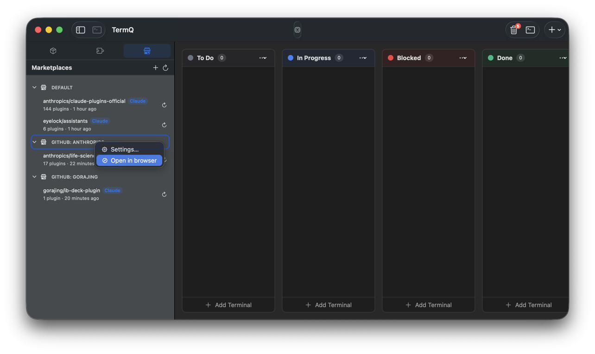
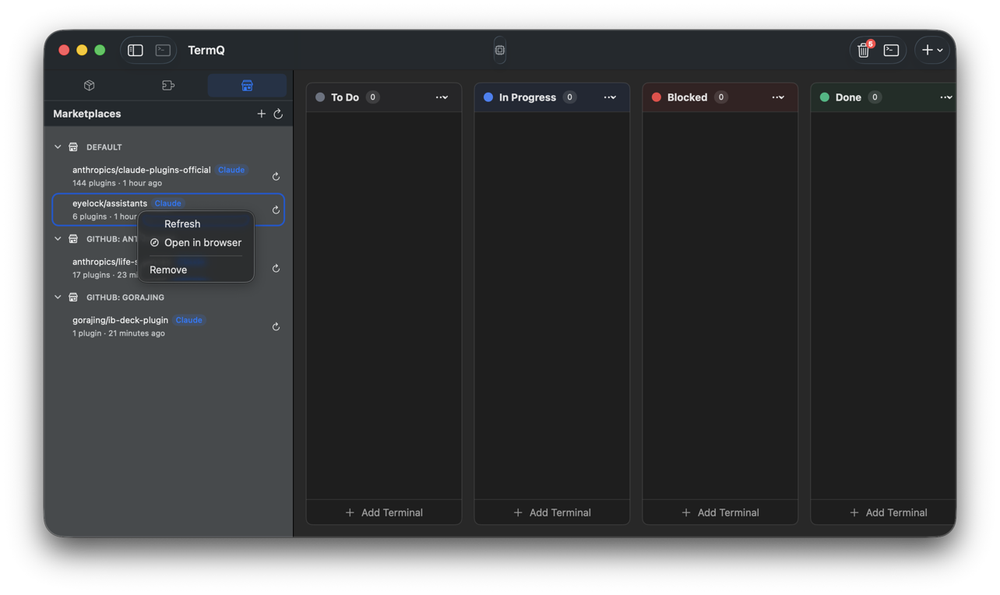

# Marketplace Browser

In this tutorial you'll connect TermQ to a community marketplace, browse its plugins, and learn how to find content you can use in your harnesses.

By the end you'll know how marketplaces work, how to add a custom one, and how to navigate the catalogue. The next tutorial covers using these plugins inside a harness — installing harnesses, populating them from the marketplace, and creating new harnesses from scratch.

**Time:** about 10 minutes
**Requires:** TermQ 0.8 or later

---

## 1 — What are marketplaces?

A **marketplace** is a Git repository that publishes a curated index of plugins — skills, agents, commands, and rules — packaged for YNH harnesses. Adding a marketplace to TermQ gives you a searchable catalogue you can browse without leaving the app.

Marketplaces follow a vendor-specific layout:
- Claude marketplaces keep their index at `.claude-plugin/marketplace.json`
- Cursor marketplaces keep theirs at `.cursor-plugin/marketplace.json`

TermQ clones the marketplace repo on demand and reads the index directly — no intermediary registry, no account required.

---

## 2 — Default marketplaces

On first launch, TermQ automatically adds two default marketplaces:

- **Claude Plugins Official** (`github.com/anthropics/claude-plugins-official`) — Anthropic's curated catalogue
- **eyelock assistants** (`github.com/eyelock/assistants`) — community plugins for TermQ and YNH workflows

These are fetched in the background immediately after being added. If you remove them and want them back, open the **Marketplaces** sidebar tab and click **Restore Defaults** — it re-adds any defaults that are missing without duplicating ones you still have.

The Marketplaces sidebar header has two buttons: **+** (add a new marketplace) and **↺** (refresh all). Use **↺** to manually re-fetch all marketplace indices at once.

---

## 3 — Adding a custom marketplace

Click **+** in the Marketplaces sidebar header, or open **Settings** (**⌘,**) → **External Sources**.

The **Add Marketplace** sheet has two tabs:

- **Known** — a list of well-known marketplaces TermQ recognises; click **Add** on any row
- **Custom** — paste any HTTPS Git URL and pick the vendor layout (Claude or Cursor)

Click **Add**. TermQ stores the marketplace in its own config (under `~/Library/Application Support/TermQ/marketplaces.json`) and immediately kicks off the first fetch in the background.

> **Known marketplaces:** If TermQ recognises the URL you pasted in Custom tab, it auto-fills the vendor and a friendly display name.

The settings row updates once the fetch completes, showing the last-fetched timestamp and the configured ref pin (or "latest (unpinned)" if you didn't supply one). If the fetch fails (bad URL, no network), the row shows the error inline.

---

## 4 — Browsing the marketplace

The marketplace browser lives in the **Sidebar** under the Marketplaces section. Select a marketplace from the list to open its plugin catalogue.

The browser shows all plugins from the index. Use the search field to filter by name, category, or tag. Each row displays:
- Plugin name and version
- Description (if provided)
- Category and tag chips
- Source indicator (relative — bundled in the repo, or external — fetched on demand)

Click a plugin to open the detail pane, which shows the full description, tags, and the list of pickable artifacts (skills, agents, commands, rules) the plugin exposes.

**External plugins:** If a plugin lives in a separate repository (source type `github`, `url`, etc.), TermQ fetches and caches it when you first open the detail. This is a one-time shallow clone — subsequent visits use the cache.

---

## 5 — Context menus

Right-clicking anywhere in the Marketplaces sidebar gives you quick access to the most common actions without opening any sheets.

### Group headers (DEFAULT, GITHUB: X)

Right-click a disclosure group header to see:

- **Settings…** — opens **Settings → External Sources** directly, so you can add or remove marketplaces and registries without hunting through the menus
- **Open in Browser** *(GitHub groups only)* — opens the GitHub organisation page for that group in your default browser

### Marketplace rows

Right-click any marketplace row for per-marketplace actions:

- **Refresh** — re-fetches the marketplace index immediately
- **Open in Browser** — opens the specific marketplace repository in your browser
- **Remove** — removes the marketplace from TermQ (destructive; use Settings to re-add)

---

## 6 — What's next

You've added marketplaces and learned to navigate the catalogue. The next tutorial brings these plugins together with harnesses — install a harness, add marketplace plugins to it, fork existing harnesses, and create new ones with the wizard.

→ [Harnesses](harnesses.md)
