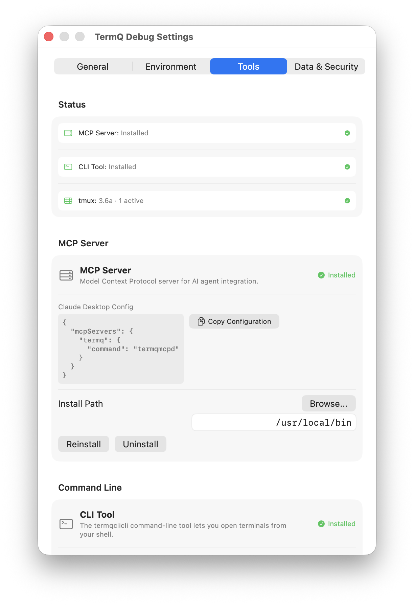

# Tutorial 10: MCP Integration

The Model Context Protocol (MCP) lets Claude Code interact with your TermQ board directly — not just reading context you paste in, but querying the board, opening terminals, moving cards, and updating fields, all from within a Claude session.

This tutorial sets up the integration and shows the core workflow.

---

## 10.1 — Install the MCP server

Open **Settings** (⌘,) and go to the **Tools** tab. Click **Install** to install both `termqcli` and `termqmcp`.



`termqmcp` is a standalone binary that speaks the Model Context Protocol over stdio. Claude Code communicates with it as a subprocess.

Verify the install:

```bash
termqmcp --version
```

---

## 10.2 — Configure Claude Code

Add TermQ to your Claude Code MCP configuration. Edit `~/.claude/mcp.json`:

```json
{
  "mcpServers": {
    "termq": {
      "command": "termqmcp",
      "args": []
    }
  }
}
```

Restart Claude Code. You should see `termq` listed in the available MCP tools.

---

## 10.3 — What Claude Code can now do

Once connected, Claude Code has access to these tools:

| Tool | What it does |
|---|---|
| `termq_pending` | List terminals needing attention — pending actions, sorted by staleness |
| `termq_list` | List all terminals, optionally filtered by column |
| `termq_find` | Smart search across all terminal metadata |
| `termq_open` | Open a terminal by name, UUID, or path — returns full details including `llmPrompt` |
| `termq_create` | Create a new terminal card |
| `termq_set` | Update terminal fields (name, description, tags, llmPrompt, llmNextAction, etc.) |
| `termq_move` | Move a terminal to a different column |
| `termq_get` | Get context for the terminal Claude is currently running in (using `$TERMQ_TERMINAL_ID`) |
| `termq_delete` | Delete a terminal (soft delete to bin by default) |

---

## 10.4 — The session start workflow

At the start of every Claude Code session in a TermQ terminal, tell it to run:

```
termq_pending
```

This surfaces terminals with queued actions and staleness indicators. Claude can then:
- Address the highest-priority pending action
- Report what's waiting for your review
- Ask which terminal to work in

You can also use the built-in prompt:

```
/mcp termq session_start
```

This runs the session start checklist: pending work, summary of active terminals, and orientation for the session.

---

## 10.5 — Self-awareness: knowing which terminal you're in

Any Claude Code session running inside a TermQ terminal has access to `$TERMQ_TERMINAL_ID`. Claude can use this with `termq_get` to retrieve its own terminal's context:

```
termq_get id="$TERMQ_TERMINAL_ID"
```

The response includes `llmPrompt`, `llmNextAction`, tags, column, and all other metadata for the current terminal. This is how Claude knows what project it's working on, what the standing instructions are, and what to do first — without you needing to explain it.

---

## 10.6 — Cross-session continuity

At the end of a Claude session, the recommended pattern is to have Claude update the terminal's state:

```
Please update this terminal:
- Set llmNextAction to "Continue the auth refactor — next step is auth/v2/tokens.py"
- Set the staleness tag to fresh
```

Claude uses `termq_set` to write those fields. The next session — whether it's you or another Claude instance — opens the terminal, calls `termq_get`, and has everything it needs.

---

## What you learned

- `termqmcp` is a standalone MCP server — add it to `~/.claude/mcp.json`
- Claude Code gets a full set of tools to **read and write** your TermQ board
- `termq_pending` at session start surfaces what needs attention
- `termq_get id="$TERMQ_TERMINAL_ID"` gives Claude its own terminal's context automatically
- The end-of-session update pattern creates continuity between Claude sessions

## Next

[Tutorial 11: Queued Actions](tutorials/queued-actions.md) — Queue actions that execute automatically when a terminal opens.
