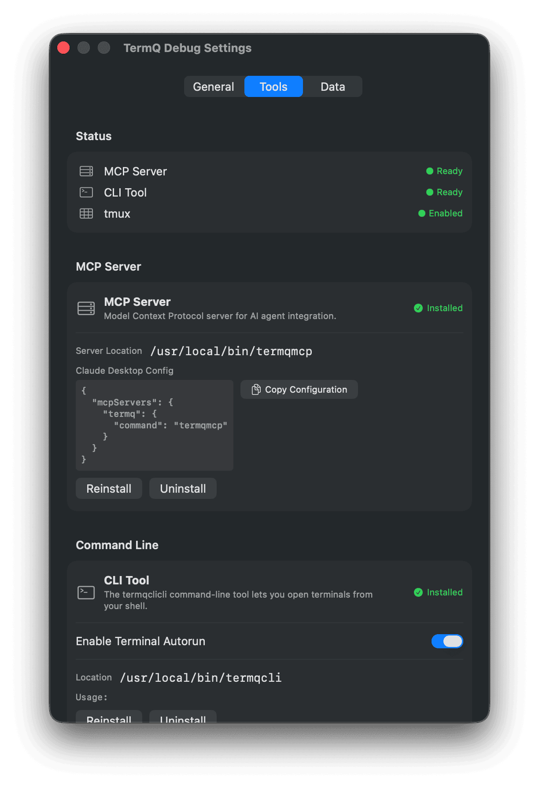
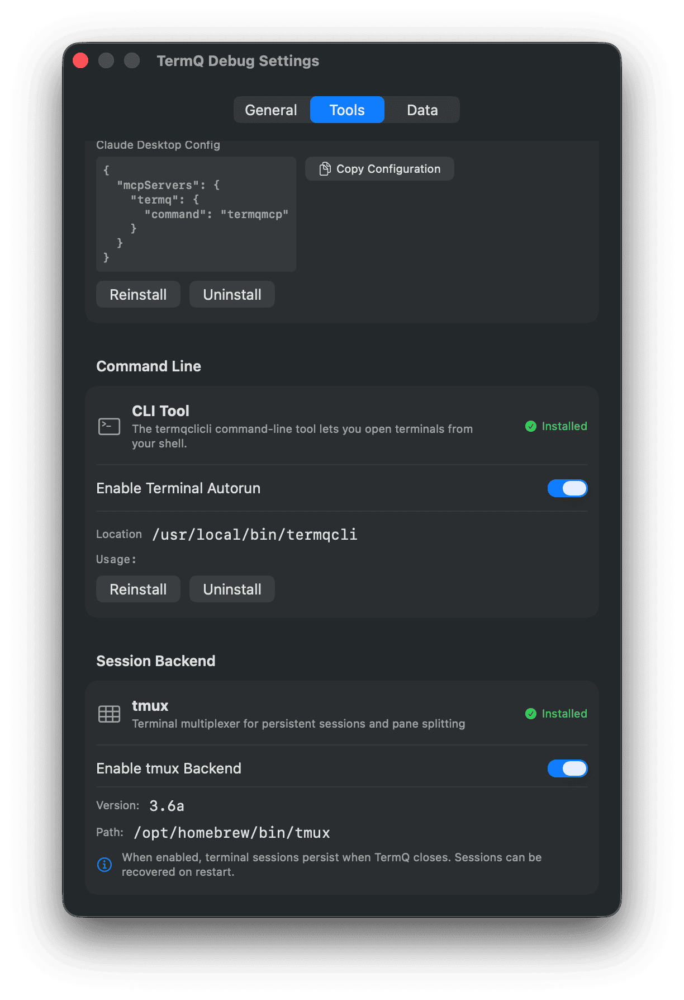
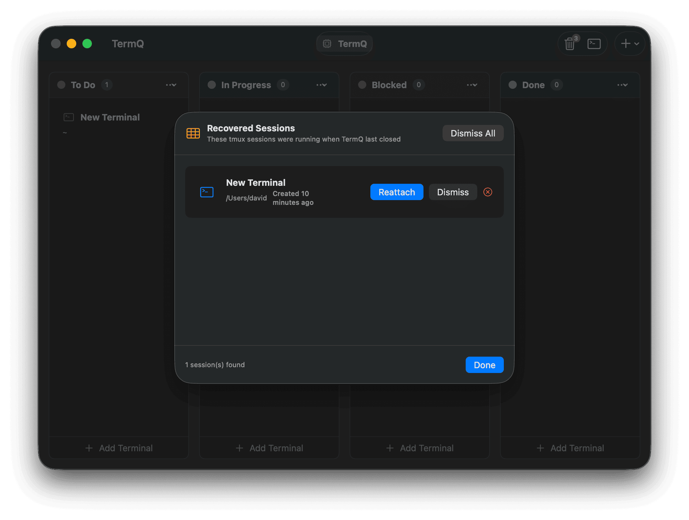
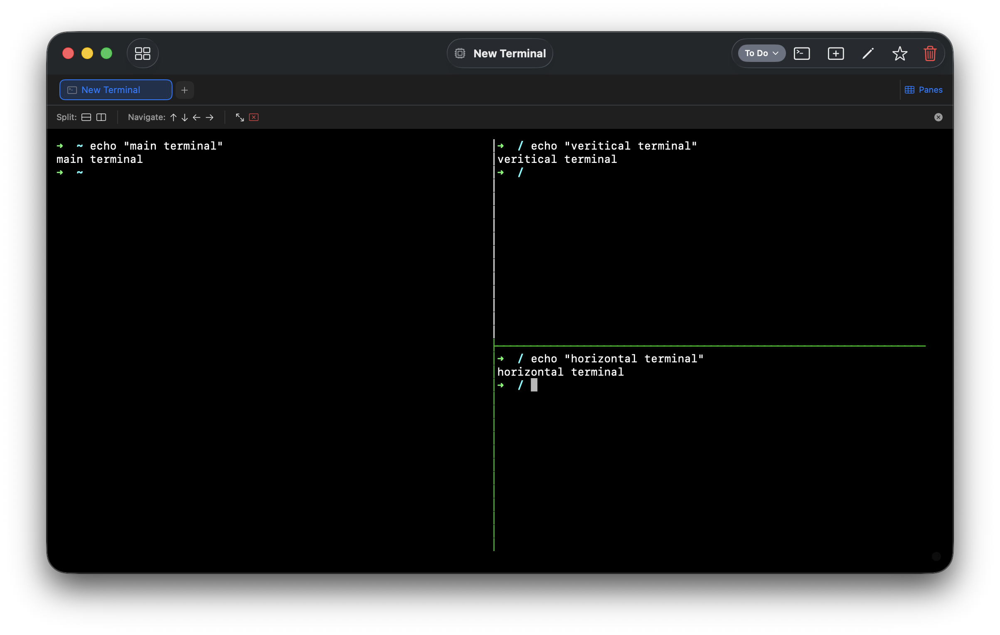

# Tutorial 5: Persistent Sessions

By default, TermQ uses your shell directly. When you quit the app, those sessions end. That's fine for quick one-off commands — but for a dev server you keep running all day, or a migration you need to resume tomorrow, you want something that survives.

That's what tmux gives you.

---

## 5.1 — What tmux does

tmux runs your shell session in a background process. TermQ connects to that process to display it — but if TermQ closes, the session keeps running. When you reopen TermQ, it reconnects.

The result: a terminal that was running `npm run dev` when you closed your laptop yesterday is still running when you open it today. No restart, no lost output.

You don't need to know tmux to use this. TermQ handles the session management. The tmux pane features (splitting, navigating panes) are there if you want them, but you can ignore them entirely and just use the persistence.

---

## 5.2 — Install tmux (if you haven't)

Check whether you already have it:

```bash
which tmux
```

If that prints nothing, install it:

```bash
brew install tmux
```

---

## 5.3 — Enable tmux in TermQ

Open **Settings** (⌘,), go to the **Tools** tab. The tmux section appears at the top when tmux is installed.



Enable **Enable tmux Backend**. You can also enable **Auto-reattach Sessions** here — with this on, TermQ silently reconnects your sessions when it launches, with no prompts.

---

## 5.4 — Switch a terminal to tmux

Open any terminal card's editor (right-click > Edit Details). In the **Terminal** section, change the **Backend** field from Direct to **TMUX (Persistent)**.



The backend picker only appears when tmux is installed and enabled globally.

> **Tip:** In Settings > General, you can set the default backend to tmux. New terminals will use it automatically, and you won't need to change individual cards.

---

## 5.5 — Verify persistence

Open the terminal with your new tmux backend and start something that runs continuously:

```bash
ping 8.8.8.8
```

Now quit TermQ (⌘Q). Wait a moment. Reopen TermQ. Open the same card.

The ping is still running — and you'll see the output that accumulated while TermQ was closed.

---

## 5.6 — Session recovery

If a session was running when TermQ crashed (or if auto-reattach was off), TermQ shows a recovery dialog on next launch. You can reattach orphaned sessions, dismiss them from the list (session keeps running), or kill them.



If you want to check what tmux sessions exist from the terminal itself:

```bash
tmux list-sessions | grep termq-
```

Each TermQ session is named `termq-<cardId>` where `cardId` is the first 8 characters of the card's UUID.

---

## 5.7 — Pane splitting (optional)

tmux terminals support splitting into multiple panes within a single card. Open any tmux-backed terminal and click the **Panes** button in the tab bar.



From there you can split horizontally or vertically, navigate between panes, zoom a pane to fill the view, or close panes. Standard tmux keyboard shortcuts also work (`Ctrl+B "` to split horizontally, `Ctrl+B %` to split vertically).

---

## What you learned

- tmux runs sessions as background processes — they **persist when TermQ closes**
- Enable tmux in **Settings > Tools**, then set the backend per-terminal (or globally)
- **Auto-reattach** silently reconnects sessions on launch with no prompts
- The **recovery dialog** appears for sessions that weren't automatically matched
- Pane splitting is available in tmux terminals — useful but entirely optional

## Next

[Tutorial 6: Terminal Context](tutorials/terminal-context.md) — Environment variables, secrets, and init commands.
