# Remote PRs

In this tutorial you'll use TermQ's Remote PR feed to monitor open pull requests for your repositories, launch harness sessions directly against a PR's checked-out worktree, and keep the list tidy with automatic prioritisation and pruning.

**Time:** about 20 minutes  
**Requires:** TermQ 0.10 or later, `gh` CLI installed and authenticated, at least one GitHub repository registered in the sidebar

---

## 15.1 — Switching to Remote mode

The Repositories sidebar has a **Local / Remote** toggle at the top of the repo list.

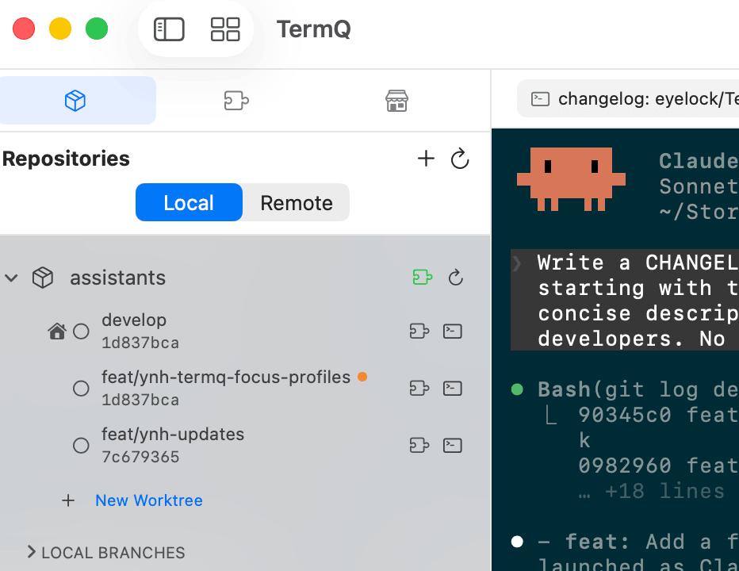

- **Local** (default) — the standard worktree view you already know from Tutorial 12.
- **Remote** — each repository expands to show its open pull requests fetched from GitHub.

Click **Remote** to switch. TermQ calls `gh pr list` for every expanded repository in the background. The first fetch for a repo typically takes a second or two; subsequent opens are instant (the feed is cached for 5 minutes).

> **gh CLI requirement:** Remote mode requires the `gh` CLI. If it is not found in `$PATH`, TermQ shows a one-time banner with a link to the install docs. If `gh` is found but not authenticated, a banner prompts you to run `gh auth login`.

---

## 15.2 — Reading the PR feed

Each PR appears as a row with its number and title. A row of small badges below the title shows your relationship to the PR:

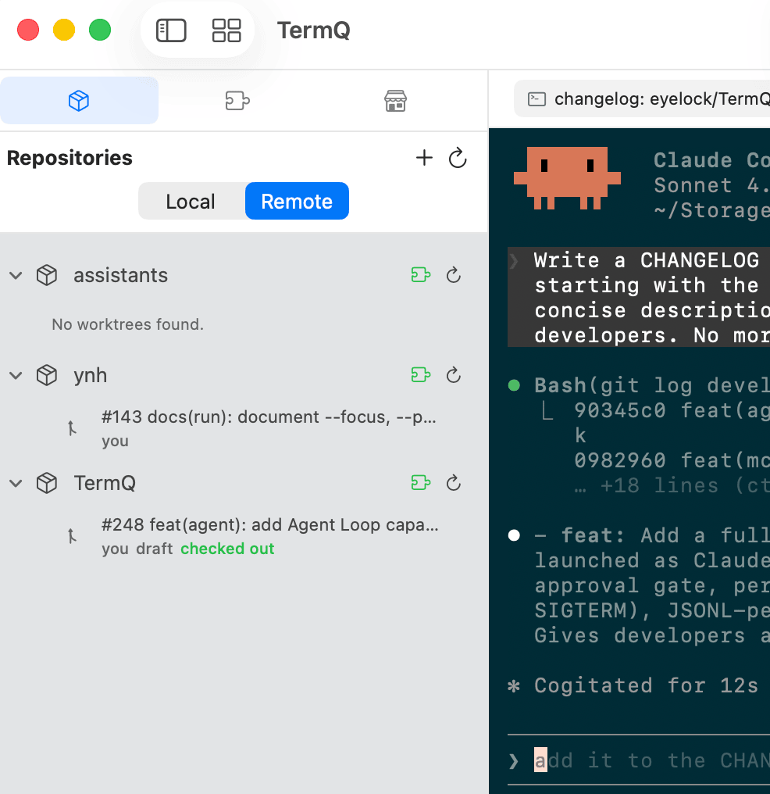

| Badge | Meaning |
|-------|---------|
| **you** | You are the author |
| **review** (orange) | A review has been requested from your account |
| **assigned** | You are assigned to the PR |
| **draft** | The PR is in draft state |
| **checked out** (green) | A local worktree exists for this PR's branch |

### Priority ordering

The feed is not simply newest-first. PRs are ranked in four tiers, with recency (`updatedAt`) as the tiebreaker within each tier:

1. **Checked out** — PRs you have locally checked out always pin to the top so they stay visible regardless of the feed cap.
2. **Review requested** — PRs where your GitHub account has been asked for a review.
3. **Open, non-draft, no reviewers assigned** — unreviewed PRs that may need attention.
4. **Everything else** — remaining open PRs.

### Feed cap

By default TermQ shows at most 20 PRs per repository. Tier-1 (checked-out) PRs always appear regardless of this limit. When the full list exceeds the cap, a **+ N more** footer shows the count of hidden PRs.

To change the cap globally, go to **Settings → GitHub** and adjust the stepper.

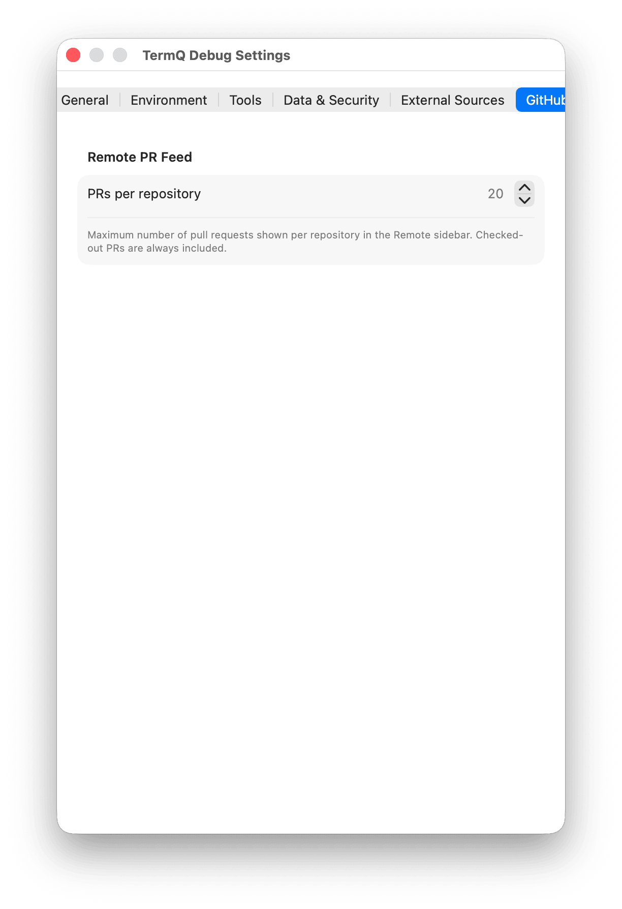

### Per-host GitHub accounts

TermQ identifies your GitHub login by running `gh api user` with the repository path as the working directory. This means each repository resolves the correct account automatically — github.com, GitHub Enterprise Cloud, and on-prem GHE instances are all supported simultaneously without any extra configuration.

---

## 15.3 — Authenticating gh

If `gh` is installed but not authenticated, TermQ shows a banner:

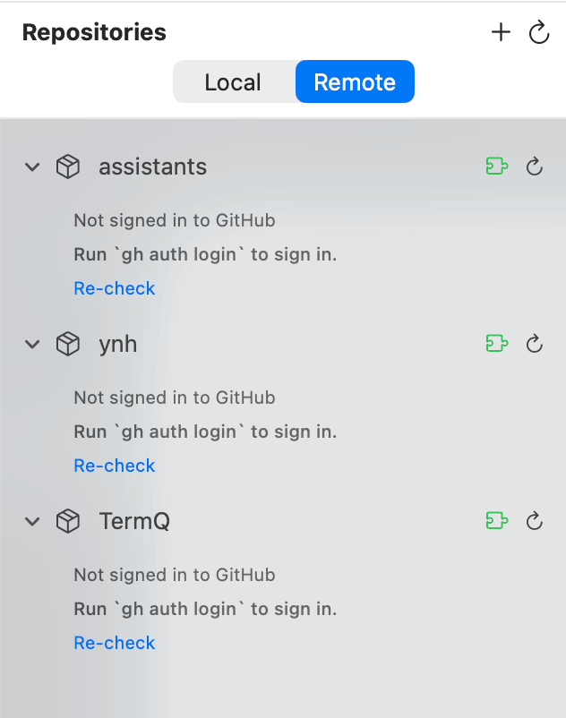

Open a terminal and run:

```
gh auth login
```

Follow the prompts. Then click **Re-check** in TermQ — the banner clears and the feed loads.

For GitHub Enterprise, run:

```
gh auth login --hostname your-instance.example.com
```

---

## 15.4 — The PR context menu

Right-click any PR row to see available actions. The menu adapts depending on whether the PR is checked out locally.

### When the PR is checked out

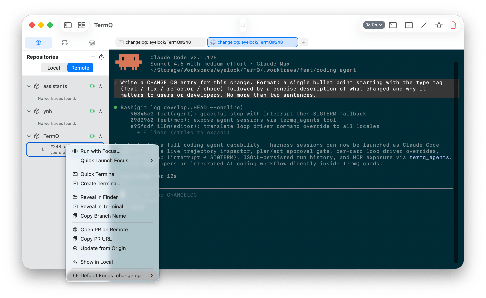

**Harness actions (top group):**
- **Run with Focus…** — opens the full Run with Focus sheet (see §15.5).
- **Quick Launch Focus ▶** — submenu listing every focus defined in the repository's default harness. Clicking a focus launches immediately without opening the sheet.

**Terminal actions:**
- **Quick Terminal** — opens a bare terminal at the worktree path.
- **Create Terminal…** — opens the Create Terminal sheet pre-filled with the worktree path.

**File actions:**
- **Reveal in Finder** — opens the worktree directory in Finder.
- **Reveal in Terminal** — opens a new terminal window at the worktree path in your default terminal app.
- **Copy Branch Name** — copies the PR's head branch name to the clipboard.

**Remote actions:**
- **Open PR on Remote** — opens the PR page in your browser.
- **Copy PR URL** — copies the PR URL to the clipboard.
- **Update from Origin** — pulls the latest changes from the PR's remote branch into the local worktree.

**Navigation:**
- **Show in Local** — switches to Local mode with the worktree in view.

**Focus settings:**
- **Set Default Focus ▶** — submenu to change or clear the default focus for this repository (see §15.6).

### When the PR is not checked out

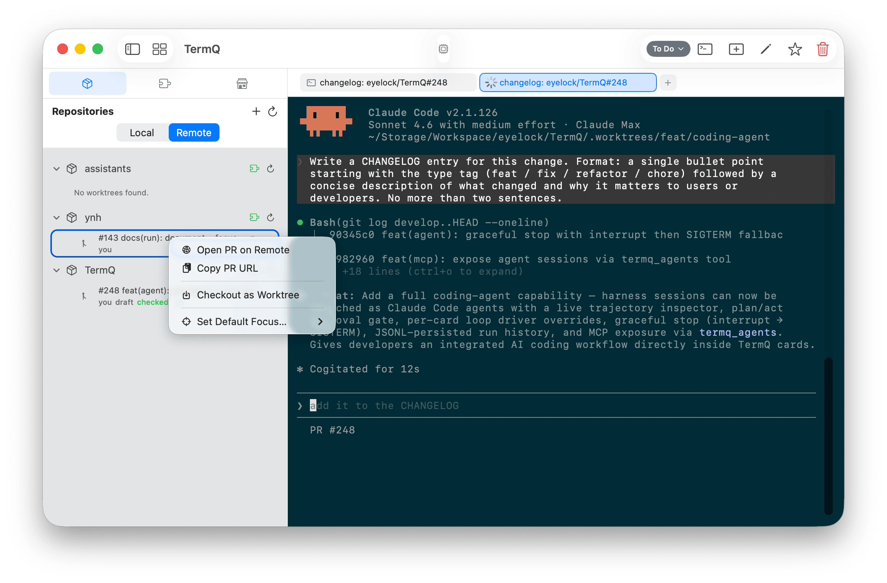

- **Checkout as Worktree** — runs `gh pr checkout --worktree` to create a linked worktree for the PR's branch.
- **Open PR on Remote** / **Copy PR URL** — as above.

If a local worktree already exists for the branch (e.g. you checked it out manually), the menu shows **Worktree exists** and a **Switch to Existing** button instead.

---

## 15.5 — Run with Focus

**Run with Focus** launches a `ynh run` session against a PR's checked-out worktree, pre-configured with a focus (a named task template defined in your harness).

Open it by right-clicking a checked-out PR row and choosing **Run with Focus…**

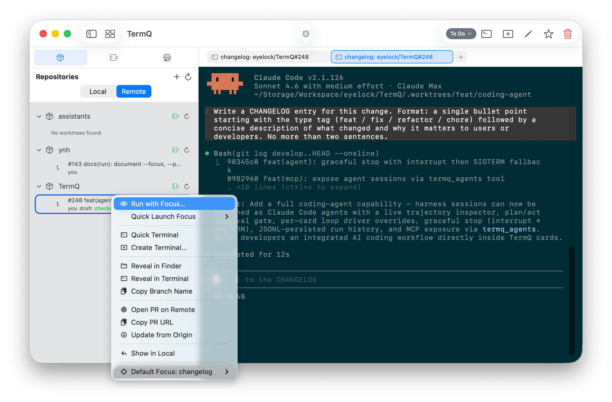

### Pickers

**Harness** — pre-selects the last harness you used for this repository. Change it to use a different harness.

**Vendor** — defaults to the harness's own default vendor. Override it to run against a different LLM backend. Vendors that are not currently available are shown in orange.

**Focus** — if the selected harness has named focuses, they appear here. Select one to use its pre-written prompt. Select **(none — ad-hoc prompt)** to write your own.

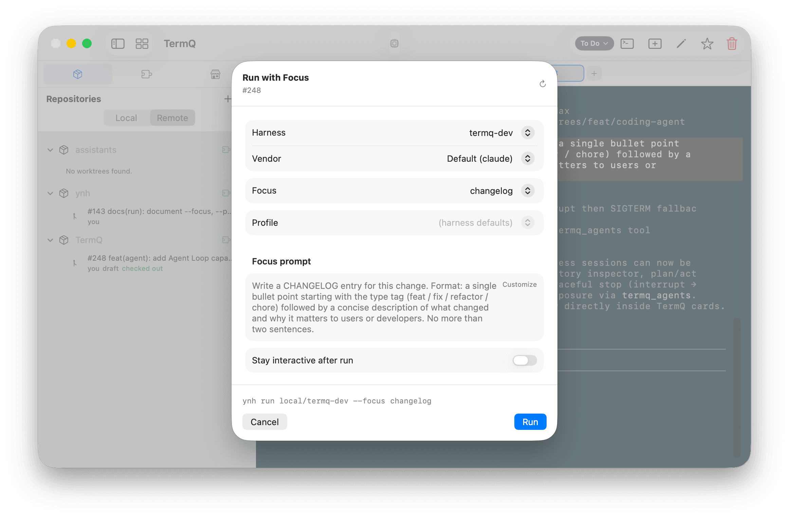

When a focus is selected, the **Focus prompt** textarea shows the focus's prompt text read-only, and the **Profile** picker is locked to the focus's configured profile.

**Profile** — when no focus is selected, you can choose a profile (a named configuration set) to pass to `ynh run`. When a focus is selected this is derived automatically.

### Customising the focus prompt

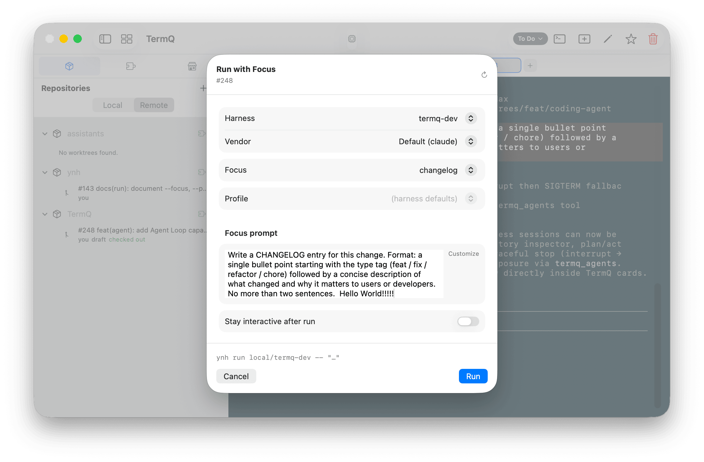

Click **Customize** to unlock the prompt textarea and edit the focus prompt before running. This is useful when a focus captures most of what you need but you want to add context specific to this PR.

When Customize is active, the command preview shows `--` followed by `"…"` instead of `--focus <name>`, because the focus name is no longer passed — the custom prompt is sent as a positional argument instead.

### Stay interactive

The **Stay interactive after run** toggle appears when the selected vendor supports it. When on, `--interactive` is appended to the `ynh run` command so the agent stays open for follow-up questions after responding to the initial focus.

### Command preview

The bar above the action buttons shows the exact `ynh run` command that will be executed. It updates live as you change pickers.

### Running

Click **Run**. TermQ creates a new terminal card and immediately starts the `ynh run` command. The card is titled `focus: org/repo#N` (e.g. `pr-summary: eyelock/TermQ#248`), truncated to 40 characters if needed.

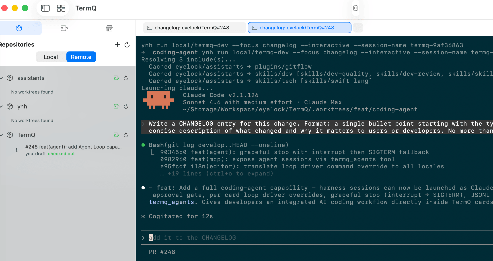

> **Harness detail loading:** Focus and profile lists are cached after the first load. Re-opening the sheet is instant. If you have edited your harness YAML on disk, click the **⟳** button in the sheet header to reload from disk.

---

## 15.6 — Setting a default focus

A **default focus** pre-selects a specific focus every time you open the Run with Focus sheet for a repository. It is also used by the **Quick Launch Focus** submenu.

To set it, right-click any checked-out PR row → **Set Default Focus ▶** → choose a focus name.

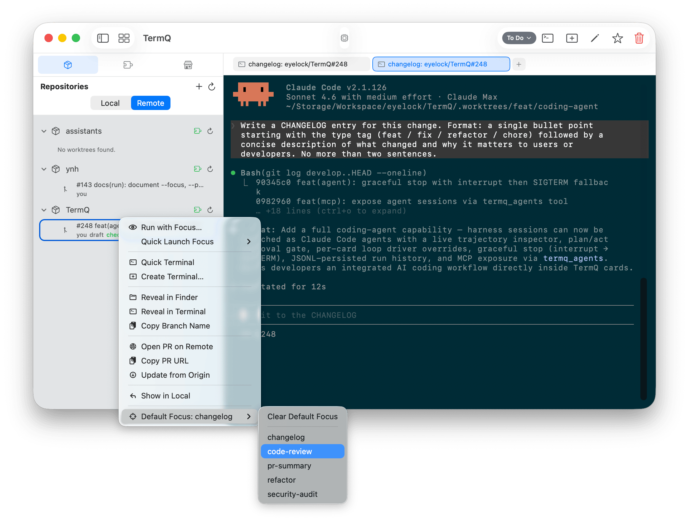

The submenu label changes to **Default Focus: code-review** (or whatever name you chose) to confirm the current setting. Select the same focus again, or choose **Clear Default Focus**, to remove it.

---

## 15.7 — Quick Launch Focus

Once a default harness and its detail are loaded, the **Quick Launch Focus ▶** submenu lists every focus by name.

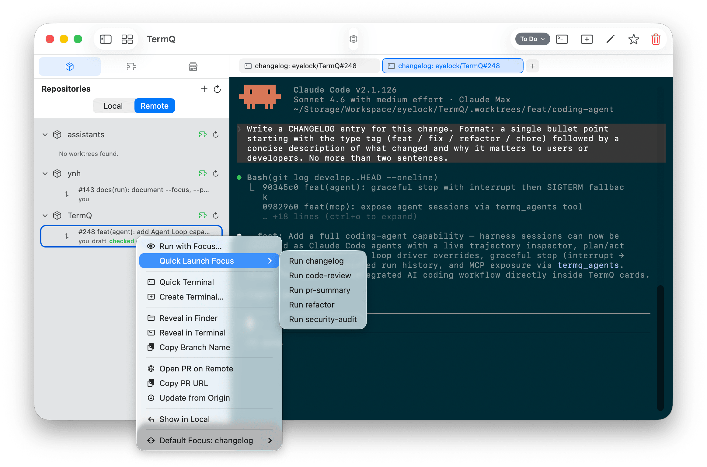

Clicking a focus name launches a `ynh run` session immediately — no sheet, no confirmation — using the PR's worktree path and the repo's default harness and vendor. Use this when you run the same focus repeatedly and don't need to change anything.

> **Submenu population:** The submenu is populated from the cached harness detail. TermQ pre-fetches the detail when the PR row first appears, so by the time you right-click the submenu is usually ready. If it appears empty, open **Run with Focus…** once to trigger the detail load, then try again.

---

## 15.8 — Prune Closed PRs

Checked-out worktrees whose PRs have since been closed or merged accumulate over time. The **⊘ Prune Closed PRs** action (visible in the repo header area when there are candidates) opens a confirmation sheet.

The sheet lists each closed PR worktree with:
- The PR number and title
- A **dirty** warning if the worktree has uncommitted changes
- An **ahead** warning if the worktree has commits not pushed to origin

Worktrees that are safe to remove (not dirty, not ahead) are checked by default. Review the list, uncheck anything you want to keep, then click **Prune**.

TermQ removes each selected worktree using `git worktree remove`. Dirty or ahead worktrees must be unchecked — use **Force Delete** from Local mode if you genuinely want to discard them.

---

## What you learned

- The **Local / Remote toggle** switches between the worktree view and the GitHub PR feed for all registered repositories
- The feed is **priority-ordered**: checked-out → review-requested → open non-draft → rest; recency breaks ties within each tier
- The **feed cap** (default 20) limits how many PRs are shown per repo; tier-1 (checked-out) PRs always appear regardless of the cap
- **Login is per-repository**: TermQ calls `gh api user` per repo so github.com, GHEC, and on-prem GHE accounts all work simultaneously
- **Run with Focus** is a full sheet for launching a `ynh run` session against a PR's worktree, with harness, vendor, focus, profile, and prompt pickers
- **Quick Launch Focus** lets you skip the sheet and launch with a single click once the harness detail is cached
- The **⟳ refresh button** in the Run with Focus sheet header reloads harness focuses and profiles from disk
- **Set Default Focus** pre-selects a focus for a repo so it appears ready each time the sheet opens
- **Prune Closed PRs** removes worktrees for PRs that have been closed or merged, with dirty and ahead safeguards

## Next

[Tutorial 16: Harness Authoring](16-harness-authoring.md) — Write and publish your own harnesses with `ynh` and the TermQ authoring tools.
