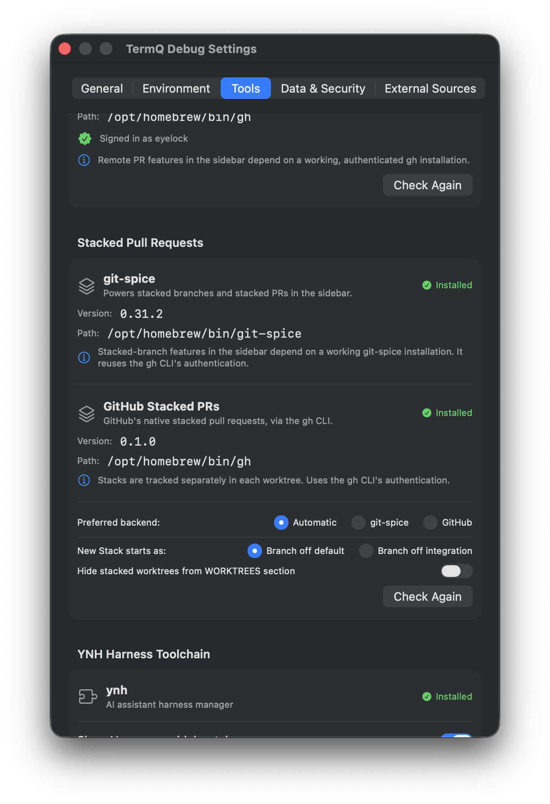
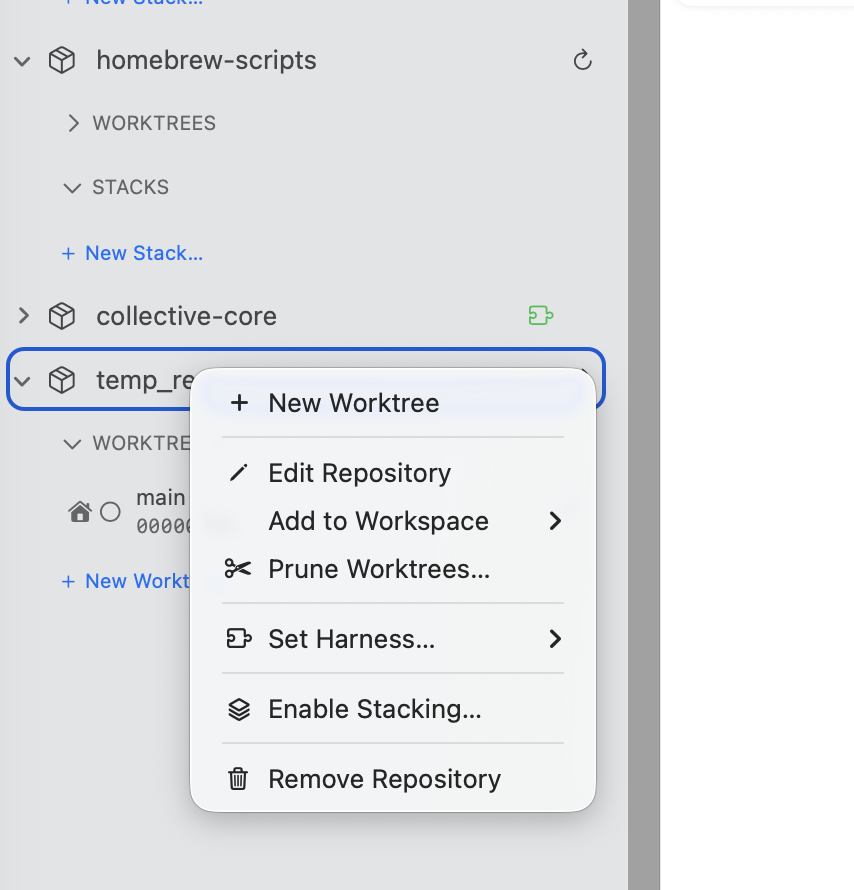
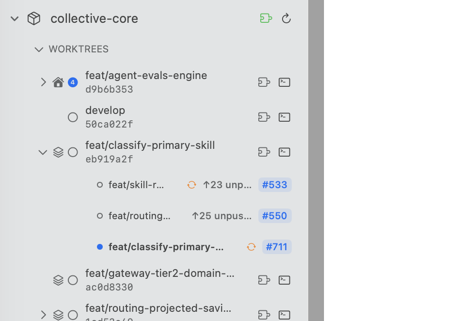
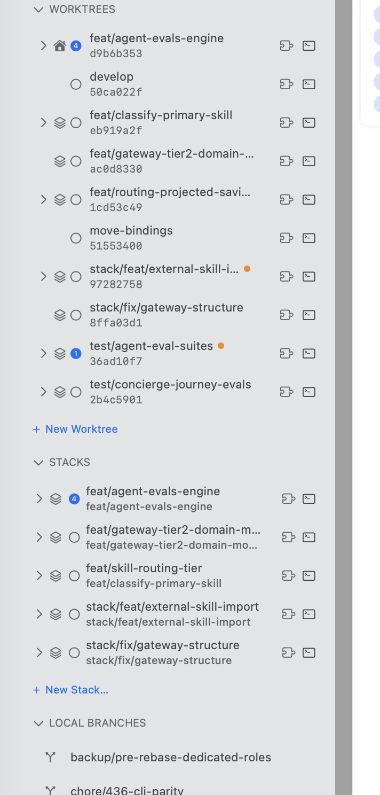
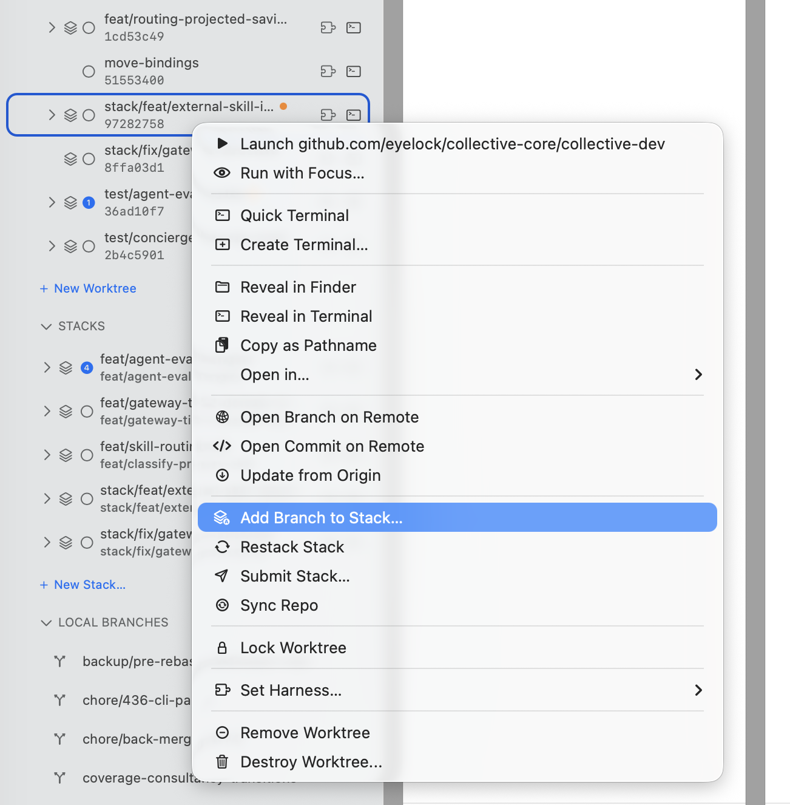
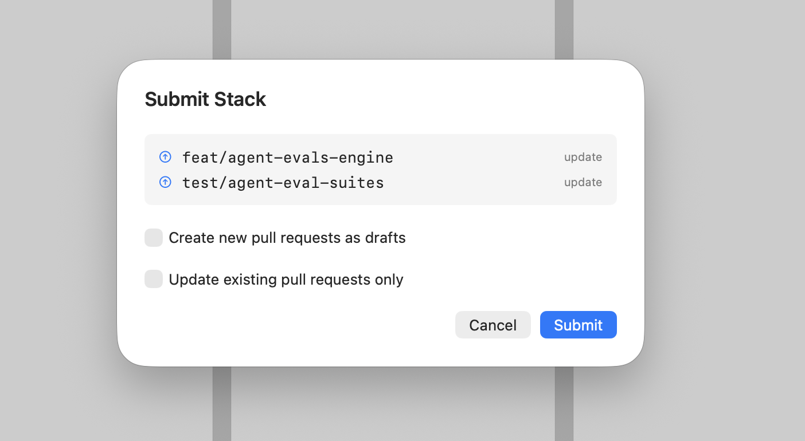
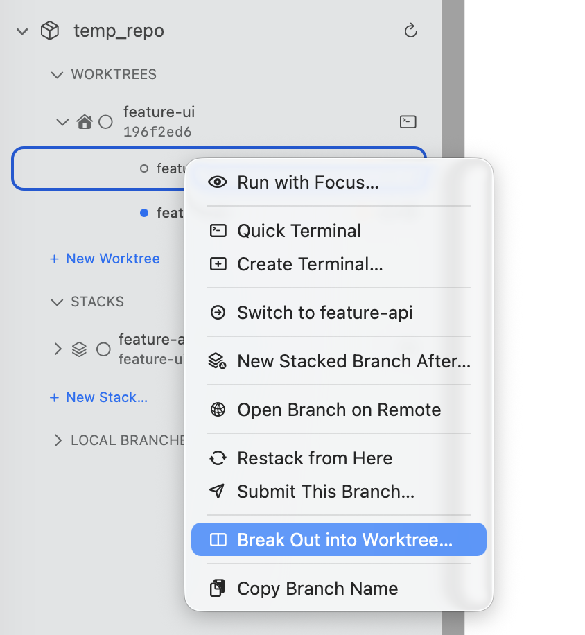
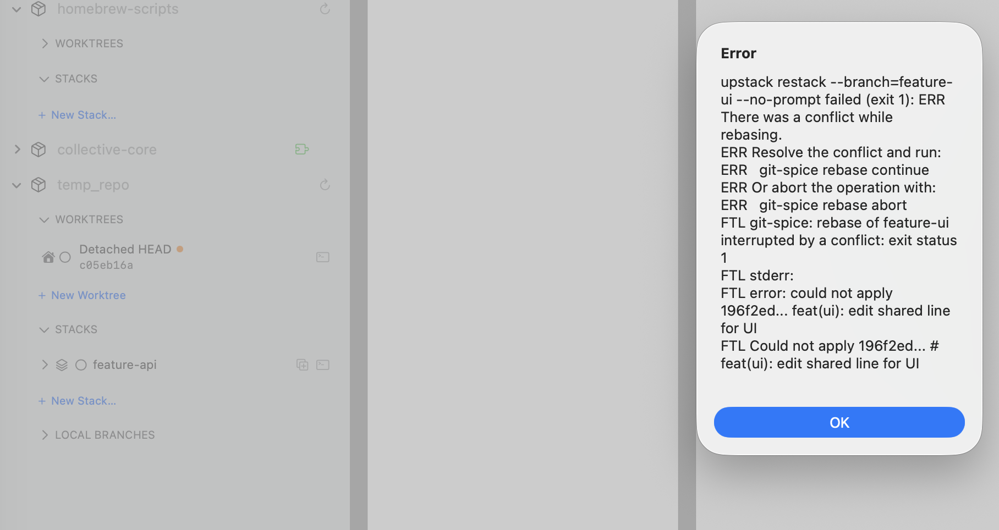

# Stacked Branches & PRs

In this tutorial you'll break a large piece of work into a stack of small, dependent branches — each with its own pull request — and manage the whole stack from the TermQ sidebar: adding branches, switching between them, restacking after changes, submitting PRs, and syncing after merges.

**Time:** about 20 minutes
**Requires:** TermQ 0.12 or later, a stacking backend installed ([git-spice](https://abhinav.github.io/git-spice/) or GitHub's [`gh stack`](https://github.com/github/gh-stack) extension), `gh` CLI authenticated, a GitHub repository registered in the sidebar

---

## What stacking is — and TermQ's model

A **stack** is a chain of branches where each builds on the one below it: `trunk ← api ← ui ← tests`. Each branch gets its own small PR targeting the branch beneath it, so reviewers see focused diffs instead of one monolith. When the bottom PR merges, the rest of the stack shifts down.

TermQ's model is deliberately simple: **a stack lives inside one worktree**. The worktree has one checked-out branch at a time — the stack's entries share that worktree's directory and its terminals. Switching entries re-points the same working directory at a different branch. (When you genuinely need two branches of the same stack open at once, see *Break-out worktrees* below.)

The one conceptual trap worth internalising up front: **uncommitted changes travel with the worktree, not the branch**. If you edit files while `ui` is checked out and then switch the worktree to `tests`, those edits would come along and land in the wrong branch. This is why TermQ *refuses* to switch a dirty worktree — commit or stash first. It's not being obstructive; it's protecting you from committing work to the wrong branch.

---

## Prerequisites

Stacking needs a backend. TermQ supports two, detects both, and bundles neither:

```
brew install git-spice              # git-spice
gh extension install github/gh-stack   # GitHub's native stacked PRs
```

Check **Settings → Tools → Stacked Pull Requests** — each backend gets its own card showing Installed/Missing status, the detected version and path, and a shared **Check Again** button after you install. Both reuse the `gh` CLI's authentication, so if Remote PRs already work, no extra sign-in is needed.



### Which backend drives a repository

You can have both installed at once. **TermQ decides per repository, from the evidence on disk** — a repo initialized with git-spice is driven by git-spice, one initialized with `gh stack` is driven by that, and neither can take a repo away from the other.

The **Preferred backend** setting is only a tie-breaker for repos *neither* tool has claimed yet — that is, when you enable stacking on a fresh repo. Leave it on **Automatic** unless you have both installed and want new repos to go a particular way.

Then enable stacking per repository: right-click the repo row in the sidebar and choose **Enable Stacking…**. Repos without stacking enabled are completely unaffected — the sidebar looks exactly as before.

> **A note if you use `gh stack`:** it starts a stack from the branch you have checked out, so check out (or create) the branch you want to stack before enabling. git-spice has no such requirement — it records a trunk and lets you add branches later.



---

## Sidebar anatomy

Once a repo is stacked, two things change in the sidebar:

**The worktree row grows a chevron.** When a worktree's checked-out branch is part of a stack, the row becomes expandable. Expanding it shows the chain bottom-to-top, one entry per branch:

- **●** marks the entry currently checked out in *this* worktree
- **#123** — the branch's PR, coloured by status (open, merged, closed); click to open it on GitHub
- **⟳ (orange)** — *needs restack*: the branch's base has moved and it should be rebased
- **↑N unpushed** — local commits not yet pushed
- **⚠ base mismatch** — the PR targets a different base than the stack expects (happens after a downstack merge; Sync Repo fixes it)
- **↩ (jump)** — the entry is checked out in a *different* worktree; click to reveal that worktree's row



**A STACKS section appears** between the worktree list and LOCAL BRANCHES. It's the inventory: every tracked stack in the repo, whether or not it's anchored to a worktree, grouped under its bottom branch. Entries here are read-only — the worktree row is where actions live — but each entry shows the same badges, and an unanchored stack offers **New Worktree…** to check its bottom branch out and start working. Branches listed in a stack group are removed from LOCAL BRANCHES so each branch appears in exactly one place.

The WORKTREES header itself is collapsible too — if you work exclusively from the Stacks section, fold the worktree list away.



---

## Everyday operations

All of these live in the worktree row's context menu (right-click):



**Add Branch to Stack…** — creates a new branch stacked on top of the current one (or a target you pick) via `gs branch create`. Anything you have *staged* becomes the new branch's first commit; with a clean tree it creates an empty branch ready for work. If you type the name of a branch that already exists, the sheet switches to *tracking* it onto the stack instead.

**Restack Stack** — rebases every branch in the stack onto its updated parent (`gs stack restack` / `gh stack rebase`). Use it after amending or adding commits to a branch lower in the stack, so the branches above incorporate the change. When nothing has diverged, restack is a **no-op** — TermQ tells you "Stack already up to date" rather than staying silent. Individual entries also offer **Restack from Here** for just a branch and everything above it — *git-spice only*, because `gh stack rebase` always starts from the checked-out branch and cannot be pointed at another one.

**Submit Stack** — opens a confirmation sheet listing exactly what will happen per branch: **create** a new PR or **update** the existing one. A Draft toggle opens new PRs as drafts; *update only* skips creating PRs for branches that don't have one yet. Submits are idempotent — running it again is safe. Entries offer **Submit This Branch…** for a single PR — *git-spice only*; `gh stack submit` has no way to target part of a stack, and *update only* has no equivalent there either.



**Sync Repo** — the stack-aware refresh: pulls trunk, deletes local branches whose PRs merged, and retargets/restacks the branches above a merged one. Run it after a downstack PR merges. TermQ lists any branches the sync removed ("Sync removed 2 merged branches: …") — and says "Everything in sync" when there was nothing to do.

> **Sync is not the same operation on both backends.** `gs repo sync` is local only. `gh stack sync` **force-pushes every branch in the stack** and rewrites the stack on GitHub — so on a `gh stack` repo, TermQ asks you to confirm first and lists exactly which branches will be pushed.

That difference decides what the repo row's **⟳ refresh** button does. On a git-spice repo it runs the sync, because that costs nothing beyond a local rebase and keeps the stack from going stale after a downstack merge. On a `gh stack` repo it does a plain fetch instead — a refresh button must never force-push, which is the whole reason Sync asks first. So on a `gh stack` repo, tidying up after a merge is something you run **Sync** for, deliberately.

**Untrack Stack** *(`gh stack` only)* — drops a stack from local tracking and **leaves every branch in place**. Use it when you want to stop managing a chain as a stack without losing any work. It is not the same as **Destroy Stack** *(git-spice only)*, which **deletes every branch** in the chain — the two are deliberately never offered under the same label.

**Merge Stack…** *(`gh stack` only)* — merges every PR in the stack into the base branch as one all-or-nothing operation. The confirmation sheet fetches each PR's **review decision and CI state at the moment you open it** — not from the cached PR feed, because stale information is exactly what you don't want when deciding to merge — and names the merge method it will use, inherited from the repository's own setting.

Review and check state are shown but do **not** block: branch protection rules vary per repository and TermQ can't read them, so it reports what it knows and lets GitHub make the final call. What *does* block is a **draft or closed PR partway up the stack** — nothing above it can merge. The sheet says so up front rather than letting you confirm something that can't succeed, and offers **Open Stack on GitHub** to merge up to that point there instead.

> **Why the partial merge goes to GitHub.** `gh stack merge <number>` treats a bare number as a *stack* number first and only then as a PR number, and the two are independent sequences in the same repository. A PR number that happens to collide with a stack number would merge a different stack entirely. Merging the whole stack is unambiguous, so that stays a TermQ button; merging *up to* a PR isn't, so it goes where it is.

**Link PRs into a Stack…** *(`gh stack` only)* — adopts existing branches into a stack on GitHub. Named for what it does rather than folded into Track Branch, because **any branch without a PR gets one created**. The sheet marks each branch as existing or new and counts the PRs it will open.

### After a stack merges

Merging doesn't make the stack vanish, and that's not a leftover — the branches are still on disk. What you'll see straight after **Merge Stack** is every PR badge turn **purple (merged)** while the stack stays in the sidebar.

Run **Sync** to finish up: it deletes the local branches whose PRs merged, and once a stack has no branches left it disappears from the sidebar with them. TermQ names what it removed ("Sync removed 3 merged branches: …").

Whether the *remote* branches go too is GitHub's call, not TermQ's — it depends on the repository's **Automatically delete head branches** setting.

While any of these runs, the repo row shows a spinner and the stack actions are disabled — mutations queue one at a time per repository.

---

## Switching between entries

Expand the worktree row and **double-click** an entry (or right-click → **Switch to <branch>**) to re-point the worktree at that branch. A single click never switches — it's safe to click around and inspect.

Switches are **guarded**. TermQ refuses when:

- **The worktree is dirty** — uncommitted changes would travel to the other branch (see the trap above). Commit or stash first.
- **A terminal is open in the worktree** — a running session's working directory would have its files swapped out from under it. Close the terminal first.
- **The branch is checked out in another worktree** — git enforces one checkout per branch; the alert names the worktree that owns it.

The guard messages tell you which case you hit. The rules exist so a switch is always boring — nothing moves that you didn't commit.

---

## Checking out a stack someone else pushed

In **Remote PRs** mode, a PR that belongs to a GitHub stack offers **Check Out Whole Stack** alongside the usual per-PR checkout. The difference matters: checking out one PR of a stack gives you a branch whose parent isn't there, so the diff reads against the wrong base and the stack UI stays dark. Checking out the whole stack fetches every branch and sets up local tracking, so it behaves like a stack you built yourself.

This is `gh stack`-only — git-spice has no forge-level stack object to discover.

## Break-out worktrees

Sometimes you genuinely need two branches of the same stack open at once — a harness churning on `api` while you edit `ui`. Right-click any stack entry that isn't checked out anywhere and choose **Break Out into Worktree…**. The branch gets its own worktree and behaves like any other worktree row: its own terminals, its own cards. Stack entries for it everywhere now show the ↩ indicator that jumps to its row.



One thing changes behind the scenes: git cannot rebase a branch that's checked out in another worktree, so git-spice quietly *skips* such branches during restack and sync — which would leave them stale. TermQ orchestrates around this: after a restack or sync, it finds skipped branches and runs a follow-up restack *inside* each owning worktree, provided that worktree is clean and has no open terminal (the same guards as switching). If a broken-out worktree is dirty or in use, TermQ leaves it alone and tells you — "Not restacked: feat/ui (checked out in … with uncommitted changes)" — and the orange ⟳ badge stays on that entry until you deal with it.

This orchestration is git-spice-only, and it isn't a gap on the GitHub side: `gh stack` keeps its tracking state *inside each worktree's git directory*, so every worktree carries its own independent stack and there is no cross-worktree staleness to sweep up.

---

## When a restack hits conflicts

A restack or sync can stop on a merge conflict, exactly like a manual rebase. TermQ shows a banner on the affected worktree row: **"Restack paused — conflicts in N files"** with **Continue** and **Abort** buttons.



This is where TermQ's home advantage kicks in: the conflicted worktree's terminal is one click away. Open it, resolve the conflicts, `git add` the files, then click **Continue** (`gs rebase continue` / `gh stack rebase --continue`). If you'd rather back out entirely, **Abort** restores the pre-restack state. If the follow-up restack of a broken-out worktree is what conflicted, the banner appears on *that* worktree's row.

---

## What you learned

- A stack is a chain of dependent branches with one PR each; in TermQ a stack lives in **one worktree** and entries share its terminals
- Two backends power stacking — git-spice or GitHub's `gh stack` extension. Install either, check **Settings → Tools → Stacked Pull Requests**, then **Enable Stacking…** per repo
- **Which backend drives a repo is decided by the evidence on disk**, not by a setting; **Preferred backend** only breaks ties for repos neither tool has claimed
- Menu items follow what the backend can actually do — **Restack from Here**, **Submit This Branch…**, and **Destroy Stack** are git-spice-only; **Untrack Stack** is `gh stack`-only; and a `gh stack` **Sync** confirms first because it force-pushes
- The worktree row expands into the stack chain with PR, restack, and push badges; the **STACKS** section is the repo-wide inventory
- **Add Branch to Stack**, **Restack Stack**, **Submit Stack**, and **Sync Repo** cover the daily loop — every operation confirms what it did, including "already up to date" no-ops
- Switching entries is double-click or context menu, and it's **guarded**: dirty worktrees, in-use terminals, and branches owned by other worktrees are refused — because uncommitted changes travel with the worktree, not the branch
- **Break Out into Worktree…** gives a stack entry its own worktree for concurrent sessions; TermQ restacks broken-out branches in their own worktrees afterwards, and tells you when a dirty or in-use worktree was skipped
- Conflict pauses show a banner with **Continue** / **Abort** — resolve in the worktree's own terminal
- **Merge Stack** checks review and CI state fresh when you open it, tells you up front when a draft or closed PR blocks the merge, and sends the partial merge to GitHub where it's unambiguous
- **Link PRs into a Stack** creates PRs for branches that lack one — the sheet counts them before you confirm
- **Check Out Whole Stack** in Remote PRs brings down every branch of someone else's stack, not just the one PR
- After a merge the PRs go purple and the stack stays until **Sync** deletes the merged branches — on a `gh stack` repo the ⟳ button won't do that for you, because it would mean force-pushing without asking

## Next

[Tutorial: CLI Automation](cli.md) — drive TermQ from scripts and CI with the `termq` command-line tool.
