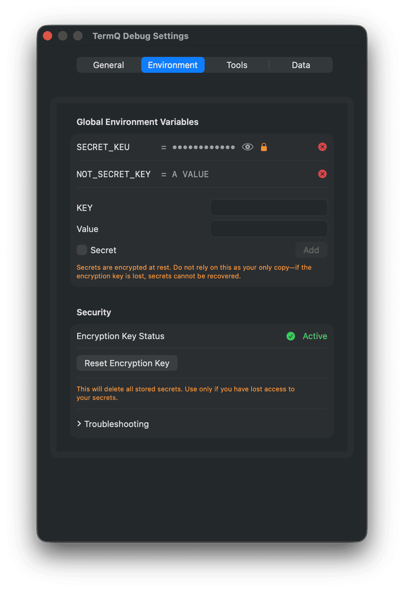
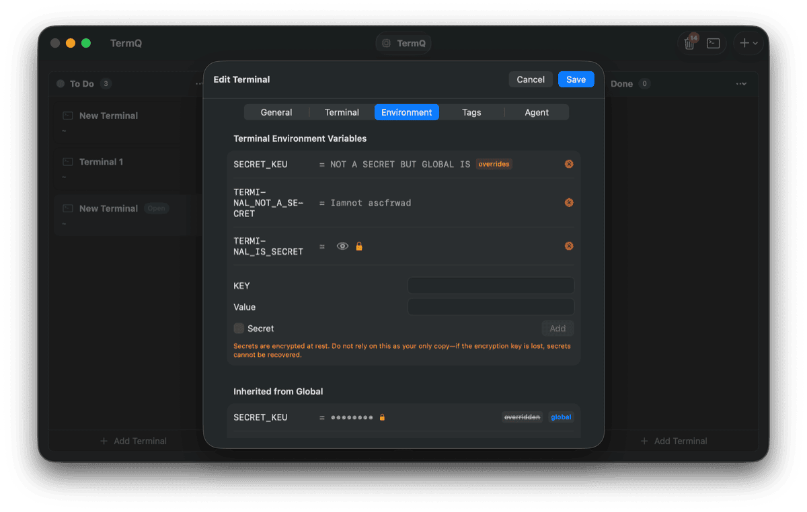

# Tutorial 6: Terminal Context

Each terminal session can carry its own environment — variables that are set before your shell starts, so tools and scripts always find what they need. You can also configure an init command that runs automatically each time the terminal opens.

This tutorial covers: global variables, per-terminal variables, secrets, init commands, and the auto-injected variables TermQ provides.

---

## 6.1 — Global environment variables

Global variables are injected into every terminal session. They're useful for things that apply across all your work — an API token, a common path, a flag you always want set.

Open **Settings** (⌘,) and go to the **Environment** tab.



Add a variable with a key and value. It will be available in every new terminal session you open.

---

## 6.2 — Per-terminal variables

Some variables belong to a specific terminal. Open the terminal editor (right-click > Edit Details) and go to the **Environment** tab.



The editor shows:
- **Terminal Variables** — variables specific to this terminal
- **Inherited Variables** — global variables (marked "overridden" if the same key is set locally)

Per-terminal variables override globals. If you have `NODE_ENV=development` globally but want `NODE_ENV=production` for one specific terminal, set it there.

---

## 6.3 — Variable injection order

When a terminal starts, variables are applied in this order — later values win:

```
1. System environment
2. Global user-defined variables
3. Per-terminal user-defined variables
4. Auto-injected TERMQ_* variables
```

The auto-injected variables are always last, so they cannot be accidentally overridden.

---

## 6.4 — Auto-injected variables

TermQ automatically sets these in every terminal session:

| Variable | Example | What it's for |
|---|---|---|
| `TERMQ_TERMINAL_ID` | `A1B2C3D4-...` | The UUID of this terminal card |
| `TERMQ_TERMINAL_TAG_<KEY>` | `TERMQ_TERMINAL_TAG_ENV=prod` | One variable per tag on the card |

The tag variables are particularly useful in scripts:

```bash
# A deploy script that checks which environment it's in
if [ "$TERMQ_TERMINAL_TAG_ENV" = "production" ]; then
    echo "Deploying to production — are you sure?"
fi
```

Tag keys are converted to uppercase; invalid characters become underscores. A tag `git-branch=main` becomes `TERMQ_TERMINAL_TAG_GIT_BRANCH=main`.

---

## 6.5 — Secrets

For API keys, tokens, and passwords, mark a variable as a **Secret**. Secret values are stored in your macOS Keychain, not in `board.json`.

When adding a variable, check the **Secret** checkbox before saving. The value is stored in the Keychain immediately and shown as dots in the UI. Click the eye icon to reveal it temporarily.

> **Important:** Backing up `board.json` does not back up secrets — they live in the Keychain. If you reset your encryption key, secrets are permanently lost. Re-enter them after any reset.

---

## 6.6 — Init commands

An init command runs automatically each time a terminal opens. It's set in the terminal editor under **Terminal > Init Command**.

Common uses:

```bash
# Activate a virtual environment
source .venv/bin/activate

# Load project environment file
source .env

# Start a specific process
npm run dev
```

For tmux terminals, the init command runs each time the session is attached (not each time the underlying process restarts).

> **LLM use:** The init command is also where you place the `{{NEXT_ACTION}}` token for queued actions. See [Tutorial 11](tutorials/queued-actions.md).

---

## What you learned

- **Global variables** apply to every terminal — set once in Settings > Environment
- **Per-terminal variables** override globals — set per card in the editor
- Variables inject in order: system → global → per-terminal → auto-injected TERMQ_*
- **TERMQ_TERMINAL_ID** and **TERMQ_TERMINAL_TAG_*** are always available in every session
- **Secrets** go to the macOS Keychain — not the board file — for sensitive values
- **Init commands** run automatically when a terminal opens

## Next

[Tutorial 7: Lifecycle](tutorials/lifecycle.md) — Pinned terminals, the bin, session export, and keeping your board clean.
