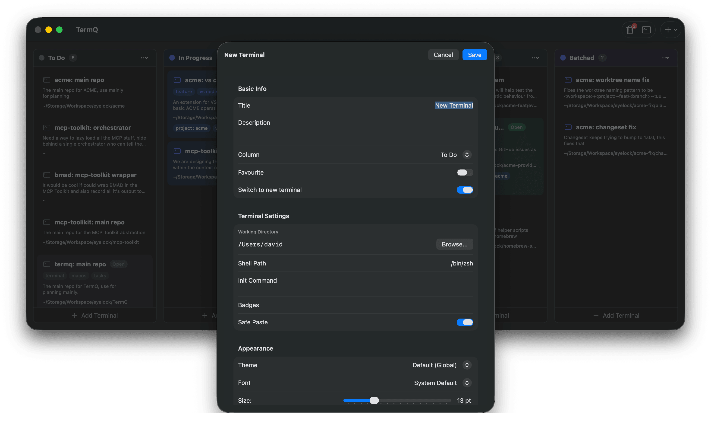
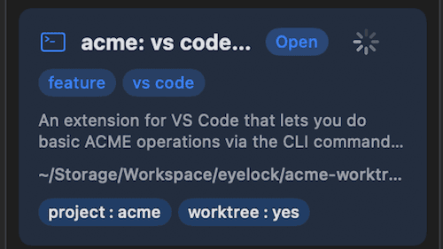
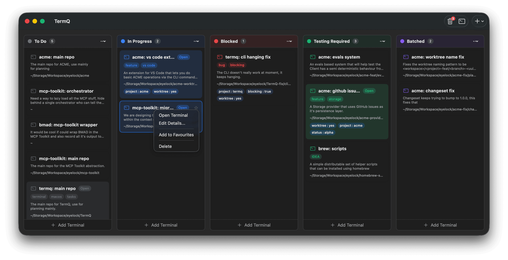
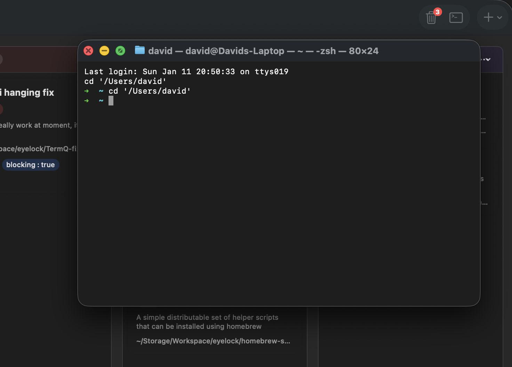

# Working with Terminals

## Creating Terminals

- Click **Add Terminal** at the bottom of any column
- Use **⌘N** for the new terminal dialog
- Use **⌘T** for a quick terminal in the same column



## Terminal Cards

Each terminal card shows:

- Title and description
- Tags (key=value pairs)
- Working directory
- Running status (green dot)
- Pin status (star icon)



## Context Menu

Right-click any terminal card for options:

- Open Terminal
- Edit Details
- Pin/Unpin
- Delete



## Native Terminal

Click the Terminal button in the toolbar to open macOS Terminal.app at the current working directory.



## Environment Variables

TermQ automatically sets environment variables in each terminal session, enabling scripts and tools to identify which terminal they're running in.

### Available Variables

| Variable | Description | Example |
|----------|-------------|---------|
| `TERMQ_TERMINAL_ID` | UUID of the current terminal | `A1B2C3D4-E5F6-...` |
| `TERMQ_TERMINAL_TAG_<KEY>` | One variable per tag | `TERMQ_TERMINAL_TAG_PROJECT=myrepo` |

### Tag Variables

Tags are converted to environment variables with sanitized names:
- Tag keys are converted to uppercase
- Invalid characters (spaces, dashes, etc.) become underscores
- Leading digits are removed

**Examples:**

| Tag | Environment Variable |
|-----|---------------------|
| `project=myrepo` | `TERMQ_TERMINAL_TAG_PROJECT=myrepo` |
| `env=production` | `TERMQ_TERMINAL_TAG_ENV=production` |
| `git-branch=main` | `TERMQ_TERMINAL_TAG_GIT_BRANCH=main` |

### Usage Examples

```bash
# Check which terminal you're in
echo $TERMQ_TERMINAL_ID

# Use in scripts
if [ -n "$TERMQ_TERMINAL_TAG_ENV" ]; then
    echo "Running in $TERMQ_TERMINAL_TAG_ENV environment"
fi

# Query terminal context via MCP (for LLM agents)
termqmcp termq_get --id "$TERMQ_TERMINAL_ID"
```

### Integration with MCP

LLM agents running in a TermQ terminal can use the `TERMQ_TERMINAL_ID` environment variable with the `termq_get` MCP tool to retrieve their current terminal's context, including tags, persistent prompt, and pending actions. See [MCP Server](mcp-server.md) for details.

