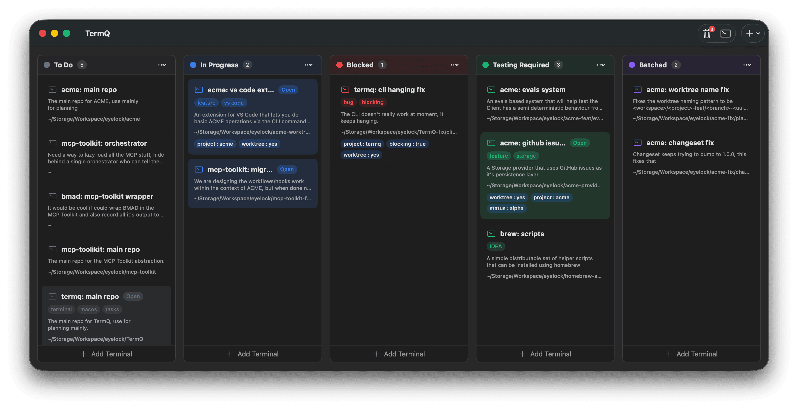
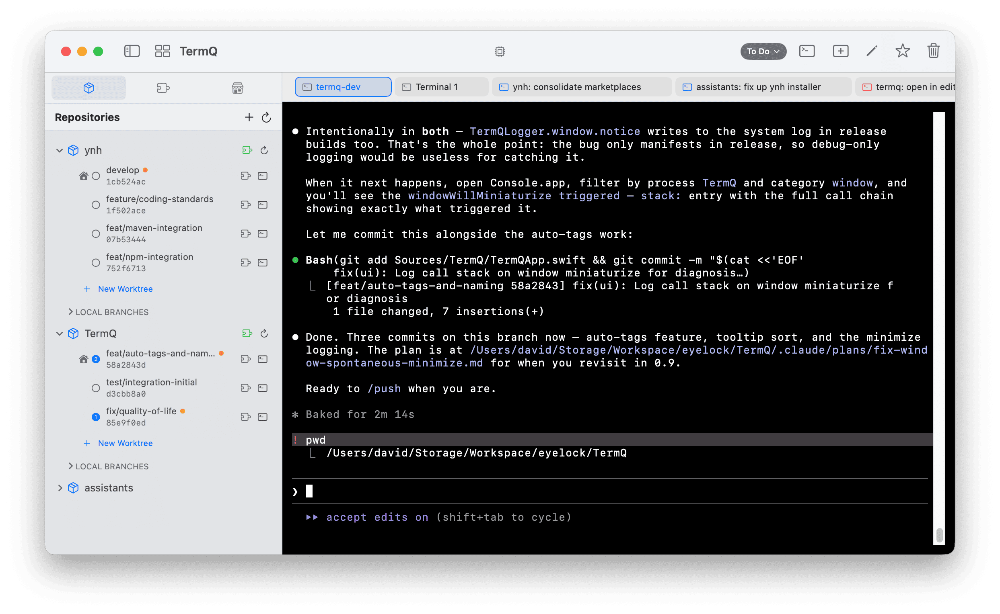

# TermQ

A Kanban-style terminal queue manager for macOS. Organize multiple terminal sessions in a visual board layout, drag them between columns, and never lose track of your running tasks.



> **Note**: This is a personal project developed in my spare time. It works well for my workflow but may have rough edges. Contributions and feedback welcome!

## Features

| Feature | Description |
|---------|-------------|
| **Kanban Board** | Organize terminals in customizable columns |
| **Persistent Sessions** | Terminal sessions persist when navigating views |
| **Pinned Terminals** | Quick access via tabs in focus mode |
| **Command Palette** | Fast terminal switching with ⌘K |
| **Rich Metadata** | Titles, descriptions, badges, and key=value tags |
| **Drag & Drop** | Reorder terminals and columns freely |
| **8 Color Themes** | Dracula, Nord, Solarized, One Dark, and more |
| **Zoom & Search** | Maximize view (⌘⇧Z) and find in buffer (⌘F) |
| **Session Export** | Save terminal content to text files |
| **Native Integration** | Launch Terminal.app at current directory |
| **CLI Tool** | Open terminals from the command line |
| **MCP Server** | Model Context Protocol for LLM integration |
| **Bin & Recovery** | Soft-delete with configurable auto-cleanup |



## Installation

### From Release (Recommended)

1. Download the latest `TermQ-{version}.zip` from [Releases](../../releases)
2. Unzip and move `TermQ.app` to your Applications folder
3. Right-click and select "Open" on first launch (required for unsigned apps)

### From Source

```bash
git clone https://github.com/eyelock/termq.git
cd termq
make sign
open TermQ.app
```

See [CONTRIBUTING.md](./CONTRIBUTING.md) for detailed build instructions.

## Requirements

- macOS 14.0 (Sonoma) or later

## Documentation

📖 **[View Online Documentation](https://eyelock.github.io/TermQ/)** | [Source](./Docs/Help/)

- [Getting Started](./Docs/Help/getting-started.md)
- [Working with Terminals](./Docs/Help/working-with-terminals.md)
- [Columns & Organization](./Docs/Help/columns-organization.md)
- [Keyboard Shortcuts](./Docs/Help/keyboard-shortcuts.md)
- [Command Palette](./Docs/Help/command-palette.md)
- [Themes & Appearance](./Docs/Help/themes-appearance.md)
- [Configuration & Data](./Docs/Help/configuration.md)
- [CLI Tool](./Docs/Help/cli-tool.md) *(early release)*
- [MCP Server](./Docs/Help/mcp-server.md) *(early release)*
- [About & Limitations](./Docs/Help/about.md)

## Contributing

Contributions are welcome! See [CONTRIBUTING.md](./CONTRIBUTING.md) for:

- Development setup and requirements
- Project structure
- Building, testing, and linting
- Release process

## Credits

- Terminal emulation powered by [SwiftTerm](https://github.com/migueldeicaza/SwiftTerm) by Miguel de Icaza
- Built with assistance from [Claude Code](https://claude.ai/code), Anthropic's AI coding assistant

## License

MIT License - See [LICENSE](LICENSE) for details.
