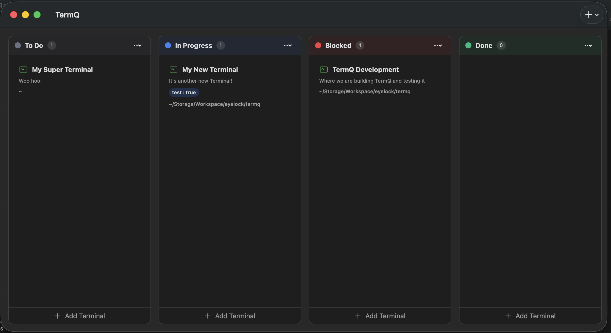

# Getting Started

Welcome to TermQ - a Kanban-style terminal queue manager for macOS.

## Quick Start

1. Click the **+** button in the toolbar to add a new terminal or column
2. Click on a terminal card to open it in full view
3. Drag cards between columns to organize your workflow
4. Pin frequently-used terminals with the ⭐ button for quick access

TermQ helps you organize multiple terminal sessions in a visual board layout, so you never lose track of your running tasks.

